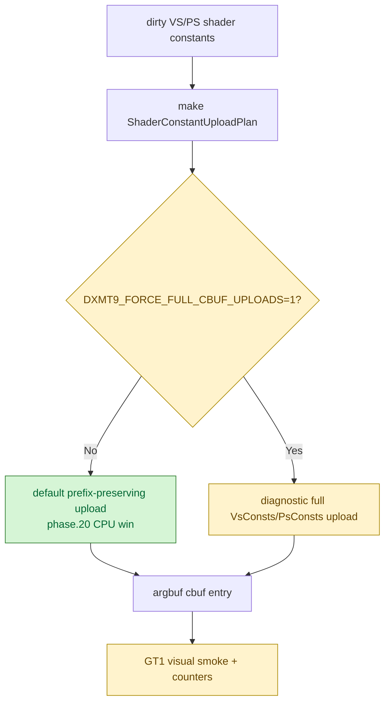
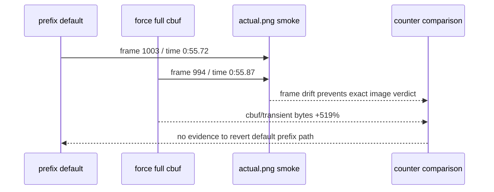

# Full Cbuf Upload Diagnostic Gate

**Question / hypothesis.** A manual GT1 run showed some geometry looking black
or semi-transparent after the recent encode CPU work. The strongest recent
semantic candidate is [state-churn-encode-encode-phase.20](state-churn-encode-encode-phase.20.md), because it changes
the dirty VS/PS cbuf upload payload from a full host struct to a
prefix-preserving byte span. Does forcing full VS/PS cbuf uploads make the
visual artifact obviously disappear?

**Implementation.** Add a diagnostic-only runtime flag:
`DXMT9_FORCE_FULL_CBUF_UPLOADS=1`. When set, `makeVsConstantUploadPlan()` and
`makePsConstantUploadPlan()` return full-struct plans even when shader usage
bounds would allow a shorter prefix. The default path is unchanged.



**Method.**

```bash
scripts/tools/run_3dmark05_perf_probe.sh \
  --suffix current-visual-smoke-r1 \
  --no-gputrace \
  --no-encoder-breakdown \
  --timeout 180

DXMT9_FORCE_FULL_CBUF_UPLOADS=1 \
scripts/tools/run_3dmark05_perf_probe.sh \
  --suffix force-full-cbuf-smoke-r1 \
  --no-gputrace \
  --no-encoder-breakdown \
  --timeout 180

python3 scripts/tools/compare_3dmark05_perf_counters.py \
  experiments/output/app-d3d9-3dmark05-current-visual-smoke-r1 \
  experiments/output/app-d3d9-3dmark05-force-full-cbuf-smoke-r1 \
  --before-label current-prefix-smoke-r1 \
  --after-label force-full-cbuf-smoke-r1 \
  --output experiments/output/app-d3d9-3dmark05-force-full-cbuf-smoke-r1/dxmt9-perf-counter-comparison-vs-current-prefix.md

python3 scripts/tools/compare_experiment_images.py \
  --before experiments/output/app-d3d9-3dmark05-current-visual-smoke-r1/actual.png \
  --after experiments/output/app-d3d9-3dmark05-force-full-cbuf-smoke-r1/actual.png \
  --label-before current-prefix-smoke-r1 \
  --label-after force-full-cbuf-smoke-r1 \
  --output experiments/output/app-d3d9-3dmark05-force-full-cbuf-smoke-r1/image-comparison-vs-current-prefix.md \
  --summary-output experiments/output/app-d3d9-3dmark05-force-full-cbuf-smoke-r1/image-comparison-vs-current-prefix-summary.json \
  --diff-output experiments/output/app-d3d9-3dmark05-force-full-cbuf-smoke-r1/image-diff-vs-current-prefix.png
```

Both runs hit the expected wrapper watchdog cleanup (`124`) after writing
postprocess artifacts.

**Measured result.**

The two runs both produced `1680` presents, so the run-level counter comparison
is aligned:

| Counter | Prefix default | Force full cbuf | Delta | Reading |
|---|---:|---:|---:|---|
| `argbuf_hybrid_bytes_per_encoder` | 488,750,968 | 3,028,270,936 | +519.59% | full upload restores large cbuf traffic |
| `transient_upload_bytes` | 488,892,004 | 3,028,411,972 | +519.44% | same byte amplification |
| `encode_draw_cpu_ms` | 16,337.894 | 16,764.195 | +2.61% | CPU regresses |
| `gpu_command_buffer_time_ms` | 5,114.768 | 5,170.505 | +1.09% | flat/noisy, slight regression |
| `completion_wait_ms` | 38,523.184 | 38,381.177 | -0.37% | flat/noisy |

The image comparison is not a correctness proof because the screenshots drifted
(`current-prefix`: frame 1003 / time 0:55.72; `force-full-cbuf`: frame 994 /
time 0:55.87). Visually, forcing full cbuf uploads did not produce an obvious
normalization of the suspected black/translucent geometry; it looked like the
same GT1 lighting/motion-blur shape at a different animation frame.



**Verdict.** Diagnostic inconclusive for the visual artifact, but it rejects a
simple full-cbuf fallback as the next default. Full upload massively increases
cbuf/transient traffic and does not obviously fix the observed black or
semi-transparent-looking geometry in the time-based smoke. Keep the
prefix-preserving default from [state-churn-encode-encode-phase.20](state-churn-encode-encode-phase.20.md).

**Next.** If the visual issue persists, use a same-input proof path instead of
time-based `actual.png`: mini-replay with dumped cbufs/geometry, a semantic
image gate, or a tightly scoped frame capture. The likely next visual bisection
axis is not "all VS/PS cbuf prefixes"; it is exact draw/row isolation for the
visible artifact.

**Related.** [state-churn-encode](index.md) ·
[state-churn-encode-encode-phase.20](state-churn-encode-encode-phase.20.md) ·
[state-churn-encode-encode-phase.21](state-churn-encode-encode-phase.21.md) · baselines-visual-capture.01.
