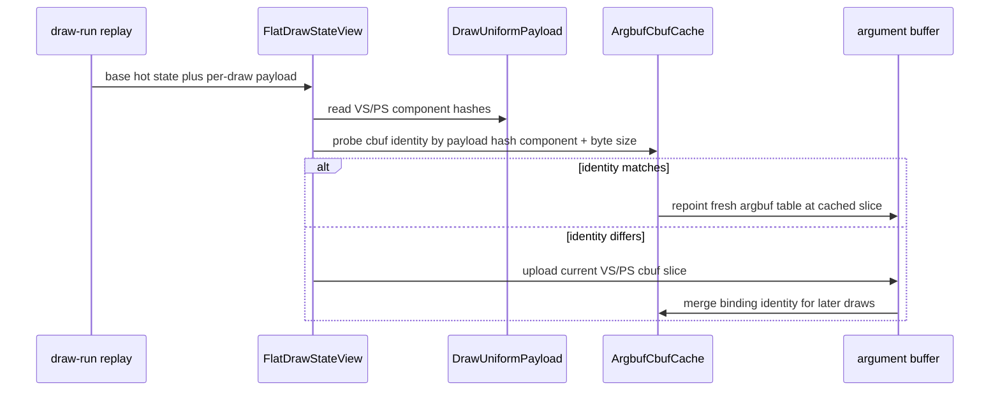

# Draw Submission Batch Cbuf Payload Identity Fix

**Question / hypothesis.** A later GT1 smoke showed black or translucent-looking
geometry even though [[state-churn-encode-encode-phase.22]] rejected full VS/PS
cbuf upload as the likely fix. The `v0.0.1` visual-good tag is useful here:
diffing from that baseline points to default-on draw submission batching and
binding override work, while `DXMT9_DISABLE_DRAW_SUBMIT_BATCH=1` restores a
normal-looking smoke frame. Is the artifact caused by stale cbuf cache identity
inside the batched per-draw uniform path?

**Root cause.** Draw submission batches replay many draw records through one
base `FlatDrawStateRecord`. Each record can carry its own `DrawUniformPayload`,
but the base `hot.vertexConstantsHash` / `hot.pixelConstantsHash` can still be
the first draw's constants. The argbuf cbuf cache identity and no-dirty
content-probe path used those base hot hashes. When the per-draw payload changed
without matching dirty bits, the cache could false-hit a stale VS/PS cbuf slice.

```mermaid
flowchart TD
  A["draw submission batch"] --> B["base FlatDrawStateRecord\nfirst draw hot state"]
  A --> C["per-draw DrawUniformPayload\ncurrent draw constants"]
  B --> D["old cbuf identity\nhot.vertex/pixelConstantsHash"]
  C --> E["actual cbuf bytes to bind"]
  D --> F{"cache identity hit?"}
  F -- "false hit" --> G["reuse stale cbuf slice\nblack/translucent geometry risk"]
  F -- "miss" --> H["upload current cbuf slice"]

  C --> I["fixed cbuf identity\npayload vertex/pixel component hash"]
  I --> J{"cache identity hit?"}
  J -- "true hit" --> K["repoint matching cbuf slice"]
  J -- "miss" --> H

  classDef bad fill:#ffe1e1,stroke:#b33,color:#500
  classDef good fill:#d6f5d6,stroke:#2b7a2b,color:#063
  class D,F,G bad
  class I,J,K,H good
```



**Implementation.**

- `DrawUniformPayload` now stores `vertexConstantsHash` and
  `pixelConstantsHash` alongside the full payload hash.
- `makeDrawUniformPayloadFromState()` and fixture payload construction fill
  those fields from the same `hashDrawUniformPayload()` component result used
  to stamp `FlatDrawStateRecord`.
- argbuf cbuf identity stamping and no-dirty content probes prefer
  `drawState.uniformPayload().vertexConstantsHash` /
  `drawState.uniformPayload().pixelConstantsHash`, falling back to base `hot`
  only when no uniform payload is present.
- The temporary correctness fix that marked all cbuf categories dirty whenever
  the payload hash changed was removed.



**Method.**

```bash
DXMT9_DISABLE_DRAW_SUBMIT_BATCH=1 \
scripts/tools/run_3dmark05_perf_probe.sh \
  --suffix disable-draw-submit-batch-visual-r1 \
  --no-gputrace \
  --no-encoder-breakdown \
  --timeout 180

scripts/tools/run_3dmark05_perf_probe.sh \
  --suffix cbuf-payload-dirty-fix-visual-r1 \
  --no-gputrace \
  --no-encoder-breakdown \
  --timeout 180

scripts/tools/run_3dmark05_perf_probe.sh \
  --suffix cbuf-payload-component-hash-visual-r1 \
  --no-gputrace \
  --no-encoder-breakdown \
  --timeout 180

python3 scripts/tools/compare_3dmark05_perf_counters.py \
  experiments/output/app-d3d9-3dmark05-cbuf-payload-dirty-fix-visual-r1 \
  experiments/output/app-d3d9-3dmark05-cbuf-payload-component-hash-visual-r1 \
  --before-label cbuf-payload-dirty-fix-visual-r1 \
  --after-label cbuf-payload-component-hash-visual-r1 \
  --output experiments/output/app-d3d9-3dmark05-cbuf-payload-component-hash-visual-r1/dxmt9-perf-counter-comparison-vs-dirty-fix.md
```

All GT1 probe runs hit the expected wrapper watchdog cleanup (`124`) after
writing postprocess artifacts.

**Measured result.**

| Run | Draw submission batch | Visual smoke | `argbuf_hybrid_bytes_per_encoder` | `encode_draw_cpu_ms` | Reading |
|---|---:|---|---:|---:|---|
| `current-visual-smoke-r1` | `822,094` records | bad-looking frame 1003 / time 0:55.72 | 488,750,968 | 16,337.894 | artifact present, but not exact-frame oracle |
| `disable-draw-submit-batch-visual-r1` | `0` records | normal-looking frame 919 / time 0:55.06 | 661,288,136 | 16,344.094 | localizes artifact to submission batching path |
| `cbuf-payload-dirty-fix-visual-r1` | `820,404` records | normal-looking frame 1030 / time 0:58.16 | 1,083,244,992 | 18,593.348 | correctness-safe but over-dirties cbufs |
| `cbuf-payload-component-hash-visual-r1` | `822,993` records | normal-looking frame 983 / time 0:55.37 | 712,364,360 | 17,157.432 | accepted fix; batching retained |

The component-hash fix keeps the normal visual smoke while reducing the
temporary dirty-fix traffic: `argbuf_hybrid_bytes_per_encoder` drops
`1,083,244,992 -> 712,364,360` (`-34.24%`) and `encode_draw_cpu_ms` drops
`18,593.348 -> 17,157.432` (`-7.72%`). Compared with the bad-looking current
smoke, the accepted fix intentionally uploads more cbuf bytes (`+45.75%`) to
avoid stale-slice false hits.

The accepted run also makes the per-category behavior visible:
`encode_draw_argbuf_cbuf_content_probe_calls=898,934`, VS probe
`138,773` hits / `760,161` misses, PS probe `607,802` hits / `291,132`
misses, and FFPPS probe `867,724` hits / `31,210` misses. That is the intended
middle ground between stale identity reuse and always dirtying every cbuf.

**Verdict.** Accepted correctness fix with visual smoke. This does not prove
pixel-perfect equality to `v0.0.1`, because time-based `actual.png` captures
still drift between frames. The structural root cause is nevertheless clear:
cbuf cache identity must be based on the actual per-draw uniform payload, not
the first draw's base hot-state constant hashes.

**Next.** Keep the component-hash identity path. Future cbuf/cache changes
should use a same-input mini-replay or stricter image gate before claiming exact
visual correctness, and should avoid cache identity decisions that mix a
per-draw payload with a base batched hot state.

**Related.** [[state-churn-encode]] ·
[[state-churn-encode-encode-phase.22]] · [[baselines-visual-capture.01]].
