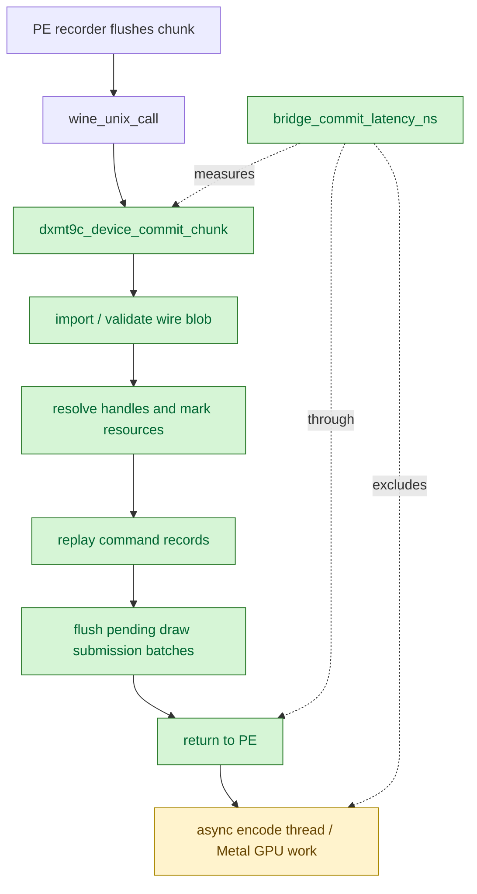
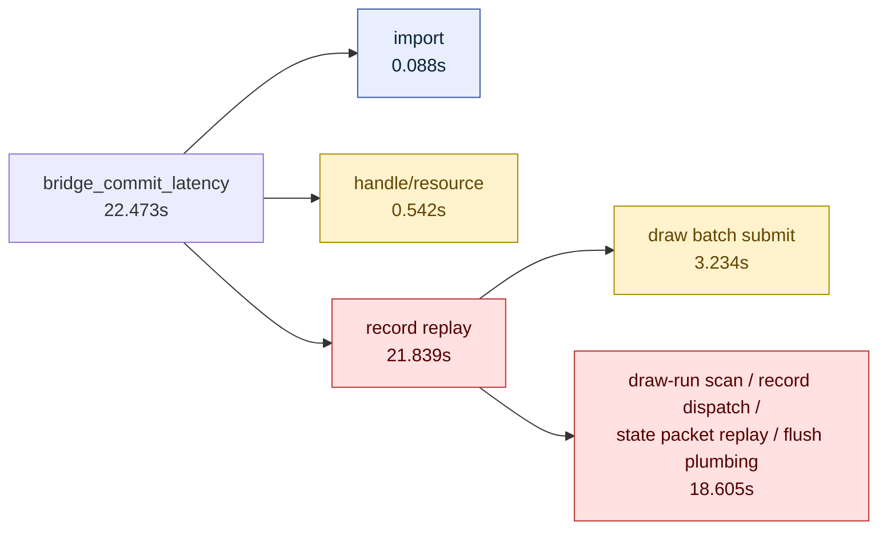

# Commit Chunk Replay Split

**Question / hypothesis.** The run-level `bridge_commit_latency_ns` counter is
large enough to look like a bridge or ABI problem. Is it raw Wine PE/unix call
overhead, or is the name hiding unix-side `commit_chunk` replay work?

**Instrumentation.** The historical `bridge_commit_latency_ns` counter still
samples around one `dxmt9c_device_commit_chunk()` call, but that scope is the
whole synchronous bridge call:



The new stage counters split that same call into:

- `commit_chunk_import_cpu_ms` - imported blob validation.
- `commit_chunk_handle_cpu_ms` - handle/resource collection, resolution, and
  resource marking before replay.
- `commit_chunk_replay_cpu_ms` - record replay through the success path,
  including draw-run scanning and the final batch flush.
- `commit_chunk_draw_batch_submit_cpu_ms` - time spent inside
  `submitDrawSubmissionBatch()` calls, a nested child of replay.

**Method.**

```bash
bash scripts/tools/run_3dmark05_perf_probe.sh \
  --suffix commit-chunk-stage-20260612-213220 \
  --frame 50 \
  --no-gputrace \
  --no-encoder-breakdown \
  --frame-sampling \
  --timeout 180
```

The run completed as `pass` and produced `1680` presents with `1724` sampled
frame rows. No `.gputrace` was requested; this is CPU attribution only.

**Measured result.**

| Counter | Value | Reading |
|---|---:|---|
| `bridge_commit_latency_ns` | `22,472,777,850` ns | Whole synchronous `commit_chunk` call time |
| `bridge_commit_latency_p50_ns` | `491,042` ns | Typical call is sub-ms |
| `bridge_commit_latency_p95_ns` | `2,230,750` ns | Tail still replay-shaped, not import-shaped |
| `commit_chunk_import_cpu_ms` | `88.356` | Negligible share of total |
| `commit_chunk_handle_cpu_ms` | `541.505` | Small but real resource/handle cost |
| `commit_chunk_replay_cpu_ms` | `21,838.641` | Dominant owner, about `97%` of bridge-call time |
| `commit_chunk_draw_batch_submit_cpu_ms` | `3,233.541` | Significant replay child, about `15%` of replay |
| `d3d9_snapshot_draw_submission_cpu_ms` | `7,779.855` | PE-side draw submission construction remains another CPU owner |
| `encode_draw_cpu_ms` | `17,051.620` | Backend encode still dominates after the bridge call returns |
| `completion_wait_ms` | `38,990.561` | Separate present/completion pacing axis |
| `sampled_avg_fps` | `15.737` | End-to-end wallclock still poor |



**Verdict.** Accepted attribution. The old counter name is misleading if read
as raw ABI overhead. `bridge_commit_latency_ns` currently means "synchronous
commit_chunk call wall time"; the owner is record replay, not PE/unix bridge
crossing, wire import, or handle/resource marking.

**Next.** Do not optimize the bridge ABI based on this counter. Split
`commit_chunk_replay_cpu_ms` into its children first:

- record-type dispatch and `ImportedDrawRun` scan time,
- draw packet state application and `DrawBindingOverride` materialization,
- constant upload pass-through records,
- draw submission batch construction and snapshot payload lookup,
- final `submitDrawSubmissionBatch()` call shape by batch size.

Keep this as a no-gputrace CPU lane until a change affects GPU-side row shape,
render-pass traffic, or present/completion pacing.

**Related.** [[state-churn-encode]] ·
[[state-churn-encode-encode-phase.23]] · [[snapshot-cache]] ·
[[present-pacing]].
