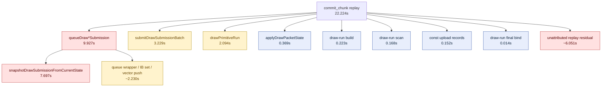

# Commit Chunk Replay Child Split

**Question / hypothesis.** state-churn-encode-encode-phase.24 shows that
`bridge_commit_latency_ns` is mostly synchronous `commit_chunk` record replay.
Which replay child is large enough to optimize first?

**Instrumentation.** Replay now records nested child timers for draw-state
application, draw-run scanning/build/submit/final-bind, queued draw submission,
and constant-upload records.



**Method.**

```bash
bash scripts/tools/run_3dmark05_perf_probe.sh \
  --suffix commit-chunk-replay-split-20260612-221000 \
  --frame 50 \
  --no-gputrace \
  --no-encoder-breakdown \
  --frame-sampling \
  --timeout 180
```

The wrapper hit watchdog cleanup (`124`) and the summary is `partial-log`
because `result.json` was missing, but the perf log contains `1680` presents,
`1721` frame samples, normal-looking `actual.png`, and no skipped pipeline or
Metal command-buffer errors. Use this as CPU attribution, not as a score run.

**Measured result.**

| Counter | Value | Reading |
|---|---:|---|
| `present_encoded` | `1,680` | Sufficient run coverage for counter attribution |
| `bridge_commit_latency_ns` | `22,842,473,297` ns | Whole synchronous `commit_chunk` call |
| `commit_chunk_replay_cpu_ms` | `22,223.637` | Replay remains the bridge-call owner |
| `commit_chunk_queue_draw_submission_cpu_ms` | `9,927.191` | Largest named replay child |
| `d3d9_snapshot_draw_submission_cpu_ms` | `7,696.922` | Nested owner inside queued submission |
| `commit_chunk_draw_batch_submit_cpu_ms` | `3,229.424` | Second major replay child |
| `commit_chunk_draw_run_submit_cpu_ms` | `2,093.639` | Coalesced draw-run submit cost |
| `commit_chunk_apply_draw_state_cpu_ms` | `368.753` | Not a first-order owner |
| `commit_chunk_draw_run_build_cpu_ms` | `223.367` | Not a first-order owner |
| `commit_chunk_draw_run_scan_cpu_ms` | `167.917` | Draw-run scan is cheap relative to replay |
| `commit_chunk_const_upload_cpu_ms` | `152.428` | Constant upload record dispatch is cheap |
| `commit_chunk_draw_run_final_bind_cpu_ms` | `14.416` | Negligible |
| `encode_draw_cpu_ms` | `16,801.131` | Backend encode remains separate and large |
| `completion_wait_ms` | `39,706.458` | Present-completion pacing remains separate |
| `sampled_avg_fps` | `15.719` | Wallclock unchanged in the expected envelope |

Steady frame sampling after dropping startup/outliers is still familiar:
wall-clock p50 `56.915ms`, p95 `90.844ms`; encode-draw p50 `8.978ms`,
p95 `17.107ms`; completion-wait p50 `23.606ms`, p95 `38.208ms`.

**Verdict.** Accepted attribution from a partial-log run. The replay child
owner is not draw-run scanning, state application, or constant-upload dispatch.
It is primarily queued draw submission and its nested D3D9 snapshot build/cache
path. The next tier is draw submission batch flushing and direct draw-run
submission.

**Next.**

- Split or reduce `snapshotDrawSubmissionFromCurrentState()` first, especially
  snapshot cache lookup/miss hot-build, uniform refresh/build/hash, and payload
  lookup/collision work.
- Split `submitDrawSubmissionBatch()` and `drawPrimitiveRun()` below
  `src/d3d9/core_draw.cpp` before changing draw-run scan heuristics.
- Treat `commit_chunk_draw_run_scan_cpu_ms`, `commit_chunk_apply_draw_state_cpu_ms`,
  and `commit_chunk_const_upload_cpu_ms` as low-priority unless a later change
  moves their totals.

**Related.** [state-churn-encode](index.md) ·
state-churn-encode-encode-phase.24 · [snapshot-cache](../snapshot-cache/index.md).
