# Submit Draw Run Internal Split

**Question / hypothesis.** [state-churn-encode-encode-phase.25](state-churn-encode-encode-phase.25.md) names
`commit_chunk_queue_draw_submission_cpu_ms`, `commit_chunk_draw_batch_submit_cpu_ms`,
and `commit_chunk_draw_run_submit_cpu_ms` as the remaining synchronous replay
owners below `commit_chunk`. Which `CommandQueue` submit substage owns that
time: binding snapshots, payload byte scans, slot/payload-arena preparation,
resource marking, append/copy into the chunk slot, or chunk-commit/prefetch?

**Instrumentation.** `CommandQueue::submitDrawRun()` and
`CommandQueue::submitDrawRunBatch()` now split the existing
`submit_draw_cpu_ms` parent into stable stage totals and max samples.

```mermaid
flowchart TD
  Replay["commit_chunk replay"] --> Queue["queueDraw*Submission"]
  Queue --> Single["CommandQueue::submitDrawRun"]
  Queue --> Batch["CommandQueue::submitDrawRunBatch"]

  Single --> SSnapshot["submit_draw_run_binding_snapshot_cpu_ms"]
  Single --> SBytes["submit_draw_run_payload_bytes_cpu_ms"]
  Single --> SSlot["submit_draw_run_slot_prepare_cpu_ms"]
  Single --> SMark["submit_draw_run_resource_mark_cpu_ms"]
  Single --> SAppend["submit_draw_run_append_cpu_ms"]
  Single --> SCommit["submit_draw_run_chunk_commit_cpu_ms"]

  Batch --> BScan["submit_draw_run_batch_compat_scan_cpu_ms"]
  Batch --> BOverride["submit_draw_run_batch_binding_override_cpu_ms"]
  Batch --> BSnapshot["submit_draw_run_batch_binding_snapshot_cpu_ms"]
  Batch --> BBytes["submit_draw_run_batch_payload_bytes_cpu_ms"]
  Batch --> BSlot["submit_draw_run_batch_slot_prepare_cpu_ms"]
  Batch --> BMark["submit_draw_run_batch_resource_mark_cpu_ms"]
  Batch --> BAppend["submit_draw_run_batch_append_cpu_ms"]
  Batch --> BCommit["submit_draw_run_batch_chunk_commit_cpu_ms"]

  classDef hot fill:#ffe1e1,stroke:#b33,color:#500
  classDef probe fill:#fff3cd,stroke:#a80,color:#640
  class Queue,Single,Batch hot
  class SSnapshot,SBytes,SSlot,SMark,SAppend,SCommit,BScan,BOverride,BSnapshot,BBytes,BSlot,BMark,BAppend,BCommit probe
```



**Counter semantics.**

| Counter family | Scope | Includes |
|---|---|---|
| `*_binding_snapshot_cpu_ms` | single and batch | Dynamic buffer binding snapshot construction via `snapshotDrawRunBindingPayloads()` / `snapshotDrawSubmissionBindingPayloads()` |
| `submit_draw_run_batch_compat_scan_cpu_ms` | batch only | Consecutive-submission compatibility scan before forming a batch subspan |
| `submit_draw_run_batch_binding_override_cpu_ms` | batch only | Base-relative `DrawBindingOverride` preparation |
| `*_payload_bytes_cpu_ms` | single and batch | Payload byte-size scan before payload-arena capacity checks |
| `*_slot_prepare_cpu_ms` | single and batch | `ensureWritingSlotUnlocked()` plus payload-arena split/commit check |
| `*_resource_mark_cpu_ms` | single and batch | Draw-resource marking and binding override/snapshot resource marking |
| `*_append_cpu_ms` | single and batch | `ChunkSlot::appendDrawRun*()` command/payload copy into the queue slot |
| `*_chunk_commit_cpu_ms` | single and batch | Draw chunk limit check, publish, resource premark, and pipeline prefetch hook |

Each counter also has a `_max_ms` companion. The stage counters intentionally do
not add percentile rings yet; the first use is total attribution under the
3DMark05 no-gputrace perf profile.

**Probe result.** The first no-gputrace run using these counters was
`app-d3d9-3dmark05-draw-packet-actual-change-20260612`. It also enabled the
draw-packet actual-change diagnostic from
[state-churn-encode-encode-phase.28](state-churn-encode-encode-phase.28.md), but these submit counters are
observation-only and still useful for the submit split.

| Counter | Value | Reading |
|---|---:|---|
| `commit_chunk_draw_batch_submit_cpu_ms` | `3629.383ms` | Parent for queued batch submission |
| `commit_chunk_draw_run_submit_cpu_ms` | `2132.504ms` | Direct draw-run submit parent |
| `submit_draw_run_batch_append_cpu_ms` | `2379.837ms` | Largest named batch child |
| `submit_draw_run_append_cpu_ms` | `667.542ms` | Largest named single-run child |
| `submit_draw_run_batch_compat_scan_cpu_ms` | `559.625ms` | Nontrivial batch grouping scan |
| `submit_draw_run_batch_binding_snapshot_cpu_ms` | `209.904ms` | Small relative to append |
| `submit_draw_run_binding_snapshot_cpu_ms` | `93.723ms` | Small relative to append |
| `submit_draw_run_batch_resource_mark_cpu_ms` | `25.176ms` | Not the owner |
| `submit_draw_run_batch_slot_prepare_cpu_ms` | `28.020ms` | Not the owner |
| `submit_draw_run_batch_chunk_commit_cpu_ms` | `22.242ms` | Not the owner |

The submit parent is not dominated by resource marking, slot preparation, or
chunk publication. The next queue-level CPU target is the append/copy path in
`ChunkSlot::appendDrawRun*()` and, secondarily, the compatibility scan that
forms batch subspans. This does not explain the larger
`commit_chunk_queue_draw_submission_cpu_ms` parent by itself because the per-draw
snapshot layer above it remains hot.

**Re-run command.**

```bash
bash scripts/tools/run_3dmark05_perf_probe.sh \
  --suffix submit-draw-run-split-<timestamp> \
  --frame 50 \
  --no-gputrace \
  --no-encoder-breakdown \
  --frame-sampling \
  --timeout 180
```

Current validation:

- `meson compile -C build-arm64-nowine`
- `meson compile -C build-x86_64-builtin`
- `meson test -C build-arm64-nowine dxmt9-chunk-record-import-spec dxmt9-chunk-record-replay-spec`
- `DXMT_3DMARK05_REQUIRE_UNLOCKED=0 python3 -m pytest tests/scripts/test_summarize_3dmark05_perf.py tests/scripts/test_3dmark05_probe_scripts.py`
- no-gputrace probe:
  `bash scripts/tools/run_3dmark05_perf_probe.sh --suffix draw-packet-actual-change-20260612 --frame 50 --no-gputrace --no-encoder-breakdown --frame-sampling --probe-draw-packet-actual-change --timeout 180`

**Decision rule.**

- If `*_append_cpu_ms` dominates, optimize command/payload copy shape before
  changing replay scan heuristics.
- If `*_resource_mark_cpu_ms` dominates, revisit retained-handle and binding
  snapshot resource marking policy.
- If `*_slot_prepare_cpu_ms` or `*_chunk_commit_cpu_ms` dominates, inspect chunk
  publication, payload-arena split, and pipeline prefetch cost.
- If batch `compat_scan` or `binding_override` dominates, the batching shape
  itself is the owner.
- If all these children are small, the remaining `commit_chunk` residual is
  outside `CommandQueue` submit and should be split at the `Device` submission
  snapshot/cache layer.

**Related.** [state-churn-encode](../state-churn-encode.md) ·
[state-churn-encode-encode-phase.24](state-churn-encode-encode-phase.24.md) ·
[state-churn-encode-encode-phase.25](state-churn-encode-encode-phase.25.md).
