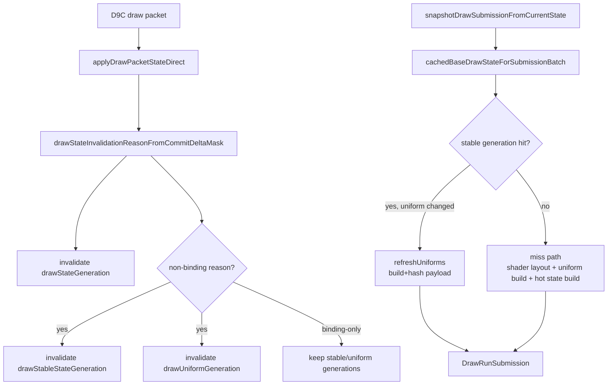
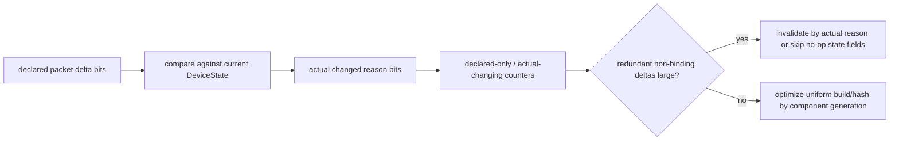

# Snapshot Cache Miss and Uniform Payload Candidate

**Question / hypothesis.** [state-churn-encode-encode-phase.25](state-churn-encode-encode-phase.25.md) named queued
draw submission and nested `snapshotDrawSubmissionFromCurrentState()` as the
largest synchronous replay owner. Is the next optimization target queue append
bookkeeping, or the D3D9 snapshot cache/uniform payload path?

**Current evidence.** Existing counters already make the snapshot side a better
candidate than generic queue bookkeeping.

| Counter | Value | Share of `d3d9_snapshot_draw_submission_cpu_ms` |
|---|---:|---:|
| `d3d9_snapshot_draw_submission_cpu_ms` | `7,696.922ms` | `100.0%` |
| `d3d9_snapshot_cache_lookup_cpu_ms` | `6,350.751ms` | `82.5%` |
| `d3d9_snapshot_cache_miss_cpu_ms` | `5,271.187ms` | `68.5%` |
| `d3d9_snapshot_cache_uniform_refresh_cpu_ms` | `2,018.013ms` | `26.2%` |
| `d3d9_snapshot_cache_miss_uniform_build_cpu_ms` | `2,413.737ms` | `31.4%` |
| `d3d9_snapshot_cache_miss_hot_build_cpu_ms` | `1,572.938ms` | `20.4%` |
| `d3d9_snapshot_cache_miss_shader_layout_cpu_ms` | `904.977ms` | `11.8%` |
| `d3d9_snapshot_uniform_build_hash_cpu_ms` | `2,649.122ms` | `34.4%` |
| `d3d9_snapshot_uniform_build_nonconst_hash_cpu_ms` | `1,433.965ms` | `18.6%` |
| `d3d9_snapshot_state_copy_cpu_ms` | `741.306ms` | `9.6%` |

Other shape counters:

| Counter | Value | Reading |
|---|---:|---|
| `d3d9_snapshot_uniform_build_calls` | `928,656` | Uniform payload is rebuilt almost per submitted draw |
| `d3d9_draw_state_cache_misses` | `499,421` | Cache misses are first-order |
| `d3d9_draw_state_cache_uniform_refreshes` | `429,235` | Even cache hits often rebuild uniforms |
| `draw_uniform_payload_appends` | `874,477` | Queue-slot uniform payload dedup rarely succeeds |
| `draw_uniform_payload_lookup_bucket_misses` | `872,798` | Payload content is usually unique within the slot |
| `d3d9_snapshot_uniform_build_vs_const_hash_bytes` | `590,145,712` | VS constant hashing scans hundreds of MiB per run |
| `d3d9_snapshot_uniform_build_vs_const_hash_full_indexed_float` | `115,665` | Some VS shaders force full constant snapshots due indexed float usage |

**Code shape.**



`applyDrawPacketStateDirect()` invalidates the cache from the packet's declared
delta mask before testing whether the new values actually differ from the
current state. That is correct for semantics, but it leaves a performance
question: if PE dirty packets contain repeated same-value texture/shader/state
bindings, the snapshot cache may be rebuilt for redundant deltas. Existing
miss-reason counters are overlap counters; they prove that texture, stream,
IB, shader, FVF/vdecl, and draw-packet deltas are common, but they do not prove
whether those deltas are value-changing.

**Interpretation.**

1. Queue-slot uniform payload lookup is not the first next bet. The payloads are
   usually genuinely unique from the slot's perspective, so a faster lookup
   would mostly make misses cheaper, not reduce `874k` appends.
2. Snapshot cache invalidation and uniform payload construction are better
   owners. They explain both the 7.70s nested snapshot time and a large part of
   the 9.93s queued submission cost.
3. The highest-risk hidden assumption is that every packet delta requires a
   stable-state/uniform cache miss. The direct applier currently lacks an
   actual-change classifier, so this is unproven.

**Next proof.** Run the narrowly scoped draw-packet actual-change diagnostic
before changing default invalidation policy. This was executed in
[state-churn-encode-encode-phase.28](state-churn-encode-encode-phase.28.md) and rejected the broad redundant
non-binding hypothesis.



Implemented counters for the next probe:

| Counter | Purpose |
|---|---|
| `draw_packet_declared_nonbinding` | Packet had texture/shader/render-state/FVF/RT/viewport/TSS/sampler/FFP/clip deltas |
| `draw_packet_actual_nonbinding` | At least one declared non-binding field actually changed current state |
| `draw_packet_redundant_nonbinding` | Declared non-binding delta but all non-binding values matched current state |
| `draw_packet_declared_uniform` / `draw_packet_actual_uniform` / `draw_packet_redundant_uniform` | Broad uniform-affecting subset: render-state, TSS/sampler, material, transform, light, clip, viewport/scissor |
| `draw_packet_redundant_texture`, `*_shader`, `*_render_state`, ... | First split if redundant non-binding is high |

Run command once the macOS session is unlocked:

```sh
bash scripts/tools/run_3dmark05_perf_probe.sh \
  --suffix draw-packet-actual-change-<timestamp> \
  --frame 50 \
  --no-gputrace \
  --no-encoder-breakdown \
  --frame-sampling \
  --probe-draw-packet-actual-change \
  --timeout 180
```

**Decision rule.**

- If redundant non-binding packet deltas are high, optimize invalidation by
  actual changed reason. This should reduce `d3d9_draw_state_cache_misses`,
  `d3d9_snapshot_cache_miss_*`, and uniform build calls without touching Metal
  encode.
- If actual non-binding deltas are high, leave invalidation policy alone and
  target component-level uniform generation/hashing instead. In that path,
  avoid rebuilding/hashing unchanged non-constant FFP payload fields when only
  VS/PS constants change.
- If full indexed VS constant hashing remains a large share after invalidation
  cleanup, investigate shader-usage proof or dirty-range hashing; do not shrink
  constants without bytecode evidence because indexed addressing requires
  conservative full snapshots.

**Related.** [state-churn-encode](index.md) ·
[state-churn-encode-encode-phase.25](state-churn-encode-encode-phase.25.md) ·
[state-churn-encode-encode-phase.26](state-churn-encode-encode-phase.26.md) ·
[state-churn-encode-encode-phase.28](state-churn-encode-encode-phase.28.md).
