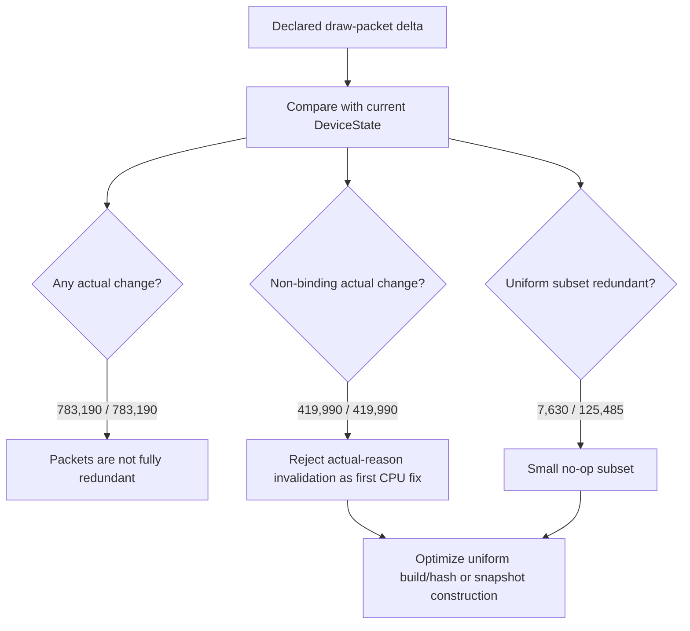

# Draw Packet Actual Change Probe

**Question / hypothesis.** [state-churn-encode-encode-phase.27](state-churn-encode-encode-phase.27.md) left one
important assumption open: `applyDrawPacketStateDirect()` invalidates snapshot
caches from the declared packet delta mask. If many non-binding deltas repeat
the current `DeviceState` value, invalidating from actual changed reason could
reduce snapshot cache misses and uniform rebuilds.

**Run.**

```sh
bash scripts/tools/run_3dmark05_perf_probe.sh \
  --suffix draw-packet-actual-change-20260612 \
  --frame 50 \
  --no-gputrace \
  --no-encoder-breakdown \
  --frame-sampling \
  --probe-draw-packet-actual-change \
  --timeout 180
```

Status: pass. `actual.png` shows a normal GT1 frame with the machine-gun muzzle
bloom visible.

**Result.**

| Counter | Value | Reading |
|---|---:|---|
| `draw_packet_actual_change_samples` | `783,190` | Packets with a declared state delta and actual-change comparison |
| `draw_packet_declared_any` | `783,190` | Every sampled packet had a declared delta |
| `draw_packet_actual_any` | `783,190` | Every sampled packet changed at least one compared field |
| `draw_packet_redundant_any` | `0` | No fully redundant state-delta packet |
| `draw_packet_declared_nonbinding` | `419,990` | Non-binding deltas are common |
| `draw_packet_actual_nonbinding` | `419,990` | Every declared non-binding delta changed current state |
| `draw_packet_redundant_nonbinding` | `0` | The main hypothesis is rejected |
| `draw_packet_declared_uniform` | `125,485` | Broad uniform-affecting subset |
| `draw_packet_actual_uniform` | `117,855` | Most broad uniform deltas changed state |
| `draw_packet_redundant_uniform` | `7,630` | Small no-op subset, not enough to explain the snapshot parent |
| `draw_packet_redundant_viewport_scissor` | `8,521` | Class-local no-op viewport/scissor deltas; many still changed another uniform class |

Snapshot and CPU shape stayed comparable to the previous replay split:

| Counter | Value |
|---|---:|
| `sampled_avg_fps` | `15.717` |
| `present_encoded` | `1,680` |
| `d3d9_snapshot_draw_submission_cpu_ms` | `7622.807ms` |
| `d3d9_snapshot_cache_lookup_cpu_ms` | `6293.019ms` |
| `d3d9_snapshot_cache_miss_cpu_ms` | `5207.400ms` |
| `d3d9_snapshot_cache_uniform_refresh_cpu_ms` | `2014.263ms` |
| `d3d9_snapshot_uniform_build_calls` | `927,937` |
| `draw_uniform_payload_appends` | `873,974` |
| `encode_draw_cpu_ms` | `16473.565ms` |
| `gpu_command_buffer_time_ms` | `5025.207ms` |
| `completion_wait_ms` | `38598.921ms` |



**Decision.** Do not prioritize changing snapshot invalidation from declared
delta mask to actual changed reason as the next broad optimization. For
3DMark05 GT1, declared non-binding deltas are not inflated by repeated
same-value packets. The open CPU owner is still the cost of building and
hashing mostly real snapshot/uniform payloads.

**Next target.** Split or reduce component-level uniform payload work:

| Candidate | Why |
|---|---|
| Component generation for uniform payloads | Avoid rebuilding/hashing unchanged non-constant FFP fields when only a small component changes |
| VS constant full-hash path | `d3d9_snapshot_uniform_build_vs_const_hash_bytes=590,255,888` and `*_full_indexed_float=115,710` remain large |
| Snapshot miss hot-build path | `d3d9_snapshot_cache_miss_hot_build_cpu_ms=1568.266ms` remains a separate named owner |
| Queue append copy path | [state-churn-encode-encode-phase.26](state-churn-encode-encode-phase.26.md) now names batch append as the largest submit child |

**Related.** [state-churn-encode](../state-churn-encode.md) ·
[state-churn-encode-encode-phase.26](state-churn-encode-encode-phase.26.md) ·
[state-churn-encode-encode-phase.27](state-churn-encode-encode-phase.27.md).
