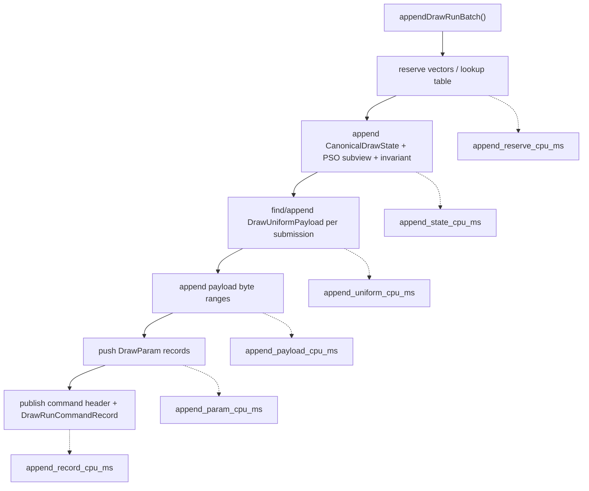
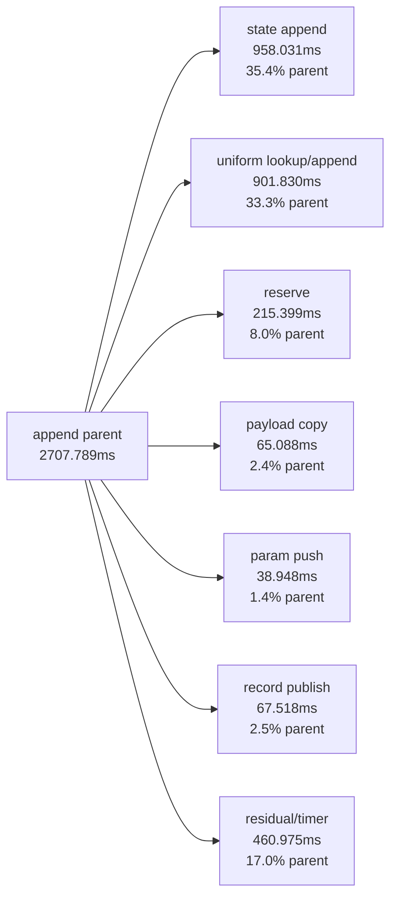

# Draw-Run Batch Append Split

> **Outdated — every artifact this leaf cites in `source:` is gone from disk.** The numbers below cannot be re-derived or re-checked. Kept as history; do not cite it as current evidence.

**Question / hypothesis.** [state-churn-encode-encode-phase.26](state-churn-encode-encode-phase.26.md) named
`submit_draw_run_batch_append_cpu_ms` as the largest `CommandQueue` submit child.
The old counter did not say whether that time was payload byte copy, vector
reservation/growth, full `CanonicalDrawState` append, uniform-payload
dedup/append, or final record publication.

**Instrumentation.**

`ChunkSlot::appendDrawRunBatch()` now splits the existing append parent with
batch-level timers only. It also reports the number of appended draw params and
payload bytes so the CPU bucket can be separated from raw byte volume.



The split intentionally avoids per-draw timers. Per-draw `steady_clock` calls
would perturb the hot path and overstate the cost being measured.

**Run.**

```sh
bash scripts/tools/run_3dmark05_perf_probe.sh \
  --suffix submit-append-split-20260613 \
  --frame 50 \
  --no-gputrace \
  --no-encoder-breakdown \
  --frame-sampling \
  --timeout 120
```

Status: pass. The wrapper used the standard 120-second no-gputrace timeout
policy. `actual.png` is a normal GT1 robot/blade/HUD frame, and the interactive
iteration confirmed muzzle flash, particle, and fog effects render normally.

**Result vs 120-second current baseline.**

Both runs encoded `1,680` presents, so the totals are comparable. The current
run completed normally; the baseline was watchdog-finalized after producing
valid artifacts.

| Counter | Baseline | Append split | Change |
|---|---:|---:|---:|
| `present_encoded` | `1,680` | `1,680` | flat |
| `draw_calls` | `1,236,327` | `1,233,840` | `-0.20%` |
| `gpu_command_buffer_time_ms` | `5190.021` | `5168.475` | flat (`-0.42%`) |
| `completion_wait_ms` | `40226.532` | `39140.174` | flat/noisy (`-2.70%`) |
| `commit_chunk_replay_cpu_ms` | `21352.888` | `21904.250` | `+2.58%` |
| `commit_chunk_queue_draw_submission_cpu_ms` | `8713.272` | `8781.440` | `+0.78%` |
| `commit_chunk_draw_batch_submit_cpu_ms` | `3628.227` | `3973.906` | `+9.53%` |
| `commit_chunk_draw_run_submit_cpu_ms` | `2140.705` | `2179.812` | `+1.83%` |
| `submit_draw_run_batch_groups` | `438,440` | `437,906` | flat |
| `submit_draw_run_batch_records` | `823,763` | `821,757` | flat |
| `submit_draw_run_batch_append_cpu_ms` | `2369.063` | `2707.789` | `+14.30%` |
| `submit_draw_run_batch_compat_scan_cpu_ms` | `566.872` | `561.021` | flat |
| `submit_draw_run_batch_binding_snapshot_cpu_ms` | `209.057` | `211.087` | flat |
| `encode_draw_cpu_ms` | `16521.072` | `17004.989` | `+2.93%` |
| `render_pass_tile_preservation_bytes` | `211,492,851,712` | `211,389,964,288` | flat |
| `gpu_command_buffer_errors` | `0` | `0` | no error |
| `draw_skipped_no_pipeline` | `0` | `0` | no skipped draw |

**Append child breakdown.**

| Child counter | Value | Reading |
|---|---:|---|
| `submit_draw_run_batch_append_state_cpu_ms` | `958.031` | Full state append + PSO subview/invariant is the largest child |
| `submit_draw_run_batch_append_uniform_cpu_ms` | `901.830` | Uniform payload lookup/append is the second largest child |
| `submit_draw_run_batch_append_reserve_cpu_ms` | `215.399` | Non-trivial but not the owner |
| `submit_draw_run_batch_append_record_cpu_ms` | `67.518` | Record publication is small |
| `submit_draw_run_batch_append_payload_cpu_ms` | `65.088` | Payload byte copy is small despite `232,541,368` bytes copied |
| `submit_draw_run_batch_append_param_cpu_ms` | `38.948` | DrawParam vector push is small |
| `submit_draw_run_batch_append_params` | `821,757` | One param per batched draw record |
| `submit_draw_run_batch_append_payload_bytes` | `232,541,368` | Raw copy volume is not the CPU owner |

The measured children sum to `2246.814ms`, or `82.98%` of the
`2707.789ms` parent. The remaining `460.975ms` is the unsplit append residual
plus timer overhead. The average batch is still only `1.877` records per group
(`821,757 / 437,906`), so the per-group state append cost is poorly amortized.



**Decision.** Accept as attribution, not as a performance win. The queue append
target is not raw payload byte copying. The first-order children are:

1. `CanonicalDrawState` copy/append width and one-state-per-group publication.
2. Per-submission uniform payload lookup/append.
3. Low draw-run batch length, which amplifies both costs.

**Next target.**

| Candidate | Reason |
|---|---|
| Remove obvious state value hops | [state-churn-encode-encode-phase.30](state-churn-encode-encode-phase.30.md) accepts this as the first CPU win |
| Compact or interned draw-run state | After the value-hop fix, avoid storing a full state for every small batch when a compact run-state key/subview is enough |
| Uniform lookup fast path | `draw_uniform_payload_lookup_last_hits=16,211`, bucket misses `872,379`, appends `874,058`; many submissions still perform the full lookup/append path |
| Consecutive uniform handle reuse inside a batch | If adjacent submissions share payload/hash, pass the known handle instead of probing the lookup table again |
| More effective batch coalescing | Larger records/group would amortize one state append and one record publication over more draws |

**Related.** [state-churn-encode](index.md) ·
[state-churn-encode-encode-phase.26](state-churn-encode-encode-phase.26.md) ·
[state-churn-encode-encode-phase.28](state-churn-encode-encode-phase.28.md) ·
[snapshot-cache-snapshot.10](../snapshot-cache/snapshot-cache-snapshot.10.md).
