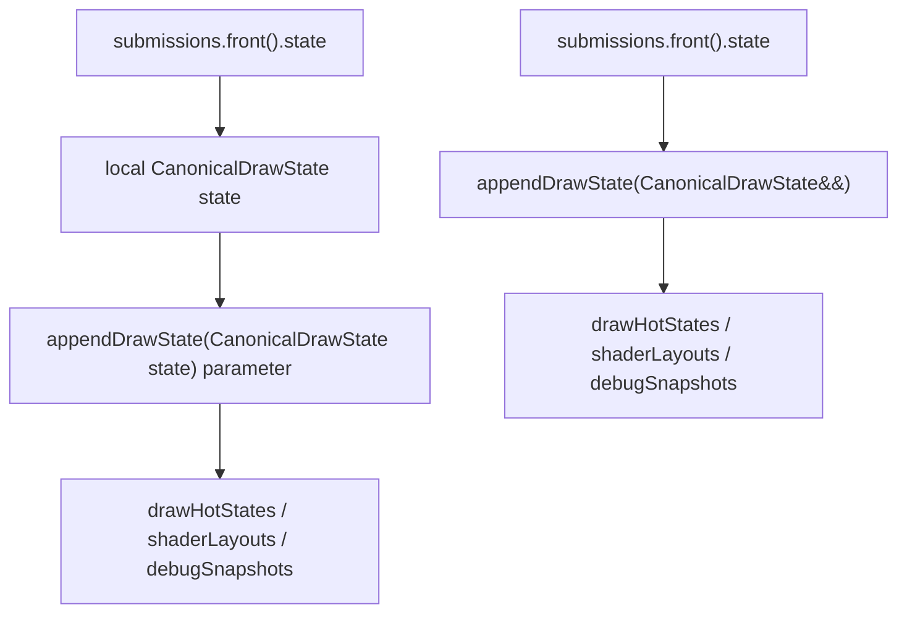
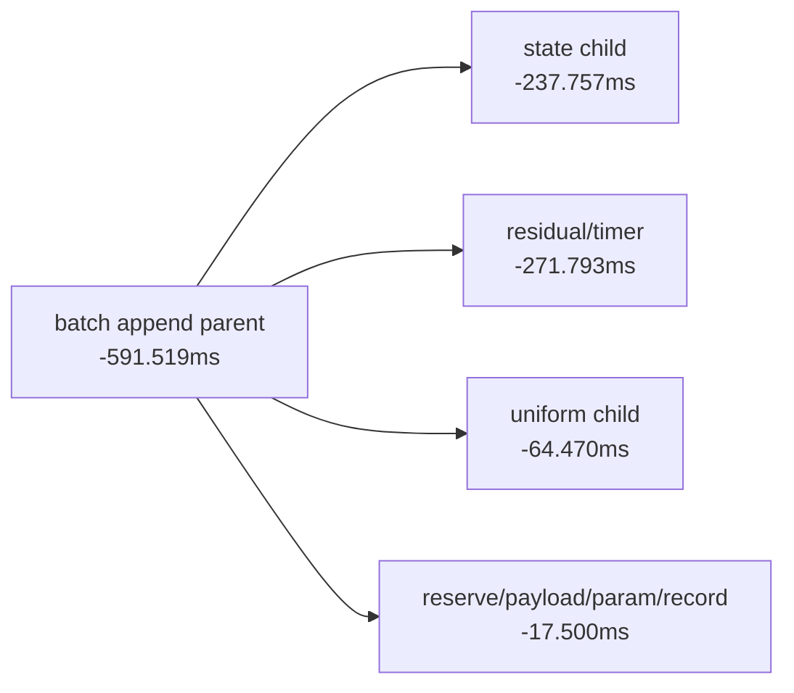

# Draw State Rvalue Append

**Question / hypothesis.** [state-churn-encode-encode-phase.29](state-churn-encode-encode-phase.29.md) showed that
`submit_draw_run_batch_append_state_cpu_ms` is the largest append child. In the
batch path, the first submission state was copied through two large
`CanonicalDrawState` value hops before the SoA vectors stored its components:



Because `CanonicalDrawState` contains large arrays (`FlatDrawStateRecord`,
`DrawShaderLayoutContext`, `DrawDebugSnapshot`), these value hops are real memory
traffic even though the code uses `std::move`.

**Implementation.**

- Change `ChunkSlot::appendDrawState()` to take `CanonicalDrawState&&`.
- In `appendDrawRunBatch()`, bind the first submission state by reference and
  move it directly into `appendDrawState()` after building the PSO subview and
  invariant.
- Leave per-draw uniform payloads, payload arena ranges, and `DrawParam` records
  unchanged.

**Run.**

```sh
bash scripts/tools/run_3dmark05_perf_probe.sh \
  --suffix append-state-rvalue-20260613 \
  --frame 50 \
  --no-gputrace \
  --no-encoder-breakdown \
  --frame-sampling \
  --timeout 120
```

Status: pass. The wrapper finalized the run by timeout after valid artifacts
were produced (`returncode=143`, `timed_out=true`), which is acceptable for this
probe under the 3DMark05 final-frame timeout policy. `actual.png` is a normal
GT1 robot/HUD frame and rejects black/yellow geometry regressions for this
change.

**Result vs append-split baseline.**

Both runs encoded `1,680` presents and kept draw/pass counts within drift.

| Counter | Append split | Rvalue append | Change |
|---|---:|---:|---:|
| `present_encoded` | `1,680` | `1,680` | flat |
| `draw_calls` | `1,233,840` | `1,235,942` | `+0.17%` |
| `gpu_command_buffer_time_ms` | `5168.475` | `5176.318` | flat (`+0.15%`) |
| `completion_wait_ms` | `39140.174` | `39725.466` | flat/noisy (`+1.50%`) |
| `commit_chunk_replay_cpu_ms` | `21904.250` | `21265.459` | `-2.92%` |
| `commit_chunk_draw_batch_submit_cpu_ms` | `3973.906` | `3361.438` | `-15.41%` |
| `submit_draw_run_batch_append_cpu_ms` | `2707.789` | `2116.270` | `-21.85%` |
| `submit_draw_run_batch_append_state_cpu_ms` | `958.031` | `720.274` | `-24.82%` |
| `submit_draw_run_batch_append_uniform_cpu_ms` | `901.830` | `837.360` | `-7.15%` |
| `submit_draw_run_batch_append_reserve_cpu_ms` | `215.399` | `208.896` | `-3.02%` |
| `submit_draw_run_batch_append_payload_cpu_ms` | `65.088` | `62.687` | `-3.69%` |
| `submit_draw_run_batch_append_param_cpu_ms` | `38.948` | `36.880` | `-5.31%` |
| `submit_draw_run_batch_append_record_cpu_ms` | `67.518` | `60.991` | `-9.67%` |
| `submit_draw_run_batch_records` | `821,757` | `823,446` | flat (`+0.21%`) |
| `submit_draw_run_batch_groups` | `437,906` | `438,961` | flat (`+0.24%`) |
| `draw_uniform_payload_appends` | `874,058` | `875,739` | flat (`+0.19%`) |
| `gpu_command_buffer_errors` | `0` | `0` | no error |
| `draw_skipped_no_pipeline` | `0` | `0` | no skipped draw |

The measured append children now sum to `1927.088ms`, or `91.06%` of the
`2116.270ms` parent. The residual/timer bucket dropped from `460.975ms` to
`189.182ms`, which is consistent with removing broad unmeasured value-copy work
around the state append child.



**Decision.** Accept as a CPU win. This is not a GPU bottleneck fix:
`gpu_command_buffer_time_ms`, render-pass split counts, and tile-preservation
bytes remain flat. It does, however, remove a real CPU-side copy tax from the
draw submission path and validates that [state-churn-encode-encode-phase.29](state-churn-encode-encode-phase.29.md)
correctly identified state append as an actionable child.

**Next target.**

| Candidate | Reason |
|---|---|
| Split remaining state child | `append_state` is still `720.274ms`; separate PSO subview/invariant from SoA component pushes before designing a compact state |
| Compact or interned run state | The batch still stores one full state for only `1.876` records/group |
| Uniform append path | `append_uniform` is now the largest child (`837.360ms`), while payloads are still mostly unique (`875,739` appends) |
| Batch coalescing | Larger records/group would amortize one state append and one uniform loop over more draws |

**Related.** [state-churn-encode](../state-churn-encode.md) ·
[state-churn-encode-encode-phase.29](state-churn-encode-encode-phase.29.md) ·
[snapshot-cache-snapshot.10](../snapshot-cache/snapshot-cache-snapshot.10.md).
