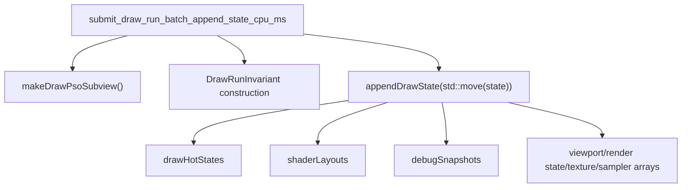
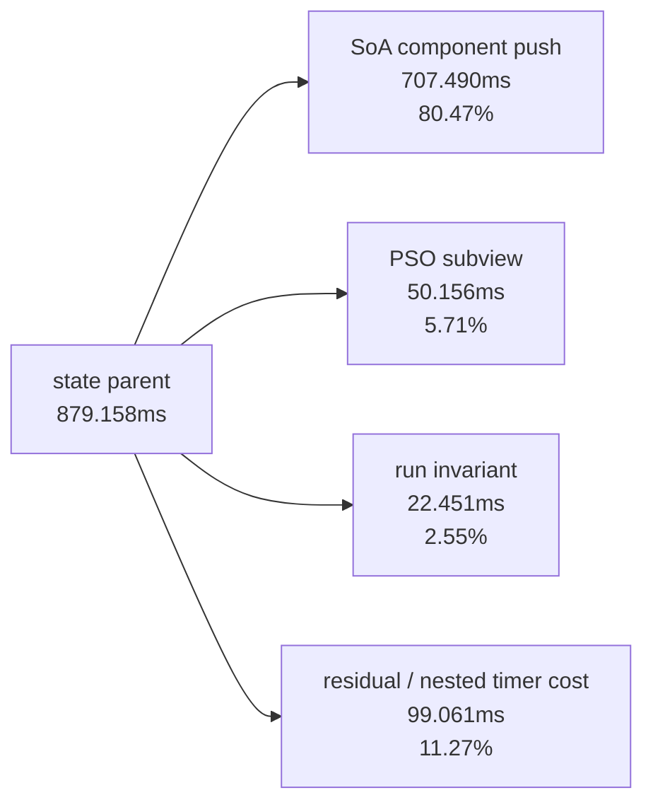

# Draw State Append Inner Split

> **Outdated — every artifact this leaf cites in `source:` is gone from disk.** The numbers below cannot be re-derived or re-checked. Kept as history; do not cite it as current evidence.

**Question / hypothesis.** [state-churn-encode-encode-phase.30](state-churn-encode-encode-phase.30.md) cut the broad
`submit_draw_run_batch_append_state_cpu_ms` child from `958.031ms` to
`720.274ms`, but the remaining bucket still mixed three different activities:
building the PSO subview, building the run invariant, and pushing the full
`CanonicalDrawState` components into the chunk-slot SoA vectors. Before a compact
state design, split that bucket without changing draw batching semantics.



**Implementation.**

- Add child timers:
  - `submit_draw_run_batch_append_state_pso_cpu_ms`
  - `submit_draw_run_batch_append_state_invariant_cpu_ms`
  - `submit_draw_run_batch_append_state_soa_cpu_ms`
- Keep the existing parent timer so child coverage and residual timer overhead
  stay visible.
- Leave the batch record shape, payload arena, uniform payload lookup, and
  `DrawBindingSnapshot` path unchanged.

**Run.**

```sh
bash scripts/tools/run_3dmark05_perf_probe.sh \
  --suffix append-state-split-20260613 \
  --frame 50 \
  --no-gputrace \
  --no-encoder-breakdown \
  --frame-sampling \
  --timeout 120
```

Status: pass. The wrapper finalized the run by timeout after valid artifacts
were produced (`returncode=143`, `timed_out=true`). This is the expected
3DMark05 final-frame policy for no-gputrace scouts. The user had already
confirmed muzzle flash, particles, and fog were rendering normally in the
current iteration; this run's `actual.png` is a normal GT1 robot/HUD frame
rather than a black/yellow/corrupt frame, but it is not a muzzle-flash timing
sample.

**Result vs rvalue-append baseline.**

The baseline encoded `1,680` presents; this split-counter run encoded `1,740`
presents. Use raw totals for the new child attribution, but compare parent CPU
movement per present because the run length drifted.

| Counter | Rvalue append | Inner split | Raw change |
|---|---:|---:|---:|
| `present_encoded` | `1,680` | `1,740` | `+3.57%` |
| `draw_calls` | `1,235,942` | `1,274,387` | `+3.11%` |
| `gpu_command_buffer_time_ms` | `5176.318` | `5199.564` | `+0.45%` |
| `completion_wait_ms` | `39725.466` | `40407.710` | `+1.72%` |
| `commit_chunk_replay_cpu_ms` | `21265.459` | `21554.260` | `+1.36%` |
| `commit_chunk_draw_batch_submit_cpu_ms` | `3361.438` | `3546.217` | `+5.50%` |
| `submit_draw_run_batch_append_cpu_ms` | `2116.270` | `2291.459` | `+8.28%` |
| `submit_draw_run_batch_append_state_cpu_ms` | `720.274` | `879.158` | `+22.06%` |
| `submit_draw_run_batch_append_uniform_cpu_ms` | `837.360` | `845.857` | `+1.01%` |
| `submit_draw_run_batch_append_reserve_cpu_ms` | `208.896` | `211.206` | `+1.11%` |
| `submit_draw_run_batch_append_payload_cpu_ms` | `62.687` | `64.829` | `+3.42%` |
| `submit_draw_run_batch_append_param_cpu_ms` | `36.880` | `35.957` | `-2.50%` |
| `submit_draw_run_batch_append_record_cpu_ms` | `60.991` | `60.541` | `-0.74%` |

Per-present normalization shows the split timers are not a CPU win by
themselves: `submit_draw_run_batch_append_state_cpu_ms/present` moves
`0.428735 -> 0.505263ms` (`+17.85%`). This is expected measurement overhead
from three extra nested timers in a hot path, not evidence that the semantic
path regressed. GPU time per present is flat/noisy in the opposite direction
(`3.081142 -> 2.988255ms`, `-3.01%`), so this run should not be read as a GPU
change either.

**Inner-state attribution.**

| Child | Time | Share of state parent |
|---|---:|---:|
| `submit_draw_run_batch_append_state_pso_cpu_ms` | `50.156ms` | `5.71%` |
| `submit_draw_run_batch_append_state_invariant_cpu_ms` | `22.451ms` | `2.55%` |
| `submit_draw_run_batch_append_state_soa_cpu_ms` | `707.490ms` | `80.47%` |
| named child sum | `780.097ms` | `88.73%` |
| residual / timer overhead | `99.061ms` | `11.27%` |



**Decision.** Accept as attribution, not as an optimization. The remaining
state-append cost is not mainly PSO subview construction or invariant hashing;
it is the full `appendDrawState()` SoA push of `CanonicalDrawState` components.
The next implementation should target the stored state shape itself:
compact/intern stable state components, avoid copying cold/debug snapshots when
not needed by replay/debug surfaces, or raise records/group so one stored state
is amortized across more draws.

**Next target.**

| Candidate | Reason |
|---|---|
| Compact run state | The hot child is `appendDrawState()` SoA storage, not PSO/invariant work |
| Component interning | Texture/sampler/shader-layout/debug components may repeat across groups even when the run state record is unique |
| Uniform append path | `append_uniform=845.857ms` remains comparable to state SoA and should be split/reduced independently |
| Coalescing / records per group | This run still has only `848,093 / 451,475 = 1.878` records/group, so one state append is poorly amortized |

**Related.** [state-churn-encode](index.md) ·
[state-churn-encode-encode-phase.29](state-churn-encode-encode-phase.29.md) ·
[state-churn-encode-encode-phase.30](state-churn-encode-encode-phase.30.md).
