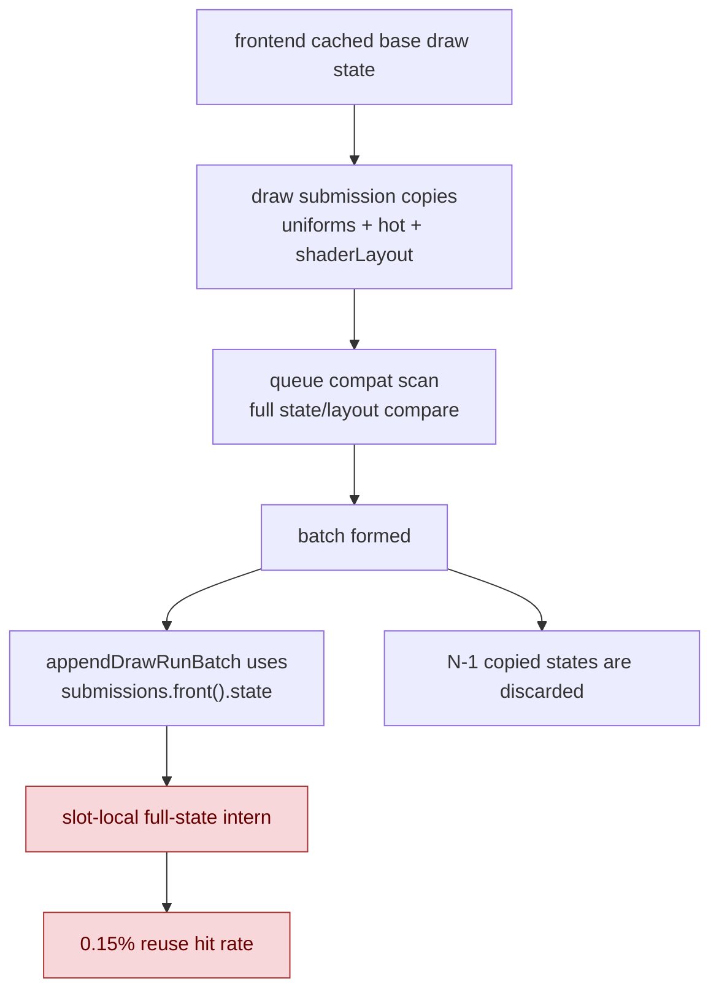
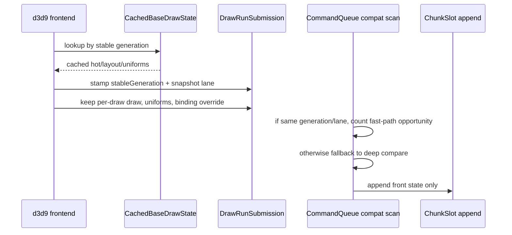

# Submission Generation Fast-Path Opportunity

> **Outdated — every artifact this leaf cites in `source:` is gone from disk.** The numbers below cannot be re-derived or re-checked. Kept as history; do not cite it as current evidence.

**Question / hypothesis.** [state-churn-encode-encode-phase.31](state-churn-encode-encode-phase.31.md) proved that
the remaining state child is mostly `appendDrawState()` SoA storage. The first
implementation bet tried to intern complete stored states inside `ChunkSlot`:
if the same `CanonicalDrawState` reached `appendDrawRunBatch()` again, the batch
record could reuse an existing state index rather than pushing another hot
record, shader layout, and debug snapshot.

**Result: reject slot-local full-state interning as a default path.**

The probe was run with the normal 120s no-gputrace scout policy:

```sh
bash scripts/tools/run_3dmark05_perf_probe.sh \
  --suffix append-state-intern-20260613 \
  --frame 50 \
  --no-gputrace \
  --no-encoder-breakdown \
  --frame-sampling \
  --timeout 120
```

Status: pass. `actual.png` is a normal GT1 robot/HUD frame, not a
black/yellow/corrupt frame. The run returned cleanly (`timed_out=false`,
`returncode=0`), so this is a valid no-gputrace CPU scout.

| Counter | Phase 31 split | Slot-state intern | Change |
|---|---:|---:|---:|
| `present_encoded` | `1,740` | `1,680` | `-3.45%` |
| `draw_calls` | `1,274,387` | `1,237,763` | `-2.87%` |
| `gpu_command_buffer_time_ms` | `5199.564` | `5132.943` | `-1.28%` |
| `completion_wait_ms` | `40407.710` | `39139.954` | `-3.14%` |
| `commit_chunk_replay_cpu_ms` | `21554.260` | `21290.481` | `-1.22%` |
| `commit_chunk_draw_batch_submit_cpu_ms` | `3546.217` | `3687.599` | `+3.99%` |
| `submit_draw_run_batch_append_cpu_ms` | `2291.459` | `2453.258` | `+7.06%` |
| `submit_draw_run_batch_append_state_cpu_ms` | `879.158` | `1131.030` | `+28.65%` |
| `submit_draw_run_batch_append_state_soa_cpu_ms` | `707.490` | `961.947` | `+35.97%` |
| state reuse hits | n/a | `663` | n/a |
| state reuse misses | n/a | `438,801` | n/a |
| state reuse probes | n/a | `172,649` | n/a |

The hit rate was only `663 / 439,464 = 0.150866%`. That is far too low to pay
for a state fingerprint, bucket probe, and equality fallback in the hot path.
The attempted code was removed; keep this run as negative evidence.



**Why the rejected path was the wrong layer.**

The waste happens before the chunk-slot append:

1. `Device::snapshotDrawSubmissionFromCurrentState()` copies
   `cached.uniforms`, `cached.hot`, and `cached.shaderLayout` into every
   `DrawRunSubmission`, even on cache hits.
2. `CommandQueue::submitDrawRunBatch()` scans adjacent submissions with
   `drawRunSubmissionStatesCompatibleForBatch()`, which reads large
   `FlatStateSet` arrays and compares shader-layout fields.
3. `ChunkSlot::appendDrawRunBatch()` stores only `submissions.front().state`.
   The other copied states were useful only for compatibility/resource work and
   are then discarded.

That means complete-state interning at the slot is late: the CPU has already
paid most of the copy/compare cost, and exact reuse across groups is rare.

**Accepted critique: carry frontend generation knowledge downstream.**

`cachedBaseDrawStateForSubmissionBatch()` already knows when the stable draw
state is unchanged through `drawStableStateGeneration_`. If the same
binding-agnostic snapshot lane and stable generation produced two adjacent
submissions, then their batch-relevant hot/layout fields should be compatible.
Uniform generation may change, but the batch compatibility key intentionally
does not compare constant hashes. Extra stream stride refreshes live in
`shaderLayout.vertexDecl.streams`, which
`shaderLayoutsCompatibleForDrawRunBatch()` also does not compare.

The right next step is not another slot-local interner. It is an observation
counter that proves how often the queue sees adjacent submissions with the same
stable generation and lane, and how often the existing deep comparison would
also return compatible.



**Opportunity classes.**

| ID | Verdict | Notes |
|---|---|---|
| F1 | highest-value next proof | Stamp submissions with stable generation and snapshot lane. First add counters: adjacent same generation/lane, same-generation deep-compatible, same-generation deep-incompatible, and group-front reuse opportunity. Only after the ratio is high should compat scan use the generation fast path. |
| F2 | low-risk microfix candidate | In `queueDraw*Submission()`, `emplace_back()` then fill in place to remove the temporary `DrawRunSubmission` zero-init + move copy. Hoist `pendingDrawSubmissions` storage out of per-chunk local allocation if the replay context can own a scratch vector safely. |
| F3 | structural hot-path cleanup | `ShaderBytecode` is a value-owned `std::vector<u8>` inside `ShaderRef`, and `VertexDeclSnapshot.streams` carries `shared_ptr<Buffer>`. That can introduce heap copies, bytecode equality scans, and atomic refcount traffic. Replace with interned bytecode/registry handles only after encoder fallback users of `vertexDecl.streams[*].buffer->bytes()` are audited. |
| F4 | storage-width reduction candidate | `FlatStateSet<64>` sampler/TSS arrays and `FlatStateSet<256>` render states use ID-space capacity rather than measured active counts. Add max-count histograms and audit overflow semantics before splitting "D3D9 ID max" from "stored flat-set capacity". |
| F5 | compact-state follow-up | `FlatDrawStateRecord` duplicates key and top-level stream/texture/attachment fields, and the binding-agnostic batch lane zeroes stream/IB fields in both places. A compact storage form should come after an encoder-read audit. |
| F6 | correctness/perf hygiene | `submitDrawRunBatch()` is under `DXMT_DEBUG_NO_HEAP_ALLOC_SCOPE` but creates a local `std::vector<DrawBindingSnapshot>` and reserves per batch. Move this to queue-owned scratch storage or prove why the no-heap guard is not compiled/armed for that path. |

**Safety caveats for F1.**

- The fast path must include a snapshot-lane tag. `renderTraceEnabled()` uses a
  different path and should keep the existing deep compare or a separate proof.
- Per-draw binding overrides and dynamic backing snapshots still have to be
  produced per draw. Binding-agnostic `hot` clears stream/IB fields, but actual
  stream/IB data is carried by `DrawBindingOverride` and
  `DrawBindingSnapshot`.
- Resource marking can avoid repeated marking for the shared state handle only
  after payload/snapshot resources remain marked per draw, or after bulk chunk
  marking proves those resources are already pinned for the sequence.
- Debug snapshots still depend on draw arguments. The slot stores only the front
  state, but diagnostics that rely on per-draw state/debug fields must be
  checked before omitting N-1 state population.

**Decision.** The critique is useful and changes the next step. The rejected
slot-local interning result should not discourage state-width work; it says the
first-order waste is upstream value traffic and deep compatibility comparison.
The next non-mutating implementation should add generation/lane opportunity
counters before changing batching behavior.

**Related.** [state-churn-encode](index.md) ·
[state-churn-encode-encode-phase.29](state-churn-encode-encode-phase.29.md) ·
[state-churn-encode-encode-phase.30](state-churn-encode-encode-phase.30.md) ·
[state-churn-encode-encode-phase.31](state-churn-encode-encode-phase.31.md).
