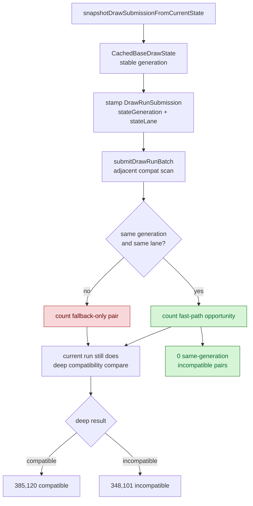
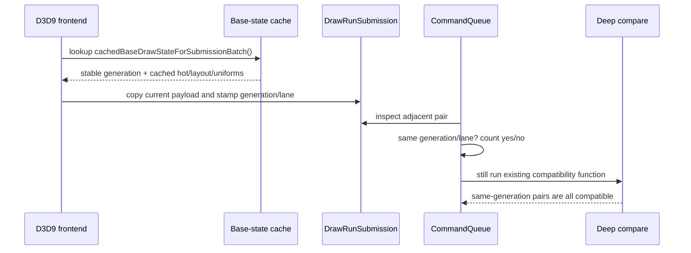

# Submission Generation Compatibility Proof

**Question / hypothesis.** [[state-churn-encode-encode-phase.32]] rejected
slot-local full-state interning because it acted too late. The useful upstream
fact is that the frontend already knows when a stable draw-state cache lane is
unchanged. If two adjacent `DrawRunSubmission` records have the same stable
state generation and the same snapshot lane, then the existing deep
compatibility comparison should report them compatible.

**Result: accept the generation/lane proof for a guarded compat fast path.**

The probe was non-mutating for batching behavior. It stamped each submission
with `stateGeneration` and `stateLane`, but still executed the original
`drawRunSubmissionStatesCompatibleForBatch()` deep comparison and counted
agreement:

```sh
bash scripts/tools/run_3dmark05_perf_probe.sh \
  --suffix submission-generation-counters-20260613 \
  --frame 50 \
  --no-gputrace \
  --no-encoder-breakdown \
  --frame-sampling \
  --timeout 120
```

Status: pass. The run returned cleanly, produced `1680` presents, and
`actual.png` is a normal GT1 frame with robot/HUD/beam rendering, not a
black/yellow/corrupt frame. The HUD sample shows about `19 FPS`; sampled frame
average was `15.825 FPS`.

| Counter | Value |
|---|---:|
| `present_encoded` | `1,680` |
| `draw_calls` | `1,237,333` |
| `commit_chunk_draw_submission_batch_records` | `824,642` |
| `commit_chunk_draw_submission_batch_submits` | `91,421` |
| `commit_chunk_draw_submission_batch_max_records` | `33` |
| `submit_draw_run_batch_submission_adjacent_pairs` | `733,221` |
| `submit_draw_run_batch_submission_adjacent_same_generation_lane` | `385,120` |
| `submit_draw_run_batch_compat_pairs` | `733,221` |
| `submit_draw_run_batch_compat_compatible` | `385,120` |
| `submit_draw_run_batch_compat_incompatible` | `348,101` |
| `submit_draw_run_batch_compat_same_generation_lane` | `385,120` |
| `submit_draw_run_batch_compat_same_generation_lane_compatible` | `385,120` |
| `submit_draw_run_batch_compat_same_generation_lane_incompatible` | `0` |
| `submit_draw_run_batch_compat_scan_cpu_ms` | `557.621` |
| `submit_draw_run_batch_append_state_soa_cpu_ms` | `693.699` |
| `d3d9_snapshot_state_copy_cpu_ms` | `714.380` |
| `commit_chunk_queue_draw_submission_cpu_ms` | `8770.423` |

Derived rates:

| Metric | Value |
|---|---:|
| Adjacent same generation/lane share | `385120 / 733221 = 52.524409%` |
| Same generation/lane compatibility | `385120 / 385120 = 100.000000%` |
| Same generation/lane incompatible cases | `0` |
| Observed compatible pairs predicted by same generation/lane | `385120 / 385120 = 100.000000%` |





**Interpretation.**

The safe first implementation is a pure compat-scan fast path:

1. If `drawRunSubmissionSameStateGenerationLane(a, b)` is true, return
   compatible immediately.
2. Otherwise, keep the existing deep compare fallback.
3. Keep a debug/probe counter for same-generation incompatible cases until
   enough additional workloads prove it remains zero.

That fast path targets only the `557.621ms` compat-scan bucket, so its direct
upper bound is smaller than the whole `8770.423ms` queued-submission bucket.
However, the same counter also sizes a larger upstream opportunity: `385,120`
non-front submissions in the same queue batches carry a state that should not
need to be copied or deep-compared before only the group front is stored. A
future copy-elision design can use the same stamp, but it must preserve
per-draw uniforms, binding overrides, dynamic backing snapshots, and resource
marking.

**Boundaries.**

- The proof is scoped to adjacent pairs inside each `submitDrawRunBatch()` span;
  it does not count cross-batch adjacency.
- The lane tag is part of the identity. Binding-agnostic, full-no-index, and
  full-with-index snapshots must not be merged without their own proof.
- The current counter run did not change batching behavior. Any follow-up
  fast path needs another 120s visual smoke and counter check.
- Resource marking is not yet optimized. Even if shared state marking can be
  collapsed to the group front, per-draw payload/snapshot resources still need
  a separate lifetime proof.

**Decision.** The critique is useful and now measured. Implement the guarded
generation/lane compat fast path next, then remeasure. Treat F2
(`emplace_back()` in-place queue fill and persistent replay scratch) as the
parallel low-risk CPU cleanup because the generation fast path alone cannot
explain the full queued-submission cost.

**Related.** [[state-churn-encode]] ·
[[state-churn-encode-encode-phase.31]] ·
[[state-churn-encode-encode-phase.32]].
