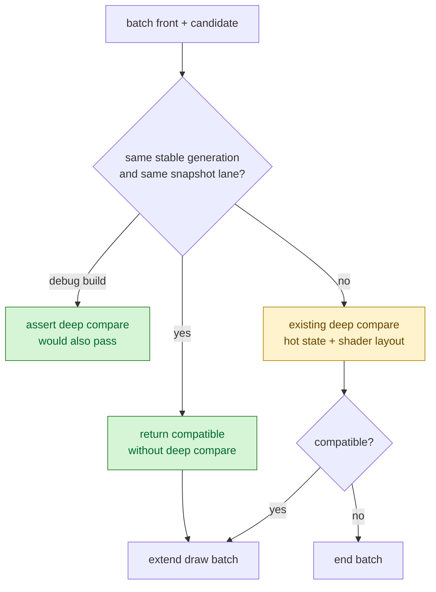
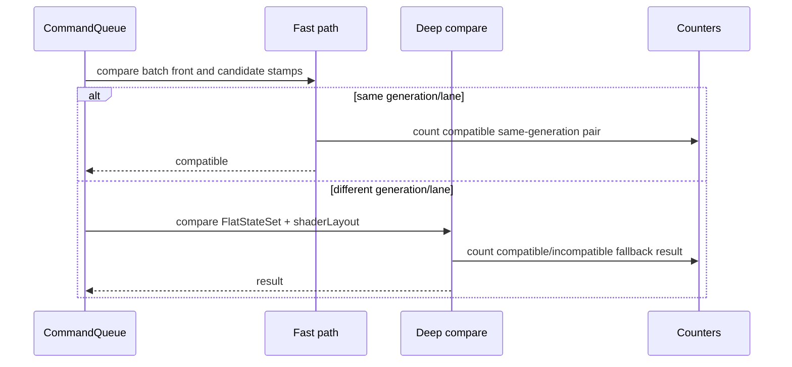

# Submission Generation Compat Fast Path

**Question / hypothesis.** [state-churn-encode-encode-phase.33](state-churn-encode-encode-phase.33.md) proved that
GT1 adjacent submissions with the same stable state generation and snapshot
lane are always compatible by the existing deep comparison. The next step is to
use that stamp in `submitDrawRunBatch()` and skip the deep
`FlatStateSet`/shader-layout comparison for those pairs.

**Result: accept as a CPU win.** The fast path removes the compat-scan bucket
without changing draw batching semantics or the visible smoke frame.

Implementation:

- If `drawRunSubmissionSameStateGenerationLane(a, b)` is true,
  `drawSubmissionStatesCompatible()` records a compatible pair and returns true
  immediately.
- Otherwise, it falls back to the existing
  `drawRunSubmissionStatesCompatibleForBatch()` deep comparison.
- Debug builds still assert that same-generation/lane pairs match the deep
  comparison.

```sh
bash scripts/tools/run_3dmark05_perf_probe.sh \
  --suffix submission-generation-fastpath-20260613 \
  --frame 50 \
  --no-gputrace \
  --no-encoder-breakdown \
  --frame-sampling \
  --timeout 120
```

Status: pass. The run timed out through the normal wrapper policy after useful
artifacts were written, produced `1740` presents, and `actual.png` is a normal
GT1 robot/HUD frame with the machine-gun muzzle flash/bloom visible.

| Counter | Proof run | Fast path | Change |
|---|---:|---:|---:|
| `present_encoded` | `1,680` | `1,740` | `+3.57%` |
| `draw_calls` | `1,237,333` | `1,274,007` | `+2.96%` |
| `submit_draw_run_batch_compat_pairs` | `733,221` | `754,059` | `+2.84%` |
| `submit_draw_run_batch_compat_same_generation_lane` | `385,120` | `396,738` | `+3.02%` |
| `submit_draw_run_batch_compat_same_generation_lane_incompatible` | `0` | `0` | `0` |
| `submit_draw_run_batch_compat_scan_cpu_ms` | `557.621` | `44.923` | `-91.94%` |
| `commit_chunk_draw_batch_submit_cpu_ms` | `3491.771` | `3070.200` | `-12.07%` |
| `commit_chunk_queue_draw_submission_cpu_ms` | `8770.423` | `8873.818` | `+1.18%` |
| `d3d9_snapshot_draw_submission_cpu_ms` | `6500.007` | `6586.928` | `+1.34%` |
| `submit_draw_run_batch_append_state_soa_cpu_ms` | `693.699` | `729.289` | `+5.13%` |

The proof run and fast-path run covered different present/draw counts, so the
per-present view is the cleaner CPU read:

| Metric | Proof run | Fast path | Change |
|---|---:|---:|---:|
| `submit_draw_run_batch_compat_scan_cpu_ms / present` | `0.331917` | `0.025818` | `-92.22%` |
| `commit_chunk_draw_batch_submit_cpu_ms / present` | `2.078435` | `1.764483` | `-15.10%` |
| `commit_chunk_queue_draw_submission_cpu_ms / present` | `5.220490` | `5.099895` | `-2.31%` |
| `d3d9_snapshot_draw_submission_cpu_ms / present` | `3.869052` | `3.785591` | `-2.16%` |
| `submit_draw_run_batch_append_state_soa_cpu_ms / present` | `0.412916` | `0.419132` | `+1.51%` |





**Interpretation.**

This removes the measured compat-scan waste. It does not solve the larger
queued-submission bucket because that bucket is dominated by earlier
`DrawRunSubmission` construction, state/layout copy, snapshot work, and
append/uniform storage. The next useful CPU work remains:

| Candidate | Reason |
|---|---|
| F2 in-place `emplace_back()` queue fill | Removes one temporary `DrawRunSubmission` move/copy per queued draw before the batch even reaches `CommandQueue`. |
| Persistent replay scratch vector | Removes per-chunk allocation/page-touch churn for `pendingDrawSubmissions`. |
| F1 copy elision for N-1 same-generation submissions | The same stamp identifies `396,738` non-front compatible pairs; copy elision needs a stronger lifetime/resource-marking design than the compat fast path. |
| Shader/layout interning | Still required to remove owned shader bytecode/vector and `shared_ptr` traffic from the hot state shape. |

**Decision.** Keep the fast path. It is a small, targeted CPU win that clears
the compat-scan sub-bucket and validates the generation/lane stamp as a useful
upstream identity. Do not treat it as the final answer to the queue path; the
dominant remaining work is submission construction and state width.

**Related.** [state-churn-encode](../state-churn-encode.md) ·
[state-churn-encode-encode-phase.32](state-churn-encode-encode-phase.32.md) ·
[state-churn-encode-encode-phase.33](state-churn-encode-encode-phase.33.md).
