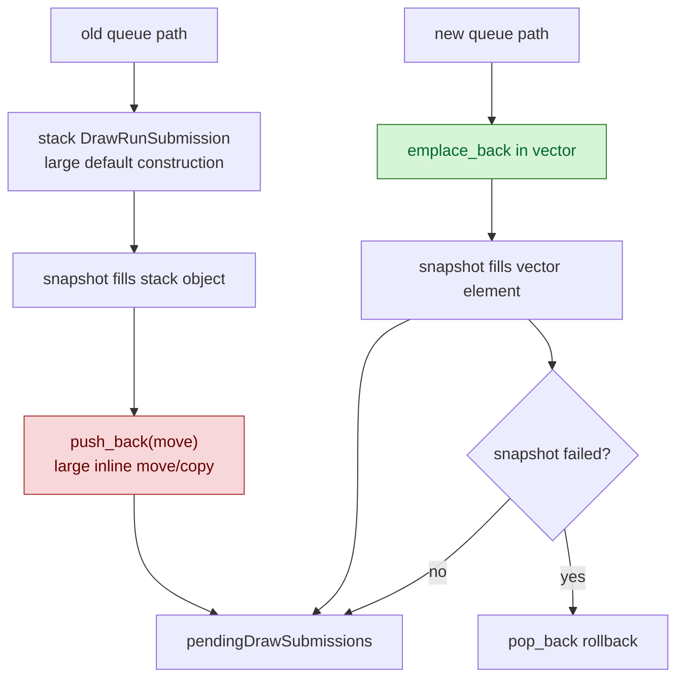

# In-Place Queued Submission Fill

> **Outdated — every artifact this leaf cites in `source:` is gone from disk.** The numbers below cannot be re-derived or re-checked. Kept as history; do not cite it as current evidence.

**Question / hypothesis.** F2 from [state-churn-encode-encode-phase.32](state-churn-encode-encode-phase.32.md)
identified a direct value-traffic waste in `queueDraw*Submission()`:
construct a large local `DrawRunSubmission`, fill it, then move it into
`pendingDrawSubmissions`. Replacing that with `emplace_back()` and filling the
vector element in place should remove one large move/copy per queued draw.

**Result: accept as a small CPU win.** The change is correct and removes the
extra value hop, but the measured run-level effect is modest. The larger queue
residual is still snapshot/cache lookup and downstream append/state width.

Implementation:

- `queueDrawPrimitiveSubmission()` now calls `submissions.emplace_back()` and
  fills the returned reference.
- `queueDrawIndexedPrimitiveSubmission()` does the same.
- If `snapshotDrawSubmissionFromCurrentState()` fails after the emplace, the
  partially filled element is removed with `pop_back()` before returning.

```sh
bash scripts/tools/run_3dmark05_perf_probe.sh \
  --suffix submission-emplace-20260613 \
  --frame 50 \
  --no-gputrace \
  --no-encoder-breakdown \
  --frame-sampling \
  --timeout 120
```

Status: pass. The run produced the same `1740` presents as the fast-path
baseline, and `actual.png` is a normal GT1 frame with machine-gun muzzle
flash/bloom visible.

| Counter | Fast-path baseline | In-place fill | Change |
|---|---:|---:|---:|
| `present_encoded` | `1,740` | `1,740` | `0.00%` |
| `draw_calls` | `1,274,007` | `1,275,373` | `+0.11%` |
| `commit_chunk_draw_submission_batch_records` | `848,052` | `848,791` | `+0.09%` |
| `commit_chunk_queue_draw_submission_cpu_ms` | `8873.818` | `8820.641` | `-0.60%` |
| `d3d9_snapshot_draw_submission_cpu_ms` | `6586.928` | `6626.766` | `+0.60%` |
| `commit_chunk_draw_batch_submit_cpu_ms` | `3070.200` | `3047.484` | `-0.74%` |
| `submit_draw_run_batch_append_cpu_ms` | `2317.123` | `2302.004` | `-0.65%` |
| `submit_draw_run_batch_append_state_soa_cpu_ms` | `729.289` | `716.580` | `-1.74%` |

The useful derived read is queue-submission residual after subtracting the
nested snapshot timer:

| Metric | Fast-path baseline | In-place fill | Change |
|---|---:|---:|---:|
| `queue_submission - snapshot` | `2286.890ms` | `2193.875ms` | `-93.015ms` |
| residual / present | `1.314305ms` | `1.260848ms` | `-4.07%` |
| total queue submission / present | `5.099895ms` | `5.069334ms` | `-0.60%` |



**Interpretation.**

The hypothesis was directionally right but not first-order. Removing the
temporary move reduces the queue residual by about `93ms` over this 120s scout,
which is useful but far smaller than the multi-second queue/snapshot buckets.
That means the queue path is not mainly paying for this final vector move.

The next F2 branch, persistent replay scratch for `pendingDrawSubmissions`, is
still plausible but should be measured separately. It targets allocation and
capacity churn, not the per-draw state copy itself. The larger remaining owners
are still:

| Owner | Evidence |
|---|---|
| Snapshot/cache lookup | `d3d9_snapshot_draw_submission_cpu_ms=6626.766`, `d3d9_snapshot_cache_lookup_cpu_ms=5268.830` in the in-place run. |
| State/layout copy width | `d3d9_snapshot_state_copy_cpu_ms=718.795` remains after removing the vector move. |
| Queue append/state storage | `submit_draw_run_batch_append_cpu_ms=2302.004`, `append_state_soa=716.580`. |
| Submission residual | `queue_submission - snapshot=2193.875ms` still remains after in-place fill. |

**Decision.** Keep the in-place fill because it is simpler and removes real
unnecessary value traffic. Do not expect it to move FPS by itself. Continue with
either persistent replay scratch as an isolated F2 follow-up or the broader F1
copy-elision/state-width work.

**Related.** [state-churn-encode](index.md) ·
[state-churn-encode-encode-phase.32](state-churn-encode-encode-phase.32.md) ·
[state-churn-encode-encode-phase.34](state-churn-encode-encode-phase.34.md).
