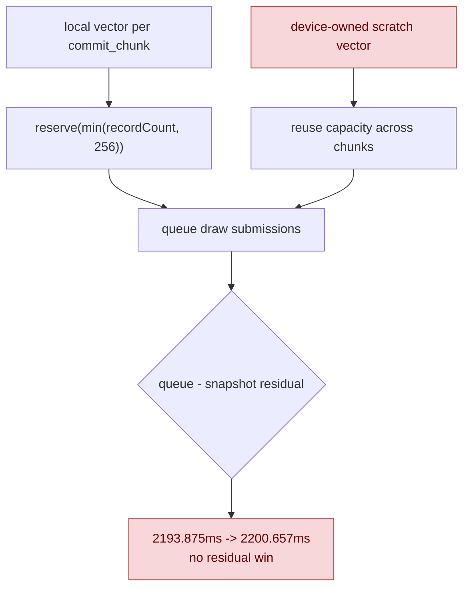

# Persistent Pending Submission Scratch

**Question / hypothesis.** [state-churn-encode-encode-phase.35](state-churn-encode-encode-phase.35.md) removed the
per-draw temporary `DrawRunSubmission` move. The remaining F2 allocation
hypothesis was that `dxmt9c_device_commit_chunk()` creates and reserves a local
`pendingDrawSubmissions` vector for every imported chunk, causing allocation
or page-touch churn. Reusing a `D9CDevice`-owned scratch vector should preserve
capacity across chunks.

**Result: reject as a retained default path.** The probe did not show a
measurable residual win. The temporary code was removed; keep this as negative
evidence.

The tested shape:

- Added `D9CDevice::pendingDrawSubmissionsScratch`.
- `dxmt9c_device_commit_chunk()` used the device scratch when it was empty.
- Debug builds asserted non-reentrancy; release builds used a local fallback if
  the scratch was already active.
- A guard cleared the vector on every return path while preserving capacity.

```sh
bash scripts/tools/run_3dmark05_perf_probe.sh \
  --suffix submission-scratch-20260613 \
  --frame 50 \
  --no-gputrace \
  --no-encoder-breakdown \
  --frame-sampling \
  --timeout 120
```

Status: pass. `actual.png` is a normal GT1 robot/HUD frame; this run did not
produce a visual regression.

| Counter | In-place baseline | Persistent scratch | Change |
|---|---:|---:|---:|
| `present_encoded` | `1,740` | `1,740` | `0.00%` |
| `draw_calls` | `1,275,373` | `1,276,792` | `+0.11%` |
| `commit_chunk_draw_submission_batch_records` | `848,791` | `849,778` | `+0.12%` |
| `commit_chunk_queue_draw_submission_cpu_ms` | `8820.641` | `8770.530` | `-0.57%` |
| `d3d9_snapshot_draw_submission_cpu_ms` | `6626.766` | `6569.873` | `-0.86%` |
| `commit_chunk_draw_batch_submit_cpu_ms` | `3047.484` | `3079.153` | `+1.04%` |
| `submit_draw_run_batch_append_cpu_ms` | `2302.004` | `2346.643` | `+1.94%` |
| `submit_draw_run_batch_append_state_soa_cpu_ms` | `716.580` | `743.663` | `+3.78%` |

The total queue number moved down, but nested snapshot time moved down more.
The residual after subtracting nested snapshot time did not improve:

| Metric | In-place baseline | Persistent scratch | Change |
|---|---:|---:|---:|
| `queue_submission - snapshot` | `2193.875ms` | `2200.657ms` | `+6.782ms` |
| residual / present | `1.260848ms` | `1.264745ms` | `+0.31%` |
| sampled average FPS | `16.112` | `16.112` | flat |



**Interpretation.**

Persistent vector capacity is not a first-order owner for the current GT1
submission path. The measured queue movement is dominated by normal snapshot
noise, while the residual and append buckets do not improve. Keeping a device
member for this without a counter-proven win would add state and reentrancy
surface for little benefit.

**Decision.** Do not keep persistent `pendingDrawSubmissions` scratch as a
default path. The next work should move away from F2 allocation churn and back
to the proven larger owners: snapshot/cache lookup, state/layout copy width,
and stronger same-generation state/layout copy elision.

**Related.** [state-churn-encode](../state-churn-encode.md) ·
[state-churn-encode-encode-phase.34](state-churn-encode-encode-phase.34.md) ·
[state-churn-encode-encode-phase.35](state-churn-encode-encode-phase.35.md).
