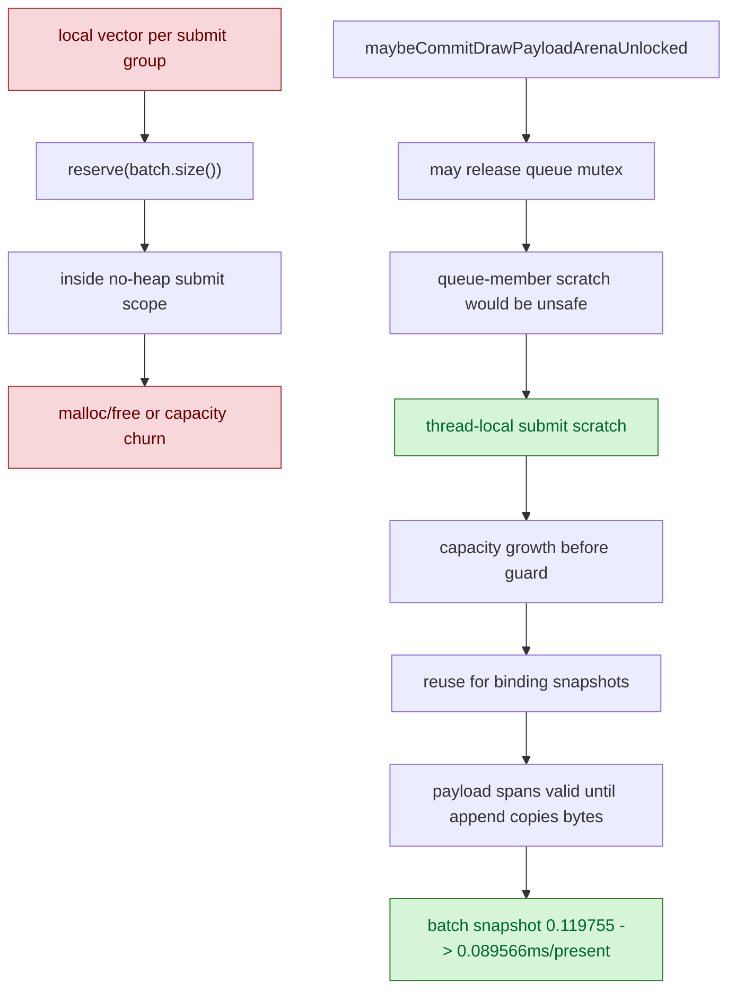

# Thread-Local Draw Binding Snapshot Scratch

**Question / hypothesis.** The F6 review found a hot-path hygiene bug:
`submitDrawRunBatch()` entered `DXMT_DEBUG_NO_HEAP_ALLOC_SCOPE` and then created
a local `std::vector<DrawBindingSnapshot>` plus `reserve(batch.size())` for
every compatible group. The single-run path did the same for
`DrawBindingSnapshot` and `DrawParamPayloadView`. Even when release builds do
not compile the guard, this is unnecessary group-level allocation churn.

**Result: accept as a small CPU and hygiene win.** The local vectors are now
thread-local scratch. Capacity growth happens before the no-heap guarded submit
body; the guarded body reuses the storage. Thread-local storage is used instead
of a queue member because `maybeCommitDrawPayloadArenaUnlocked()` can commit a
chunk and temporarily release the queue mutex while payload spans still point
into the scratch. A queue member would let another submitting thread invalidate
those spans; thread-local scratch does not.

```sh
bash scripts/tools/run_3dmark05_perf_probe.sh \
  --suffix submission-tls-scratch-r2-20260613 \
  --timeout 120 \
  --no-gputrace
```

The final code run passed and produced the normal perf summary and `actual.png`;
the smoke image is a normal GT1 robot frame with machine-gun bloom. An earlier
same-day scout accidentally requested `.gputrace` and the capture layer was not
inserted:

```text
[dxmt9-capture] startCapture failed ... error=Capture layer is not inserted.
```

Therefore this leaf uses only the clean `--no-gputrace` run as CPU scout
evidence, not as Xcode/gputrace evidence.

| Counter | In-place baseline | TLS scratch r2 | Raw change | Per-present change |
|---|---:|---:|---:|---:|
| `present_encoded` | `1,740` | `1,680` | `-3.45%` | n/a |
| `draw_calls` | `1,275,373` | `1,236,214` | `-3.07%` | `+0.39%` |
| `submit_draw_run_batch_groups` | `451,885` | `439,051` | `-2.84%` | `+0.63%` |
| `submit_draw_run_batch_records` | `848,791` | `823,703` | `-2.96%` | `+0.51%` |
| `submit_draw_run_batch_binding_snapshot_cpu_ms` | `208.374` | `150.471` | `-27.79%` | `-25.21%` |
| `submit_draw_run_binding_snapshot_cpu_ms` | `94.568` | `73.721` | `-22.04%` | `-19.26%` |
| `submit_draw_run_batch_append_cpu_ms` | `2302.004` | `2252.578` | `-2.15%` | `+1.35%` |
| `commit_chunk_draw_batch_submit_cpu_ms` | `3047.484` | `2938.825` | `-3.57%` | `-0.12%` |
| `commit_chunk_queue_draw_submission_cpu_ms` | `8820.641` | `8695.736` | `-1.42%` | `+2.10%` |
| `commit_chunk_replay_cpu_ms` | `21040.309` | `20703.138` | `-1.60%` | `+1.91%` |

The targeted binding snapshot buckets improve. The broader replay and queue
timers remain flat on a per-present basis, so this is not the hidden
first-order owner of GT1 CPU time.



**Interpretation.**

This closes the F6 no-heap guard critique for the binding-snapshot vectors and
removes a small measured CPU bucket. The native build used for normal tests is
`debugoptimized` with `dxmt9_per_draw_alloc_guard=auto`, so the debug heap guard
is not compiled in that build; the direct guard assertion still needs a separate
debug or forced-guard build if we want to prove the assertion path itself.

The remaining queue-side owners are unchanged: `d3d9_snapshot_cache_lookup`,
uniform/hash work, `d3d9_snapshot_state_copy`, state append/storage width, and
same-generation non-front state/layout copy elision. Do not spend another
optimization turn on generic vector-capacity scratch without a named hot bucket.

**Related.** [state-churn-encode](index.md) ·
[state-churn-encode-encode-phase.35](state-churn-encode-encode-phase.35.md) ·
[state-churn-encode-encode-phase.36](state-churn-encode-encode-phase.36.md).
