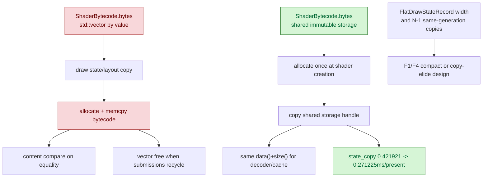

# Shared Shader Bytecode Storage

**Question / hypothesis.** The F3 review found that `ShaderRef` carried
`ShaderBytecode{std::vector<u8> bytes}` by value inside canonical draw-state and
shader-layout records. Programmable shader paths therefore copied VS/PS
bytecode payloads when draw state/layout values were copied, and freed those
vectors again when transient submission records were recycled. That violates the
hot-path rule against per-draw heap ownership and also makes equality fall back
to bytecode content comparisons when pointer/hash identity would be enough.

**Result: accept as a CPU win.** `ShaderBytecode::bytes` now stores shared
immutable byte storage. Shader creation still allocates the byte payload once,
but later draw-state, snapshot, and shader-layout copies share it instead of
allocating and memcpying the bytecode. Consumers that need raw shader bytes use
the explicit `data()+size()` view.

```sh
bash scripts/tools/run_3dmark05_perf_probe.sh \
  --suffix shader-bytecode-shared-20260613 \
  --timeout 120 \
  --no-gputrace
```

The run passed and produced a normal visible GT1 frame (`actual.png`, frame
946, HUD FPS 20). The baseline is the previous thread-local scratch scout. The
two runs have different present counts, so the verdict uses per-present
movement.

| Counter | TLS scratch r2 | Shared bytecode | Raw change | Per-present change |
|---|---:|---:|---:|---:|
| `present_encoded` | `1,680` | `1,740` | `+3.57%` | n/a |
| `draw_calls` | `1,236,214` | `1,277,399` | `+3.33%` | `-0.23%` |
| `d3d9_snapshot_state_copy_cpu_ms` | `708.828` | `471.932` | `-33.42%` | `-35.72%` |
| `d3d9_snapshot_cache_miss_shader_layout_cpu_ms` | `894.114` | `712.446` | `-20.32%` | `-23.07%` |
| `d3d9_snapshot_draw_submission_cpu_ms` | `6484.145` | `6220.374` | `-4.07%` | `-7.38%` |
| `commit_chunk_queue_draw_submission_cpu_ms` | `8695.736` | `8339.790` | `-4.09%` | `-7.40%` |
| `commit_chunk_draw_batch_submit_cpu_ms` | `2938.825` | `2901.867` | `-1.26%` | `-4.66%` |
| `submit_draw_run_batch_append_state_soa_cpu_ms` | `663.939` | `674.213` | `+1.55%` | `-1.95%` |
| `encode_draw_cpu_ms` | `19295.986` | `19608.135` | `+1.62%` | `-1.89%` |
| `commit_chunk_replay_cpu_ms` | `20703.138` | `20223.264` | `-2.32%` | `-5.69%` |



**Interpretation.**

This validates the F3 bytecode-copy critique. The main measured wins are in
snapshot/cache miss shader-layout construction and state-copy shaped buckets,
with a run-level queue submit improvement. It is not the full state-width
solution: `FlatDrawStateRecord` is still wide, `appendDrawRunBatch()` still
stores one front state per group, and snapshot submission still copies hot/layout
records for non-front draws. Those belong to the larger F1/F4 design: generation
copy elision, compact state records, or interning at the point where the frontend
already knows stable-state identity.

**Verification.**

- `meson compile -C build-arm64-nowine`
- `meson test -C build-arm64-nowine dxmt9-shader-transform-spec dxmt9-shader-bytecode-validation-spec dxmt9-core-shader-translator-spec dxmt9-shader-source-determinism-spec dxmt9-backend-pipeline-key-spec dxmt9-chunk-record-replay-spec dxmt9-chunk-record-import-spec dxmt9-dod-replay-observer-spec --timeout-multiplier 4 --print-errorlogs`
- `meson compile -C build-win32-x64-builtin`
- `meson compile -C build-win32-x86-builtin`
- `meson compile -C build-x86_64-builtin`
- 3DMark05 GT1 120s no-gputrace scout above

`dxmt9-state-draw-transform-spec` currently fails on the baseline too with
`completedSequenceId_ <= submittedSequenceId_` in `completeUpTo()`, so it is not
used as evidence for this patch.

**Related.** [[state-churn-encode]] ·
[[state-churn-encode-encode-phase.35]] ·
[[state-churn-encode-encode-phase.37]].
