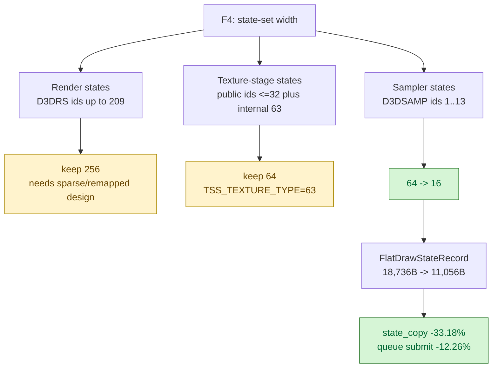

# Compact Sampler State Capacity

**Question / hypothesis.** The F4 review found that `FlatStateSet` capacities
were using D3D state-id space limits instead of the number of states that can
actually be present. Render state cannot shrink trivially because D3DRS ids
reach `209`. Texture-stage state also cannot shrink trivially because dxmt9 uses
the internal `TSS_TEXTURE_TYPE=63` key. Sampler state is the safe first slice:
public `D3DSAMP_*` ordinals are `1..13`, so the identity-mapped table only needs
slot `0` plus those ordinals. Capacity `16` keeps the public mapping intact and
still fits in one bitset word.

**Result: accept as a CPU win.** `kMaxSamplerStates` and the PE sampler-state
shadow now use `16` slots instead of `64`. `SAMP_ELEMENT_INDEX=12` and
`SAMP_DMAP_OFFSET=13` are named and asserted so the table's upper bound is tied
to the public D3D9 enum.

The structural size change is the useful proof that this targets the intended
copy width:

| Type | Before | After | Change |
|---|---:|---:|---:|
| `FlatStateSet<sampler>` | `536 B` | `152 B` | `-71.64%` |
| `FlatDrawStateRecord` | `18,736 B` | `11,056 B` | `-40.99%` |
| `CanonicalDrawState` | `21,080 B` | `13,384 B` | `-36.51%` |
| `DrawRunSubmission` | `31,744 B` | `24,064 B` | `-24.19%` |

```sh
bash scripts/tools/run_3dmark05_perf_probe.sh \
  --suffix sampler-state-compact-r2-20260613 \
  --timeout 120 \
  --no-gputrace
```

The first sampler-compact scout was discarded as evidence because the unix
provider had not been rebuilt; PE DLLs rebuilt, but the queue/replay hot path
still used the stale `winemetal.so`. The accepted `r2` run rebuilt
`build-x86_64-builtin` first, then installed the updated unix provider.

| Counter | Shared bytecode baseline | Sampler compact r2 | Raw change | Per-present change |
|---|---:|---:|---:|---:|
| `present_encoded` | `1,740` | `1,800` | `+3.45%` | n/a |
| `draw_calls` | `1,277,399` | `1,322,375` | `+3.52%` | `+0.07%` |
| `d3d9_snapshot_state_copy_cpu_ms` | `471.932` | `326.231` | `-30.87%` | `-33.18%` |
| `d3d9_snapshot_draw_submission_cpu_ms` | `6220.374` | `5877.860` | `-5.51%` | `-8.66%` |
| `commit_chunk_queue_draw_submission_cpu_ms` | `8339.790` | `7569.238` | `-9.24%` | `-12.26%` |
| `commit_chunk_draw_batch_submit_cpu_ms` | `2901.867` | `2717.557` | `-6.35%` | `-9.47%` |
| `submit_draw_run_batch_append_cpu_ms` | `2242.982` | `2065.086` | `-7.93%` | `-11.00%` |
| `submit_draw_run_batch_append_state_cpu_ms` | `850.268` | `661.502` | `-22.20%` | `-24.79%` |
| `submit_draw_run_batch_append_state_soa_cpu_ms` | `674.213` | `474.530` | `-29.62%` | `-31.96%` |
| `encode_draw_cpu_ms` | `19608.135` | `18819.568` | `-4.02%` | `-7.22%` |
| `commit_chunk_replay_cpu_ms` | `20223.264` | `18911.481` | `-6.49%` | `-9.60%` |

The smoke image is a normal GT1 frame with machine-gun bloom visible.



**Interpretation.**

This validates the stored-width critique, but only for sampler state. The
remaining large state shape is still render-state/TSS heavy and still copied
for every queued submission before the queue eventually stores only the batch
front state. The next work should either introduce a compact/remapped record for
render-state/TSS sets or implement same-generation copy elision for non-front
submissions; do not expect another safe constant shrink of the same kind.

**Verification.**

- `meson compile -C build-arm64-nowine`
- `meson test -C build-arm64-nowine dxmt9-dod-state-format-spec dxmt9-chunk-record-micro-spec dxmt9-chunk-record-import-spec dxmt9-chunk-record-replay-spec dxmt9-backend-pipeline-key-spec dxmt9-encode-draw-recorder-spec dxmt9-argbuf-hybrid-msl-spec --timeout-multiplier 4 --print-errorlogs`
- `meson compile -C build-x86_64-builtin`
- `meson test -C build-x86_64-builtin dxmt9-backend-key-descriptor-spec --timeout-multiplier 4 --print-errorlogs`
- `meson compile -C build-win32-x64-builtin`
- `meson compile -C build-win32-x86-builtin`
- 3DMark05 GT1 120s no-gputrace scout above

During the x86_64 rebuild, one stale test object still referenced the old
`FlatStateSet<64>` helper signature. Removing that build artifact and rebuilding
the target fixed the build; the source dependency itself is now consistent.

**Related.** [state-churn-encode](index.md) ·
[state-churn-encode-encode-phase.38](state-churn-encode-encode-phase.38.md).
