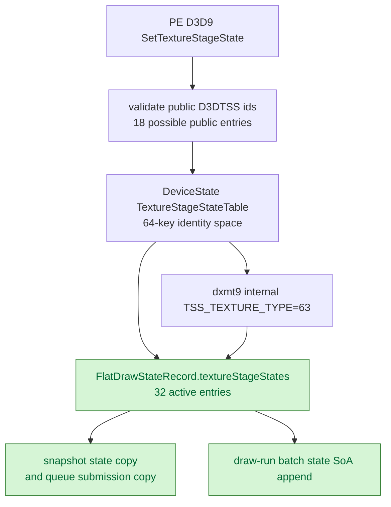

# Split Texture-Stage Flat Capacity

**Question / hypothesis.** Phase 39 kept texture-stage state at `64` because
dxmt9 uses internal key `TSS_TEXTURE_TYPE=63`. That is true for the
identity-mapped `DeviceState` table, but it is not necessarily true for the
copied `FlatDrawStateRecord` active-entry array. `FlatStateSet` entries store
the state id explicitly, so its capacity only needs to cover the maximum active
entry count, not the highest key value.

PE-side validation accepts only public `D3DTSS_*` ids `1..11`, `22..24`,
`26..28`, and `32` (`18` entries). dxmt9 adds `TSS_TEXTURE_TYPE=63` internally.
A flat capacity of `32` therefore leaves conservative headroom while keeping the
state id space at `64`.

**Result: accept as a targeted CPU state-width win.** `kMaxTextureStageStates`
stays `64`; the new `kMaxFlatTextureStageStates=32` is used only by
`FlatDrawStateRecord::textureStageStates`.

| Type | Before | After | Change |
|---|---:|---:|---:|
| `FlatStateSet<TSS>` | `536 B` | `280 B` | `-47.76%` |
| `FlatDrawStateRecord` | `11,056 B` | `9,008 B` | `-18.52%` |
| `CanonicalDrawState` | `13,384 B` | `11,336 B` | `-15.30%` |
| `DrawRunSubmission` | `24,064 B` | `22,016 B` | `-8.51%` |



**Primary scout.**

```sh
bash scripts/tools/run_3dmark05_perf_probe.sh \
  --suffix tss-flat-compact-r3-20260613 \
  --frame 60 \
  --no-gputrace \
  --timeout 120
```

The first compare attempt used `--require-draw-run-records-increase`; that gate
is wrong for a width-only patch and was discarded. The `r2` sample was
`status=pass` but had only `1560` presents, so it is supplementary only. The
primary `r3` sample has the same `1800` presents as the sampler-compact
baseline and a normal GT1 screenshot with bloom/particles visible.

| Counter | Sampler compact r2 | TSS flat compact r3 | Per-present change |
|---|---:|---:|---:|
| `present_encoded` | `1,800` | `1,800` | n/a |
| `draw_calls` | `734.652778` | `735.488333` | `+0.11%` |
| `submit_draw_run_batch_records` | `489.187222` | `489.468333` | `+0.06%` |
| `d3d9_snapshot_state_copy_cpu_ms` | `0.181239` | `0.158232` | `-12.69%` |
| `d3d9_snapshot_draw_submission_cpu_ms` | `3.265478` | `3.194776` | `-2.17%` |
| `commit_chunk_queue_draw_submission_cpu_ms` | `4.205132` | `4.077018` | `-3.05%` |
| `commit_chunk_draw_batch_submit_cpu_ms` | `1.509754` | `1.437548` | `-4.78%` |
| `submit_draw_run_batch_append_cpu_ms` | `1.147270` | `1.079406` | `-5.92%` |
| `submit_draw_run_batch_append_state_cpu_ms` | `0.367501` | `0.323385` | `-12.00%` |
| `submit_draw_run_batch_append_state_soa_cpu_ms` | `0.263628` | `0.220626` | `-16.31%` |
| `commit_chunk_replay_cpu_ms` | `10.506378` | `10.184764` | `-3.06%` |
| `submit_draw_cpu_ms` | `1.854215` | `1.745624` | `-5.86%` |
| `encode_draw_cpu_ms` | `10.455316` | `10.617021` | `+1.55%` |
| `gpu_command_buffer_time_ms` | `3.058187` | `3.015948` | `-1.38%` |

**Interpretation.**

This is useful because it confirms that F4 can continue by separating id-space
tables from copied active-entry storage. It does not prove that TSS width was a
large end-to-end owner: the direct copy and SoA append buckets move, but
`encode_draw_cpu_ms` is mixed/noisy and the GPU bottleneck is unchanged.

The next storage-width candidate is render-state compaction, but render states
cannot use a simple constant shrink: D3DRS ids reach `209`, and the active-entry
count depends on all supported render states. That work needs a sparse/remapped
flat record or a supported-ID/count proof before changing storage.

**Verification.**

- `clang++` size probe: `FlatDrawStateRecord=9008`,
  `CanonicalDrawState=11336`, `DrawRunSubmission=22016`.
- `meson compile -C build-arm64-nowine`
- `meson test -C build-arm64-nowine dxmt9-dod-state-format-spec dxmt9-ffp-key-determinism-spec dxmt9-ffp-triadic-msl-spec dxmt9-chunk-record-replay-spec dxmt9-backend-pipeline-key-spec dxmt9-encode-draw-recorder-spec --timeout-multiplier 4 --print-errorlogs`
- `meson compile -C build-x86_64-builtin`
- `meson test -C build-x86_64-builtin dxmt9-backend-key-descriptor-spec --timeout-multiplier 4 --print-errorlogs`
- `meson compile -C build-win32-x64-builtin`
- `meson compile -C build-win32-x86-builtin`
- 3DMark05 GT1 120s no-gputrace scout above.

Two broader tests were not used as evidence: `dxmt9-imported-apply-state-value-spec`
hit the known `completeUpTo()` assert, and `dxmt9-core-ffp-state-key-spec`
failed its visual sanity readback outside the TSS key path.

**Related.** [[state-churn-encode]] ·
[[state-churn-encode-encode-phase.39]].
