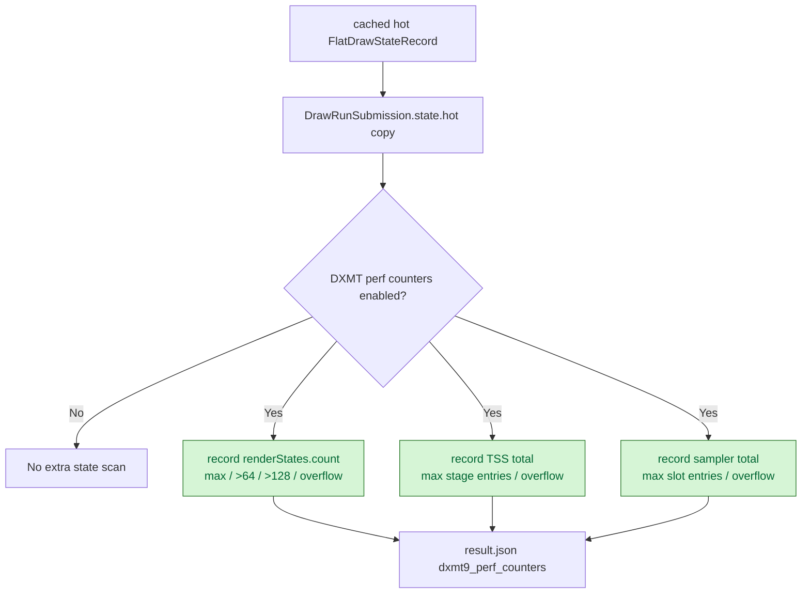
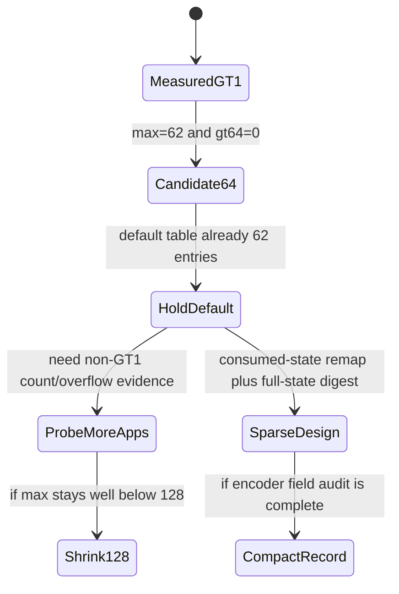

# Probe Render-State Flat Entry Count

**Question / hypothesis.** Phase 40 left render-state compaction open. Unlike
sampler and texture-stage state, render states already occupy `62` default
entries and `SetRenderState()` accepts the full 0..255 identity-mapped table.
Before shrinking `FlatDrawStateRecord::renderStates`, measure the active entry
count that the weighted draw-submission path actually copies.

**Implementation.** Added permanent low-cost perf counters sampled after the
per-draw `cached.hot` state copy:

- `d3d9_snapshot_flat_state_samples`
- `d3d9_snapshot_flat_render_state_entries`
- `d3d9_snapshot_flat_render_state_entries_max`
- `d3d9_snapshot_flat_render_state_entries_gt64`
- `d3d9_snapshot_flat_render_state_entries_gt128`
- `d3d9_snapshot_flat_render_state_overflow`
- `d3d9_snapshot_flat_tss_entries`
- `d3d9_snapshot_flat_tss_stage_entries_max`
- `d3d9_snapshot_flat_tss_overflow`
- `d3d9_snapshot_flat_sampler_entries`
- `d3d9_snapshot_flat_sampler_slot_entries_max`
- `d3d9_snapshot_flat_sampler_overflow`

The counter call is gated by `perf::enabled()` before scanning the eight TSS
sets and sampler slots, so non-perf runs keep the existing copy path.



**Scout.**

```sh
bash scripts/tools/run_3dmark05_perf_probe.sh \
  --suffix flat-state-entry-counters-r1-20260613 \
  --frame 60 \
  --no-gputrace \
  --timeout 120 \
  --compare-baseline-output \
    experiments/output/app-d3d9-3dmark05-tss-flat-compact-r3-20260613
```

The run is timeout-finalized but valid: `status=pass`, `failures=[]`,
`present_encoded=1800`, `returncode=143`, and `timed_out=True`. The screenshot is
a normal GT1 action frame with muzzle flashes, bullet trails, bloom, and
particles visible.

| Counter | Value | Interpretation |
|---|---:|---|
| `d3d9_snapshot_flat_state_samples` | `883,062` | weighted per queued draw submission |
| `d3d9_snapshot_flat_render_state_entries` | `54,749,699` | `61.999836` entries/sample |
| `d3d9_snapshot_flat_render_state_entries_max` | `62` | GT1 observed max |
| `d3d9_snapshot_flat_render_state_entries_gt64` | `0` | `64` would fit this GT1 run |
| `d3d9_snapshot_flat_render_state_entries_gt128` | `0` | `128` has large headroom |
| `d3d9_snapshot_flat_render_state_overflow` | `0` | current `256` store did not overflow |
| `d3d9_snapshot_flat_tss_entries` | `77,709,456` | exactly `88` entries/sample |
| `d3d9_snapshot_flat_tss_stage_entries_max` | `11` | phase 40 `32` cap is safe here |
| `d3d9_snapshot_flat_tss_overflow` | `0` | no TSS loss |
| `d3d9_snapshot_flat_sampler_entries` | `158,951,160` | exactly `180` entries/sample |
| `d3d9_snapshot_flat_sampler_slot_entries_max` | `9` | phase 39 `16` cap is safe here |
| `d3d9_snapshot_flat_sampler_overflow` | `0` | no sampler loss |

Current sizes remain phase 40's shape:

| Type | Size |
|---|---:|
| `FlatStateSet<render>` | `2,072 B` |
| `FlatStateSet<TSS>` | `280 B` |
| `FlatStateSet<sampler>` | `152 B` |
| `FlatDrawStateRecord` | `9,008 B` |
| `CanonicalDrawState` | `11,336 B` |
| `DrawRunSubmission` | `22,016 B` |

**Result: accept the proof, not the render-state shrink.** For current GT1,
`FlatStateSet<64>` would preserve every sampled render-state entry. That is not
yet enough to make `64` the default runtime capacity because the initialized
render-state table already contains `62` entries. Only two additional unknown or
currently-uninitialized render-state ids would cross the proposed cap. Generic
render-state compaction should therefore use either:

1. a wider active-entry cap such as `96`/`128`, after collecting non-GT1
   overflow evidence, or
2. a remapped/sparse record that stores only encoder-consumed render states plus
   a separate hash/compat digest for unsupported-but-tracked ids.



**Performance note.** This run is a counter proof, not a performance mutation.
Against the phase 40 baseline it shows normal drift: `present_encoded=1800`,
`draw_calls +0.16%`, `gpu_command_buffer_time_ms -0.28%`, and
`encode_draw_cpu_ms -4.10%`. The new counters add atomics during perf runs, so
do not treat this sample as a new CPU win.

**Verification.**

- `python3 scripts/check/audit_perf_counter_table.py`
- `python3 scripts/check/audit_perf_counter_callsites.py`
- `meson compile -C build-arm64-nowine`
- `meson test -C build-arm64-nowine dxmt9-dod-state-format-spec dxmt9-ffp-key-determinism-spec dxmt9-ffp-triadic-msl-spec dxmt9-chunk-record-replay-spec dxmt9-backend-pipeline-key-spec dxmt9-encode-draw-recorder-spec dxmt9-perf-counter-table-audit dxmt9-perf-counter-callsite-audit --timeout-multiplier 4 --print-errorlogs`
- `meson compile -C build-x86_64-builtin`
- `meson compile -C build-win32-x64-builtin`
- `meson compile -C build-win32-x86-builtin`
- `git diff --check`
- 3DMark05 GT1 120s no-gputrace scout above.

**Related.** [state-churn-encode](../state-churn-encode.md) ·
[state-churn-encode-encode-phase.40](state-churn-encode-encode-phase.40.md).
