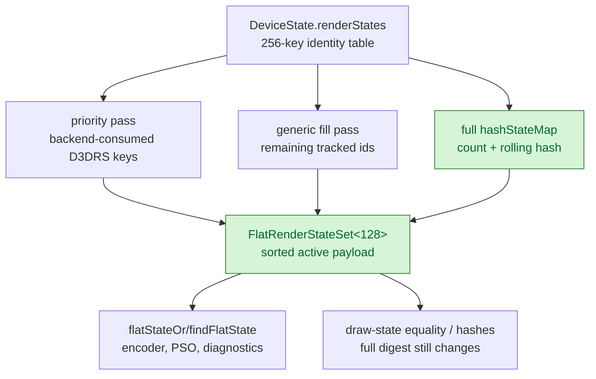
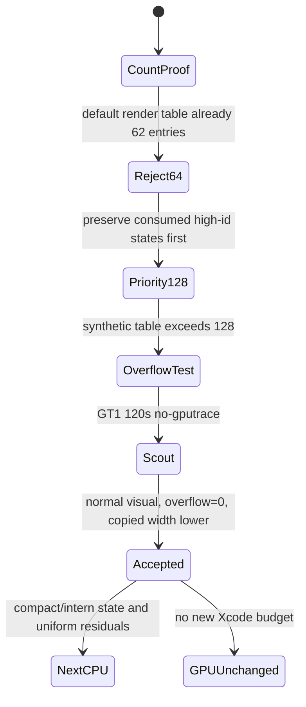

# Compact Render-State Flat Payload

**Question / hypothesis.** Phase 41 proved current GT1 render-state active
payloads never exceed `62` entries, but rejected a simple `64` cap because
`DeviceState::reset()` already seeds `62` render states. The safe production
shape is a wider compact payload plus a priority fill: preserve backend-consumed
high-id render states first, keep the full render-state hash/digest, then fill
any remaining slots with other tracked ids.

**Implementation.**

- Added `kMaxFlatRenderStates=128`; `DeviceState` keeps the full
  `kMaxStateSlots=256` Set/GetRenderState id space.
- `FlatDrawStateRecord::renderStates` now stores `FlatRenderStateSet`
  (`FlatStateSet<128>`).
- Render-state flattening now uses `makePrioritizedFlatStateSet()`:
  encoder/runtime-visible D3DRS keys are appended first, duplicate keys are
  skipped, remaining state table entries fill spare slots, and the result is
  sorted for binary-search lookup.
- The compact payload still stores the full `hashStateMap(values)` and the
  full-table overflow bit. Compatibility and debug hashes therefore continue to
  see unsupported-but-tracked ids even if the active payload is capped.
- Added an overflow regression test that fills the render-state table past the
  compact cap and proves high-id separate-alpha, CCW stencil, color-write,
  depth-bias, ATOC, and point-sprite keys remain present in the compact payload.



**Width result.**

| Type | Phase 41 | Phase 42 | Change |
|---|---:|---:|---:|
| `FlatStateSet<render>` | `2,072 B` | `1,048 B` | `-49.42%` |
| `FlatStateSet<TSS>` | `280 B` | `280 B` | `0` |
| `FlatStateSet<sampler>` | `152 B` | `152 B` | `0` |
| `FlatDrawStateRecord` | `9,008 B` | `7,984 B` | `-11.37%` |
| `CanonicalDrawState` | `11,336 B` | `10,312 B` | `-9.03%` |
| `DrawRunSubmission` | `22,016 B` | `20,992 B` | `-4.65%` |

**Scout.**

```sh
bash scripts/tools/run_3dmark05_perf_probe.sh \
  --suffix render-state-flat-compact-r1-20260613 \
  --frame 60 \
  --no-gputrace \
  --timeout 120 \
  --compare-baseline-output \
    experiments/output/app-d3d9-3dmark05-flat-state-entry-counters-r1-20260613
```

The run is timeout-finalized but valid: `status=pass`, `failures=[]`,
`returncode=143`, and `timed_out=True`. It encoded `1800` presents. The frame60
screen capture is a normal GT1 scene with rifle/machine-gun muzzle flashes,
bloom, bullet trails, impact particles, and HUD visible.

| Counter | Value | Interpretation |
|---|---:|---|
| `d3d9_snapshot_flat_state_samples` | `878,802` | weighted queued submissions |
| `d3d9_snapshot_flat_render_state_entries` | `54,485,579` | `61.999835` entries/sample |
| `d3d9_snapshot_flat_render_state_entries_max` | `62` | unchanged GT1 max |
| `d3d9_snapshot_flat_render_state_entries_gt64` | `0` | current GT1 still fits 64 |
| `d3d9_snapshot_flat_render_state_entries_gt128` | `0` | compact cap has headroom |
| `d3d9_snapshot_flat_render_state_overflow` | `0` | no render-state payload loss |
| `d3d9_snapshot_flat_tss_stage_entries_max` | `11` | phase 40 cap remains safe |
| `d3d9_snapshot_flat_tss_overflow` | `0` | no TSS loss |
| `d3d9_snapshot_flat_sampler_slot_entries_max` | `9` | phase 39 cap remains safe |
| `d3d9_snapshot_flat_sampler_overflow` | `0` | no sampler loss |

Selected CPU counters versus the phase 41 counter-only baseline:

| Counter | Baseline | Phase 42 | Delta |
|---|---:|---:|---:|
| `d3d9_snapshot_state_copy_cpu_ms` | `284.646` | `262.991` | `-7.61%` |
| `d3d9_snapshot_draw_submission_cpu_ms` | `5,812.706` | `6,742.485` | `+16.00%` |
| `commit_chunk_queue_draw_submission_cpu_ms` | `7,383.435` | `8,258.885` | `+11.86%` |
| `submit_draw_run_batch_append_state_cpu_ms` | `563.835` | `537.426` | `-4.68%` |
| `submit_draw_run_batch_append_state_soa_cpu_ms` | `381.852` | `357.219` | `-6.45%` |
| `encode_draw_cpu_ms` | `18,327.341` | `18,241.769` | `-0.47%` |
| `submit_draw_cpu_ms` | `3,085.364` | `3,068.978` | `-0.53%` |
| `gpu_command_buffer_time_ms` | `5,413.428` | `5,451.426` | `+0.70%` |
| `completion_wait_ms` | `41,758.974` | `42,509.227` | `+1.80%` |

**Result: accept as a bounded CPU state-width win.** The structural reduction is
real and correctness-safe for current consumers: copied state width drops by
`1024 B` per `FlatDrawStateRecord`, and the weighted GT1 run keeps overflow at
zero. The direct state-copy and batch state-SoA children move in the expected
direction; broader snapshot/queue totals do not, so the run should not be read
as an end-to-end CPU win. GPU command-buffer time and completion wait are
unchanged within run variance, so this is not a GPU bottleneck fix.



**Build-system note.** After the header layout change, one native incremental
build left `core_resources.cpp.o` stale and produced a `completeUpTo()` assert
from mismatched `Device` member offsets. Rebuilding all
`libdxmt9_frontend_core` objects fixed the test. For future `Device` layout
changes, force-rebuild the split `src/d3d9/core_*.cpp` translation units before
trusting native tests.

**Verification.**

- `meson compile -C build-arm64-nowine`
- forced rebuild of `src/d3d9/libdxmt9_frontend_core.a.p/*.o` in all four build
  dirs after the header layout change
- `meson test -C build-arm64-nowine dxmt9-state-draw-transform-spec dxmt9-dod-state-format-spec dxmt9-ffp-key-determinism-spec dxmt9-ffp-triadic-msl-spec dxmt9-chunk-record-replay-spec dxmt9-backend-pipeline-key-spec dxmt9-encode-draw-recorder-spec dxmt9-perf-counter-table-audit dxmt9-perf-counter-callsite-audit --timeout-multiplier 4 --print-errorlogs`
- `meson compile -C build-x86_64-builtin`
- `meson compile -C build-win32-x64-builtin`
- `meson compile -C build-win32-x86-builtin`
- `meson test -C build-x86_64-builtin dxmt9-backend-key-descriptor-spec --timeout-multiplier 4 --print-errorlogs`
- `clang++` stdin size probe:
  `FlatDrawStateRecord=7984`, `CanonicalDrawState=10312`,
  `DrawRunSubmission=20992`
- 3DMark05 GT1 120s no-gputrace scout above.

**Related.** [state-churn-encode](index.md) ·
state-churn-encode-encode-phase.41.
