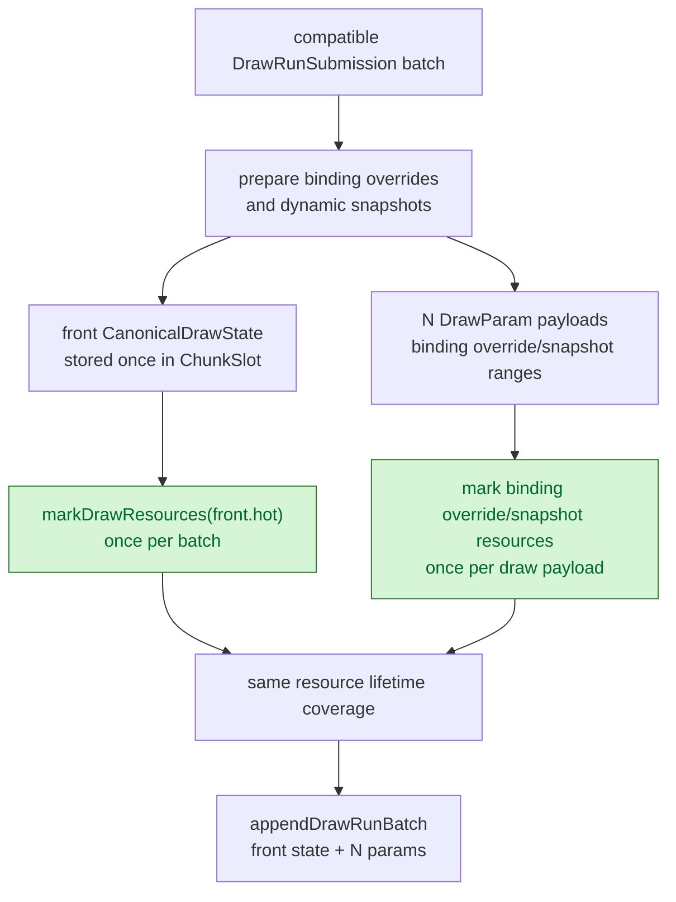
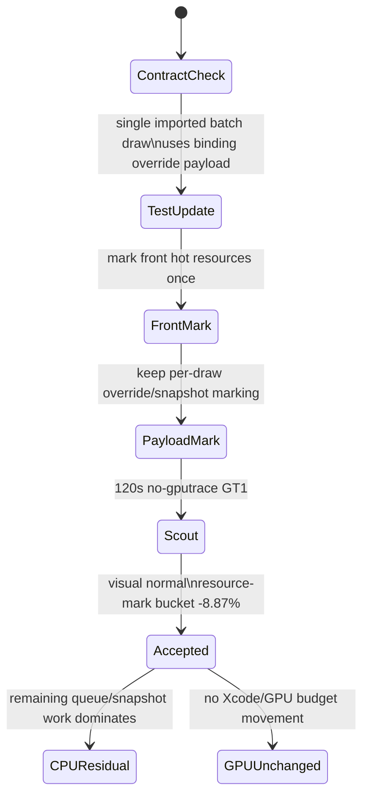

# Mark Batch Front Draw Resources Once

**Question / hypothesis.** `ChunkSlot::appendDrawRunBatch()` stores only
`submissions.front().state`; the remaining draw records contribute per-draw
`DrawParam`, uniform handles, and payload ranges. Resource retention was still
walking `pool_.markDrawResources(submission.state.hot, seqId)` for every
submission in the batch. If the batch state is already represented by the front
state plus per-draw binding overrides/snapshots, then draw-state resources can
be marked once for the front state and per-draw payload resources can remain
per-submission.

**Implementation.**

- In `CommandQueue::submitDrawRunBatch`, the resource-mark stage now computes
  `seqId` once per compatible batch.
- `pool_.markDrawResources(batch.front().state.hot, seqId)` runs once.
- The loop still marks every submission's `bindingOverrideData` and
  `bindingSnapshotData`, preserving stream/index resources that differ from the
  front state or from binding-agnostic snapshots.
- `resource_hazard_spec` now documents the current single imported
  batch-submission contract: base `hot` stream/index fields are
  binding-agnostic, while the effective bound stream/index handles live in
  `DrawBindingOverride` payloads. Coalesced draw-run tests that use full hot
  state are left unchanged.



**Scout.**

```sh
bash scripts/tools/run_3dmark05_perf_probe.sh \
  --suffix resource-mark-front-once-r1-20260613 \
  --frame 60 \
  --no-gputrace \
  --timeout 120 \
  --compare-baseline-output \
    experiments/output/app-d3d9-3dmark05-render-state-flat-compact-r1-20260613
```

The run is timeout-finalized but valid: `status=pass`, `failures=[]`,
`returncode=143`, and `timed_out=True`. It encoded `1800` presents. The frame60
screen capture is normal for GT1: bright muzzle/bloom, bullet trails, impact
particles, geometry, and HUD are visible.

| Counter | Baseline | Phase 43 | Delta |
|---|---:|---:|---:|
| `submit_draw_run_batch_resource_mark_cpu_ms` | `27.146` | `24.739` | `-8.87%` |
| `submit_draw_cpu_ms` | `3,068.978` | `3,011.678` | `-1.87%` |
| `commit_chunk_queue_draw_submission_cpu_ms` | `8,258.885` | `8,189.639` | `-0.84%` |
| `submit_draw_run_batch_append_state_cpu_ms` | `537.426` | `526.067` | `-2.11%` |
| `submit_draw_run_batch_append_state_soa_cpu_ms` | `357.219` | `345.945` | `-3.16%` |
| `d3d9_snapshot_state_copy_cpu_ms` | `262.991` | `261.907` | `-0.41%` |
| `encode_draw_cpu_ms` | `18,241.769` | `18,240.271` | `-0.01%` |
| `gpu_command_buffer_time_ms` | `5,451.426` | `5,468.664` | `+0.32%` |
| `completion_wait_ms` | `42,509.227` | `43,358.218` | `+2.00%` |

**Result: accept as a targeted CPU retention micro-win.** The intended bucket
moves in the expected direction, and broader draw-submission CPU also improves
slightly despite a `+0.17%` draw-count drift in the sampled run. This is not a
GPU bottleneck fix: command-buffer time is flat and completion wait is worse by
`+2.00%`, consistent with run variance rather than a resource-mark mechanism.

**Frame60 capture follow-up.** Two current-head gputrace candidates were rerun
after the microfix:

- `app-d3d9-3dmark05-phase43-frame60-gputrace-r1-20260613` used the default
  file destination. GT1 rendered normally and produced a valid `result.json`
  (`status=pass`, `timed_out=false`, `present_encoded=1680`), but
  `MTLCaptureManager` rejected the capture with
  `destination=2 destination_supported=0` / `Capture layer is not inserted`.
- `app-d3d9-3dmark05-phase43-frame60-xcode-devtools-r1-20260613` reran with
  Xcode open and `DXMT_3DMARK05_METAL_CAPTURE_DESTINATION=developerTools`.
  GT1 again rendered normally (`status=pass`, `present_encoded=1740`), but the
  capture failed the same way with `destination=1 destination_supported=0`.

These are counter samples only. They confirm the current code path still needs
an inserted Metal capture layer before Xcode encoder counters can be exported;
there is no `.gputrace`, no embedded-performance export, and no encoder-counter
CSV for this phase. The run-level comparisons stay in the expected noise band:
GPU command-buffer time moved `+1.74%` for the file attempt and `+1.93%` for the
developerTools attempt versus the phase43 no-gputrace baseline, while tile
preservation moved mainly with shorter sampled presentation counts.



**Verification.**

- `meson compile -C build-arm64-nowine`
- `meson test -C build-arm64-nowine dxmt9-resource-hazard-spec dxmt9-imported-apply-state-value-spec dxmt9-dod-replay-observer-spec dxmt9-chunk-record-replay-spec dxmt9-encode-draw-recorder-spec dxmt9-state-draw-transform-spec dxmt9-backend-pipeline-key-spec dxmt9-perf-counter-table-audit dxmt9-perf-counter-callsite-audit --timeout-multiplier 4 --print-errorlogs`
- `meson test -C build-arm64-nowine dxmt9-chunk-record-spec dxmt9-chunk-record-validation-spec dxmt9-chunk-record-hazard-spec dxmt9-chunk-record-import-spec dxmt9-pe-chunk-record-value-spec dxmt9-chunk-record-micro-spec --timeout-multiplier 4 --print-errorlogs`
- `meson compile -C build-x86_64-builtin`
- `meson compile -C build-win32-x64-builtin`
- `meson compile -C build-win32-x86-builtin`
- 3DMark05 GT1 120s no-gputrace scout above.

**Related.** [state-churn-encode](index.md) ·
[state-churn-encode-encode-phase.42](state-churn-encode-encode-phase.42.md).
