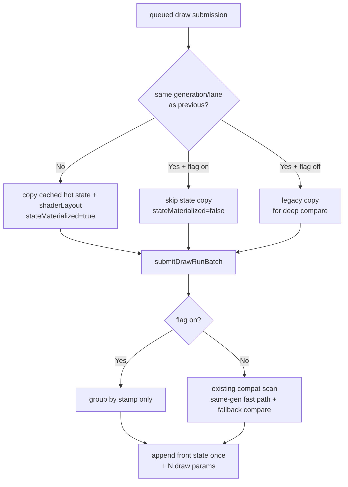

# Gate Stamp-Only Draw-Run State Elision

**Question / hypothesis.** The generation/lane fast path proved that adjacent
same-stamp submissions are batch-compatible, but the producer still copied the
batch-consumed `state.hot` and `shaderLayout` into every `DrawRunSubmission`.
`appendDrawRunBatch()` stores only the batch front state, so same-stamp
continuations pay copy cost for state that is then discarded. If grouping keys on
the same stamp, the producer can skip the non-front state copy and still keep one
materialized run front.

**Implementation.**

- `DXMT9_DRAWRUN_GROUP_BY_GEN_LANE=1` enables the A/B path. Default still
  materializes every queued submission and keeps the existing same-generation
  fast path plus deep-compare fallback.
- `snapshotDrawSubmissionFromCurrentState()` now receives the previous queued
  submission. When the new submission has the same `{stateGeneration,stateLane}`
  stamp, it sets `stateMaterialized=false` and skips the `state.hot` /
  `shaderLayout` copy.
- `submitDrawRunBatch()` uses stamp-only compatibility while the flag is enabled,
  so it never deep-compares an elided non-front state.
- Binding override/snapshot and resource retention read the materialized front
  state plus per-draw binding payloads. The current backbuffer update also reads
  the front state, matching the canonical state stored by `appendDrawRunBatch()`.
- New counters expose the R-ARCH-7.6 copy-class proof:
  `d3d9_snapshot_state_materialized`,
  `d3d9_snapshot_state_materialized_bytes`,
  `d3d9_snapshot_state_elided`, and
  `d3d9_snapshot_state_elided_bytes`.

**Runtime gate.** The 2026-06-14 no-gputrace GT1 A/B proves the copy-elision
mechanism and keeps the default off. The candidate used
`DXMT9_DRAWRUN_GROUP_BY_GEN_LANE=1`; both runs used 120s timeout, frame sampling,
and no encoder breakdown.

| Metric | Baseline | Elide | Delta |
|---|---:|---:|---:|
| `d3d9_snapshot_state_elided` | `0` | `400,838` | `+400,838` |
| `d3d9_snapshot_state_elided_bytes` | `0` | `4,101,374,416` | `+4.10GB` |
| `d3d9_snapshot_state_copy_cpu_ms` | `258.969` | `139.672` | `-119.297ms` (`-46.07%`) |
| `d3d9_snapshot_debug_snapshot_cpu_ms` | `43.094` | `22.987` | `-20.107ms` (`-46.66%`) |
| `commit_chunk_queue_draw_submission_cpu_ms` | `8,105.588` | `8,000.112` | `-105.476ms` (`-1.30%`) |
| `submit_draw_run_batch_compat_scan_cpu_ms` | `48.305` | `34.750` | `-13.555ms` (`-28.06%`) |
| `submit_draw_run_batch_append_state_cpu_ms` | `529.256` | `511.278` | `-17.978ms` (`-3.40%`) |
| `submit_draw_run_batch_groups` | `455,463` | `455,099` | `-364` (`-0.08%`) |
| `submit_draw_run_batch_records` | `854,845` | `855,937` | `+1,092` (`+0.13%`) |
| `encode_draw_cpu_ms` | `15,536.857` | `15,667.391` | `+130.534ms` (`+0.84%`) |
| `gpu_command_buffer_time_ms` | `5,435.688` | `5,600.415` | `+164.727ms` (`+3.03%`) |
| `completion_wait_ms` | `43,680.425` | `44,339.617` | `+659.192ms` (`+1.51%`) |
| sampled mean FPS | `18.435` | `18.403` | `-0.032` |
| sampled p50 FPS | `18.070` | `18.032` | `-0.038` |

The evidence supports a targeted CPU micro-win: the intended state-copy bucket
moves by almost exactly the elided materialization share, and stamp-only grouping
does not materially reduce batch size. It does not support enabling the mode by
default yet. The wall/FPS lane is flat, and the run also reports small GPU and
completion-wait regressions that are likely within run variance but are not a
promotion signal.

Visual smoke passed at the output-frame level: both `actual.png` captures are
normal GT1 frames with muzzle/particle effects and no black/yellow/texture
collapse. The captures are not same-input images, so pixel diff is not a
correctness proof for default promotion.

**Verification.**

- `meson compile -C build-arm64-nowine`
- `meson test -C build-arm64-nowine dxmt9-dod-replay-observer-spec dxmt9-imported-apply-state-value-spec dxmt9-perf-counter-table-audit dxmt9-perf-counter-callsite-audit --timeout-multiplier 3`
- `DXMT9_DRAWRUN_GROUP_BY_GEN_LANE=1 meson test -C build-arm64-nowine dxmt9-dod-replay-observer-spec dxmt9-imported-apply-state-value-spec --timeout-multiplier 3`
- `python3 -m pytest tests/scripts/test_summarize_3dmark05_perf.py`
- `python3 scripts/check/audit_perf_docs_sources.py`
- `git diff --check`
- `meson compile -C build-x86_64-builtin`
- `meson compile -C build-win32-x64-builtin`
- `meson compile -C build-win32-x86-builtin`
- `scripts/tools/run_3dmark05_perf_probe.sh --suffix drawrun-genlane-baseline-r1-20260614 --frame 60 --no-gputrace --no-encoder-breakdown --frame-sampling --timeout 120`
- `DXMT9_DRAWRUN_GROUP_BY_GEN_LANE=1 scripts/tools/run_3dmark05_perf_probe.sh --suffix drawrun-genlane-elide-r1-20260614 --frame 60 --no-gputrace --no-encoder-breakdown --frame-sampling --timeout 120 --compare-baseline-output experiments/output/app-d3d9-3dmark05-drawrun-genlane-baseline-r1-20260614`

**Next.** This keeps the F1 direction alive but narrows the next useful change:
the remaining floor is not another stamp-only grouping tweak. To move FPS, the
producer carrier itself must shrink or be bypassed, or the work must return to
the larger P2/P3/P4 cadence buckets. A default flip requires a same-input visual
gate and a repeated no-gputrace A/B showing no GPU/completion regression.
