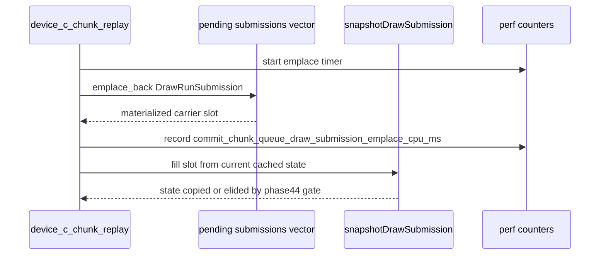

# Measure Queued Submission Carrier Emplace Cost

**Question / hypothesis.** Phase 44 proves that same-stamp non-front draws can
skip the copied canonical state, but every draw still creates a
`DrawRunSubmission` carrier in the pending vector. That carrier includes the
large `CanonicalDrawState` and uniform payload storage even when
`stateMaterialized=false`. Before introducing an optional-state or
direct-construct carrier refactor, measure whether `submissions.emplace_back()`
itself is a meaningful child of `commit_chunk_queue_draw_submission_cpu_ms`.

This is intentionally narrower than the rejected phase 36 scratch-vector branch:
phase 36 already tested persistent vector capacity reuse and found no residual
win. Phase 45 only splits the default-construction/reallocation cost so the next
structural carrier change has a quantified target.

**Implementation.**

- Add `commit_chunk_queue_draw_submission_emplace_cpu_ms` plus max/p50/p95
  variants to the perf counter table.
- Time only the `submissions.emplace_back()` call in both primitive and indexed
  queued-submission paths.
- Add the new counter to the 3DMark05 summary key set so no-gputrace scouts
  expose it without UI work.



**Runtime gate.** Accepted as bounded attribution. The 120-second no-gputrace
GT1 scout ran with `DXMT9_DRAWRUN_GROUP_BY_GEN_LANE=1`, so state-copy elision
was active and the remaining carrier construction cost was visible:

```sh
DXMT9_DRAWRUN_GROUP_BY_GEN_LANE=1 \
bash scripts/tools/run_3dmark05_perf_probe.sh \
  --suffix drawrun-emplace-counter-r1-20260614 \
  --frame 60 --no-gputrace --no-encoder-breakdown --frame-sampling \
  --timeout 120
```

| Metric | Value |
|---|---:|
| `present_encoded` | `1,740` |
| `d3d9_snapshot_state_elided` | `399,701` |
| `d3d9_snapshot_state_elided_bytes` | `4,089,740,632` |
| `d3d9_snapshot_state_copy_cpu_ms` | `141.556` |
| `commit_chunk_queue_draw_submission_cpu_ms` | `8,031.316` |
| `commit_chunk_queue_draw_submission_emplace_cpu_ms` | `1,123.253` |
| emplace / queue submission | `13.99%` |
| emplace / `commit_chunk_replay_cpu_ms` | `5.94%` |
| emplace per present | `0.646ms` |
| `gpu_command_buffer_time_ms` per present | `3.207ms` |
| `completion_wait_ms` per present | `26.142ms` |
| sampled average FPS | `16.319` |

Visual smoke passed at output-frame level: `actual.png` is a normal GT1 robot
frame, with no black/yellow collapse or obvious texture mapping failure.

**Verdict.** The carrier construction target is real, but bounded. Phase 46
follows up by lazily materializing the large carrier fields and cuts the measured
emplace child by about half. That is useful CPU cleanup, not a complete FPS
answer: completion wait is still about `26ms/present`, and phase44 already
showed state-copy elision itself was FPS-flat. Do not repeat the phase36
scratch-vector path; any further carrier experiment must first prove a new
non-zero residual child.

**Verification.**

- `meson compile -C build-arm64-nowine`
- `meson test -C build-arm64-nowine dxmt9-dod-replay-observer-spec dxmt9-imported-apply-state-value-spec dxmt9-perf-counter-table-audit dxmt9-perf-counter-callsite-audit --timeout-multiplier 3`
- `DXMT9_DRAWRUN_GROUP_BY_GEN_LANE=1 meson test -C build-arm64-nowine dxmt9-dod-replay-observer-spec dxmt9-imported-apply-state-value-spec --timeout-multiplier 3`
- `python3 -m pytest tests/scripts/test_summarize_3dmark05_perf.py`
- `python3 scripts/check/audit_perf_docs_sources.py`
- `git diff --check`
- `meson compile -C build-x86_64-builtin`
- `meson compile -C build-win32-x64-builtin`
- `meson compile -C build-win32-x86-builtin`
- `DXMT9_DRAWRUN_GROUP_BY_GEN_LANE=1 scripts/tools/run_3dmark05_perf_probe.sh --suffix drawrun-emplace-counter-r1-20260614 --frame 60 --no-gputrace --no-encoder-breakdown --frame-sampling --timeout 120`
