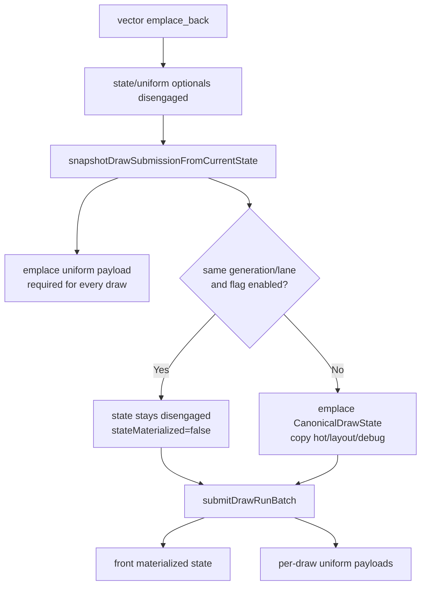

# Optional Queued Submission Carrier Storage

**Question / hypothesis.** Phase 45 measured `submissions.emplace_back()` as a
real queued-submission child. The cost was not vector capacity reuse; phase 36
already rejected that. The remaining candidate was default-constructing large
per-draw carrier fields and then immediately overwriting them in
`snapshotDrawSubmissionFromCurrentState()`.

**Implementation.**

- `DrawRunSubmission::state` is now `std::optional<CanonicalDrawState>`.
  Elided same-stamp non-front submissions keep it disengaged; batch-front and
  non-elided submissions materialize it explicitly.
- `DrawRunSubmission::uniforms` is now `std::optional<DrawUniformPayload>`.
  Every queued draw still owns a uniform payload, but `emplace_back()` no longer
  first default-constructs the 10KB payload only to overwrite it.
- State and uniform consumers use `materializedState()` and `uniformPayload()`
  accessors. The upper-device test fallback uses the materialized batch-front
  state for elided non-front rows while keeping each row's own uniform payload.
- Structural size is intentionally not the win: `DrawRunSubmission` grows
  `20,992 -> 21,008B` from optional discriminants. The win is avoiding default
  construction for disengaged/soon-overwritten carrier storage.



**Runtime gate.** Accepted as a bounded CPU win. The A/B uses the phase45 run as
baseline and reruns the same `DXMT9_DRAWRUN_GROUP_BY_GEN_LANE=1` no-gputrace
GT1 scout after optional carrier storage:

```sh
DXMT9_DRAWRUN_GROUP_BY_GEN_LANE=1 \
bash scripts/tools/run_3dmark05_perf_probe.sh \
  --suffix drawrun-optional-carrier-r1-20260614 \
  --frame 60 --no-gputrace --no-encoder-breakdown --frame-sampling \
  --timeout 120 \
  --compare-baseline-output \
    experiments/output/app-d3d9-3dmark05-drawrun-emplace-counter-r1-20260614
```

| Metric | Before | After | Delta |
|---|---:|---:|---:|
| `present_encoded` | `1,740` | `1,740` | `0` |
| `commit_chunk_queue_draw_submission_emplace_cpu_ms` | `1,123.253` | `573.056` | `-550.197ms` (`-48.98%`) |
| emplace per present | `0.646ms` | `0.329ms` | `-0.316ms` |
| `commit_chunk_queue_draw_submission_cpu_ms` | `8,031.316` | `7,867.581` | `-163.735ms` (`-2.04%`) |
| queue submission per present | `4.616ms` | `4.522ms` | `-0.094ms` |
| `commit_chunk_replay_cpu_ms` | `18,917.743` | `18,862.896` | `-54.847ms` (`-0.29%`) |
| sampled average FPS | `16.319` | `16.423` | `+0.104` (`+0.64%`) |
| `gpu_command_buffer_time_ms` | `5,580.653` | `5,337.959` | `-242.694ms` (`-4.35%`) |
| `completion_wait_ms` | `45,486.427` | `43,125.796` | `-2,360.631ms` (`-5.19%`) |

Visual smoke passed at output-frame level: the after frame is a normal GT1 robot
frame with machine-gun bloom visible and no black/yellow collapse or obvious
texture mapping failure.

The remaining queue-submission shape is no longer carrier-dominated. In the
after run, `commit_chunk_queue_draw_submission_cpu_ms` is `7,867.581ms`
(`4.522ms/present`), but `d3d9_snapshot_draw_submission_cpu_ms` accounts for
`6,786.395ms` (`3.900ms/present`) and the new emplace child accounts for
`573.056ms` (`0.329ms/present`). The remainder after those two children is only
`508.130ms` (`0.292ms/present`). Within snapshot,
`d3d9_snapshot_cache_lookup_cpu_ms` is still `5,816.135ms`
(`3.343ms/present`), so further average-FPS work should not keep digging in
queued-submission carrier construction without a new counter.

**Verdict.** This validates phase45's target and removes about half of the
measured carrier-emplace child. The broader replay and FPS movement is much
smaller, so this remains CPU cleanup rather than the final average-FPS answer.
The next FPS work should still prioritize the larger P2/P3/P4 cadence and
completion-overlap buckets; another carrier experiment should first prove a new
non-zero residual child.

**Verification.**

- `meson compile -C build-arm64-nowine`
- `meson test -C build-arm64-nowine dxmt9-dod-replay-observer-spec dxmt9-imported-apply-state-value-spec dxmt9-perf-counter-table-audit dxmt9-perf-counter-callsite-audit --timeout-multiplier 3`
- `DXMT9_DRAWRUN_GROUP_BY_GEN_LANE=1 meson test -C build-arm64-nowine dxmt9-dod-replay-observer-spec dxmt9-imported-apply-state-value-spec --timeout-multiplier 3`
- `python3 -m pytest tests/scripts/test_summarize_3dmark05_perf.py`
- `python3 scripts/check/audit_perf_docs_sources.py`
- `git diff --check`
- `meson compile -C build-x86_64-builtin`
- `meson compile -C build-win32-x64-builtin`
- `meson compile -C build-win32-x86-builtin`
- `DXMT9_DRAWRUN_GROUP_BY_GEN_LANE=1 scripts/tools/run_3dmark05_perf_probe.sh --suffix drawrun-optional-carrier-r1-20260614 --frame 60 --no-gputrace --no-encoder-breakdown --frame-sampling --timeout 120 --compare-baseline-output experiments/output/app-d3d9-3dmark05-drawrun-emplace-counter-r1-20260614`
