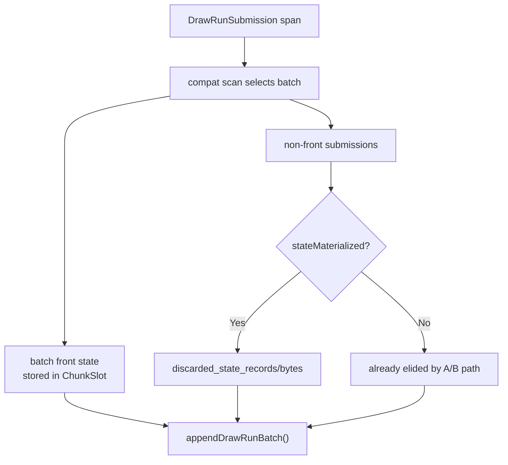

# Discarded Materialized Draw-Run State Counter

**Question / hypothesis.** [state-churn-encode-encode-phase.44](state-churn-encode-encode-phase.44.md) proved that
same-stamp non-front submissions can skip copied canonical state behind
`DXMT9_DRAWRUN_GROUP_BY_GEN_LANE=1`, but default remains conservative. After
[state-churn-encode-encode-phase.46](state-churn-encode-encode-phase.46.md), the next producer-side question is how
much materialized state is still built in the default path and then discarded
because `appendDrawRunBatch()` stores only the batch front.

**Instrumentation.**

- Add `submit_draw_run_batch_discarded_state_records`.
- Add `submit_draw_run_batch_discarded_state_bytes`.
- Count only non-front submissions in the actual compatibility batch when
  `stateMaterialized=true`.
- Do not change batching, state materialization, or hash semantics.



**Run.**

```sh
scripts/tools/run_3dmark05_perf_probe.sh \
  --suffix drawrun-discarded-state-probe-r1-20260614 \
  --frame 60 \
  --no-gputrace \
  --no-encoder-breakdown \
  --frame-sampling \
  --timeout 120
```

Status: pass. The run timeout-finalized under the 120s wrapper. `actual.png` is
visually normal for the sampled machine-gun frame, with no black/yellow screen,
texture collapse, or missing bloom. No Wine/3DMark/xctrace process remained
after the run.

**Result.**

| Counter | Value |
|---|---:|
| `present_encoded` | `1,800` |
| `sampled_avg_fps` | `16.596` |
| `submit_draw_run_batch_groups` | `469,455` |
| `submit_draw_run_batch_records` | `880,817` |
| `submit_draw_run_batch_max_records` | `32` |
| `submit_draw_run_batch_discarded_state_records` | `411,362` |
| `submit_draw_run_batch_discarded_state_bytes` | `4,209,055,984` |
| `d3d9_snapshot_state_materialized` | `880,817` |
| `d3d9_snapshot_state_materialized_bytes` | `9,012,519,544` |
| `d3d9_snapshot_state_elided` | `0` |
| `d3d9_snapshot_state_copy_cpu_ms` | `261.001` |
| `d3d9_snapshot_draw_submission_cpu_ms` | `6,358.286` |
| `commit_chunk_queue_draw_submission_cpu_ms` | `7,463.771` |
| `gpu_command_buffer_time_ms` | `5,442.053` |
| `completion_wait_ms` | `44,739.324` |

The default path still materializes `411,362` non-front states that are not
stored by the batch append. That is `46.70%` of batch records and materialized
state bytes, or `4.209GB` over the supervised run. This matches the magnitude
of the opt-in phase44 state-elision proof (`~4.10GB`) without changing runtime
behavior.

**Decision.** Accept the counter as attribution for the remaining copy-policy
frontier. The evidence does **not** promote the stamp-only elision path by
itself; phase44 still owns that A/B and remains default-off. The new counter
sharpens the next implementation target: direct construction into queue-owned
storage or interned compact draw-state storage should aim at the
materialized-but-discarded batch non-front state class, not more queued-carrier
default-construction work.

**Verification.**

- `meson compile -C build-arm64-nowine`
- `meson test -C build-arm64-nowine dxmt9-perf-counter-table-audit dxmt9-perf-counter-callsite-audit dxmt9-state-draw-transform-spec --timeout-multiplier 3`
- `meson compile -C build-x86_64-builtin`
- `meson compile -C build-win32-x64-builtin`
- `meson compile -C build-win32-x86-builtin`
- `scripts/tools/run_3dmark05_perf_probe.sh --suffix drawrun-discarded-state-probe-r1-20260614 --frame 60 --no-gputrace --no-encoder-breakdown --frame-sampling --timeout 120`

**Related.** [state-churn-encode](../state-churn-encode.md) ·
[state-churn-encode-encode-phase.44](state-churn-encode-encode-phase.44.md) ·
[state-churn-encode-encode-phase.46](state-churn-encode-encode-phase.46.md) · [snapshot-cache](../snapshot-cache.md) ·
[overview-3dmark05-gt1](../overview-3dmark05-gt1.md).
