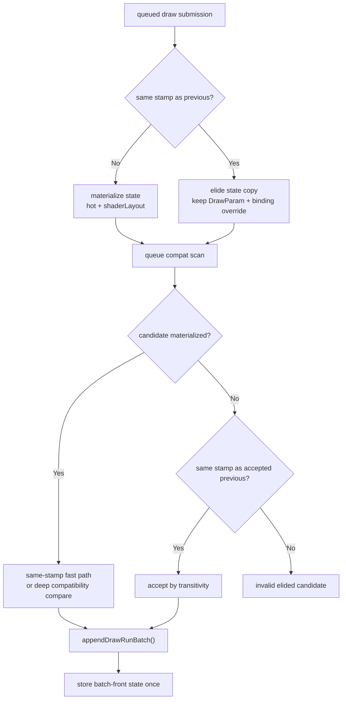

# Default Same-Stamp Draw-State Elision

**Question / hypothesis.** [state-churn-encode-encode-phase.47](state-churn-encode-encode-phase.47.md) proved that
the default path still materializes non-front draw-run state and then discards
it in `appendDrawRunBatch()`. Can we promote the safe part of
[state-churn-encode-encode-phase.44](state-churn-encode-encode-phase.44.md) without adopting stamp-only batching?

**Implementation.**

- `snapshotDrawSubmissionFromCurrentState()` now skips the
  `FlatDrawStateRecord` + `DrawShaderLayoutContext` copy for same
  `{stateGeneration,stateLane}` continuations on the binding-agnostic snapshot
  path.
- The default queue compatibility scan keeps the normal policy: same-stamp
  pairs use the generation fast path, other materialized candidates still use
  the deep compatibility compare.
- If a candidate is elided and shares its stamp with the previous already
  accepted draw, the queue accepts it by transitivity: the previous draw was
  already compatible with the batch front, and the elided candidate has the
  same stable producer state as that previous draw.
- `DXMT9_DRAWRUN_GROUP_BY_GEN_LANE=1` remains a stricter diagnostic mode that
  groups only by stamp. The default path no longer needs that flag for N-1
  state-copy elision.



**Run.**

```sh
scripts/tools/run_3dmark05_perf_probe.sh \
  --suffix drawrun-default-state-elide-r1-20260614 \
  --frame 60 \
  --no-gputrace \
  --no-encoder-breakdown \
  --frame-sampling \
  --timeout 120
```

Status: pass. The wrapper timeout-finalized after producing complete artifacts.
`actual.png` is visually normal for the sampled machine-gun bloom frame, with no
black screen, texture collapse, missing muzzle bloom, or pipeline skips. No
Wine/3DMark/xctrace process remained after the run.

**Result.**

| Counter | phase47 default attribution | phase48 default elision |
|---|---:|---:|
| `present_encoded` | `1,800` | `1,800` |
| `submit_draw_run_batch_records` | `880,817` | `882,617` |
| `submit_draw_run_batch_groups` | `469,455` | `470,437` |
| `d3d9_snapshot_state_materialized` | `880,817` | `470,437` |
| `d3d9_snapshot_state_materialized_bytes` | `9,012,519,544` | `4,813,511,384` |
| `d3d9_snapshot_state_elided` | `0` | `412,180` |
| `d3d9_snapshot_state_elided_bytes` | `0` | `4,217,425,760` |
| `submit_draw_run_batch_discarded_state_records` | `411,362` | `0` |
| `submit_draw_run_batch_discarded_state_bytes` | `4,209,055,984` | `0` |
| `d3d9_snapshot_state_copy_cpu_ms` | `261.001` | `138.856` |
| `d3d9_snapshot_draw_submission_cpu_ms` | `6,358.286` | `5,928.241` |
| `commit_chunk_queue_draw_submission_cpu_ms` | `7,463.771` | `7,023.458` |
| `submit_draw_run_batch_compat_scan_cpu_ms` | `51.511` | `51.629` |
| `gpu_command_buffer_time_ms` | `5,442.053` | `5,454.127` |
| `completion_wait_ms` | `44,739.324` | `44,973.877` |
| `draw_skipped_no_pipeline` | `0` | `0` |
| `gpu_command_buffer_errors` | `0` | `0` |

The phase47 discarded-state class is gone: `411,362` discarded records become
`412,180` default elisions, and discarded state bytes drop to zero. State-copy
CPU drops `261.001 -> 138.856ms` (`-46.80%`), with the broader
queued-submission bucket down `7,463.771 -> 7,023.458ms` (`-5.90%`). The batch
shape stays effectively the same, and compat-scan CPU is flat because the
default path already had the same-generation fast path.

The run is not a wall-clock/FPS breakthrough. GPU command-buffer time is flat
within noise (`+0.22%`) and completion wait is slightly higher (`+0.52%`).
The frame CSV's simple mean is `18.762fps`, close to the prior default
attribution run's `18.629fps`; treat this as noise-level support, not a new FPS
owner.

**Decision.** Accept as a default CPU cleanup and copy-policy improvement. The
implementation removes the proven materialized-but-discarded state class
without requiring stamp-only grouping, and it keeps the stricter
`DXMT9_DRAWRUN_GROUP_BY_GEN_LANE=1` mode as a diagnostic batching experiment.
The average-FPS owner remains outside this local copy bucket: completion/pacing
and broader encode cadence still need separate proof.

**Verification.**

- `meson compile -C build-arm64-nowine` after `meson compile -C build-arm64-nowine --clean`
- `meson test -C build-arm64-nowine dxmt9-dod-replay-observer-spec dxmt9-imported-apply-state-value-spec dxmt9-perf-counter-table-audit dxmt9-perf-counter-callsite-audit --timeout-multiplier 3`
- `meson compile -C build-x86_64-builtin`
- `meson compile -C build-win32-x64-builtin`
- `meson compile -C build-win32-x86-builtin`
- `scripts/tools/run_3dmark05_perf_probe.sh --suffix drawrun-default-state-elide-r1-20260614 --frame 60 --no-gputrace --no-encoder-breakdown --frame-sampling --timeout 120`

**Related.** [state-churn-encode](../state-churn-encode.md) ·
[state-churn-encode-encode-phase.44](state-churn-encode-encode-phase.44.md) ·
[state-churn-encode-encode-phase.47](state-churn-encode-encode-phase.47.md) · [overview-3dmark05-gt1](../overview-3dmark05-gt1.md).
