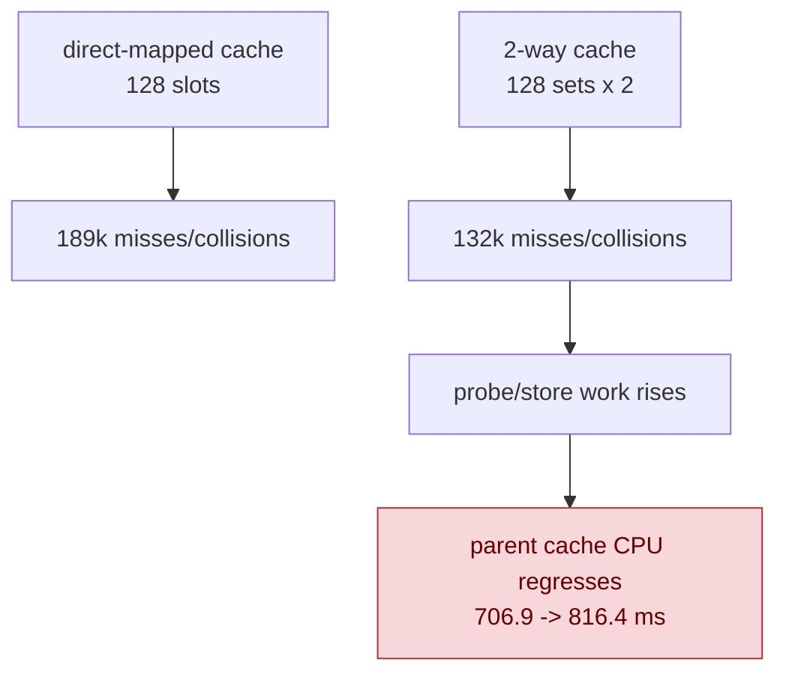

# Binding Packet 2-Way Cache Rejected

**Question / hypothesis.** The current binding-packet cache is direct-mapped.
The phase08 scout still reports `189,178` misses and `189,050` collisions, so
a small 2-way set-associative cache might keep the hot collision pair without
weakening the safety boundary. The exact match still used
`hashDrawBindingPacketPlan()` plus `drawBindingPacketPlansEqual()`; only the
cache replacement shape changed.

**Implementation tested, then reverted.**

- `DrawBindingPacketCache` was changed from `128 x 1` entries to `128 x 2`.
- Lookup probed way0 then way1, promoted way1 hits to way0, and inserted misses
  at way0 while shifting the old entry to way1.
- A native spec proved two distinct packets mapping to the same set could both
  be reused.
- The code was reverted after the scout because it regressed the hot cache CPU
  bucket. The retained code change from this iteration is unrelated:
  `copyBoolPrefixToUpload()` now returns early for zero bool copies so partial
  int-only uniform uploads do not assert in debug builds.

**Method.**

```sh
bash scripts/tools/run_3dmark05_perf_probe.sh \
  --suffix binding-packet-cache-2way-r1-20260614 \
  --frame 60 \
  --no-gputrace \
  --no-encoder-breakdown \
  --frame-sampling \
  --timeout 120
```

The run timeout-finalized normally with `status=pass`, `present_encoded=1800`,
and a normal machine-gun muzzle-flash GT1 frame. This is a no-gputrace CPU A/B,
not an Xcode GPU proof.

**Result versus [present-pacing-stage-delta.08](../present-pacing/present-pacing-stage-delta.08.md).**

| Counter | phase08 | 2-way cache | Delta |
|---|---:|---:|---:|
| `present_encoded` | `1,800` | `1,800` | `0` |
| `draw_calls` | `1,324,049` | `1,322,511` | `-0.12%` |
| `encode_draw_binding_packet_cache_hits` | `1,134,871` | `1,189,564` | `+54,693` |
| `encode_draw_binding_packet_cache_misses` | `189,178` | `132,947` | `-56,231` |
| `encode_draw_binding_packet_cache_collisions` | `189,050` | `132,819` | `-56,231` |
| `encode_draw_binding_packet_cache_cpu_ms` | `706.875` | `816.355` | `+109.480` |
| `encode_draw_binding_packet_cache_hash_cpu_ms` | `145.264` | `133.742` | `-11.522` |
| `encode_draw_binding_packet_cache_probe_cpu_ms` | `177.413` | `212.498` | `+35.085` |
| `encode_draw_binding_packet_cache_store_cpu_ms` | `111.611` | `126.317` | `+14.706` |
| `encode_draw_binding_packet_cpu_ms` | `1,835.316` | `1,939.451` | `+104.135` |
| `encode_draw_cpu_ms` | `16,023.609` | `16,109.642` | `+86.033` |
| `encode_chunk_cpu_p50_ms` | `10.459` | `10.337` | noisy flat |
| `completion_wait_ms` | `45,002.302` | `45,607.873` | `+1.35%` |
| sampled FPS mean / p50 | `18.763 / 18.381` | `18.677 / 18.369` | flat |



**Verdict.** Rejected as a default optimization. The hypothesis was half-right:
extra associativity removes about `56k` collision misses. The cost of probing,
promoting, shifting, and storing larger packet entries exceeds the saved misses
for GT1, so the parent cache bucket regresses and total encode CPU is flat to
slightly worse.

**Next.** Do not pursue binding-packet cache associativity as the next FPS
lever. A future binding-packet attempt needs a stronger identity or plan reuse
that reduces plan/probe bytes instead of just keeping more full packet entries.
The larger current encode owners remain argbuf setup/cbuf update, stream/index
bind, pipeline lookup, issue cost, and the still exposed pre-publish
replay/snapshot path from [present-pacing-stage-delta.08](../present-pacing/present-pacing-stage-delta.08.md).

**Related.** [state-churn-encode](../state-churn-encode.md) ·
[state-churn-encode-encode-phase.08](state-churn-encode-encode-phase.08.md) ·
[state-churn-encode-encode-phase.21](state-churn-encode-encode-phase.21.md) ·
[present-pacing-stage-delta.08](../present-pacing/present-pacing-stage-delta.08.md).
