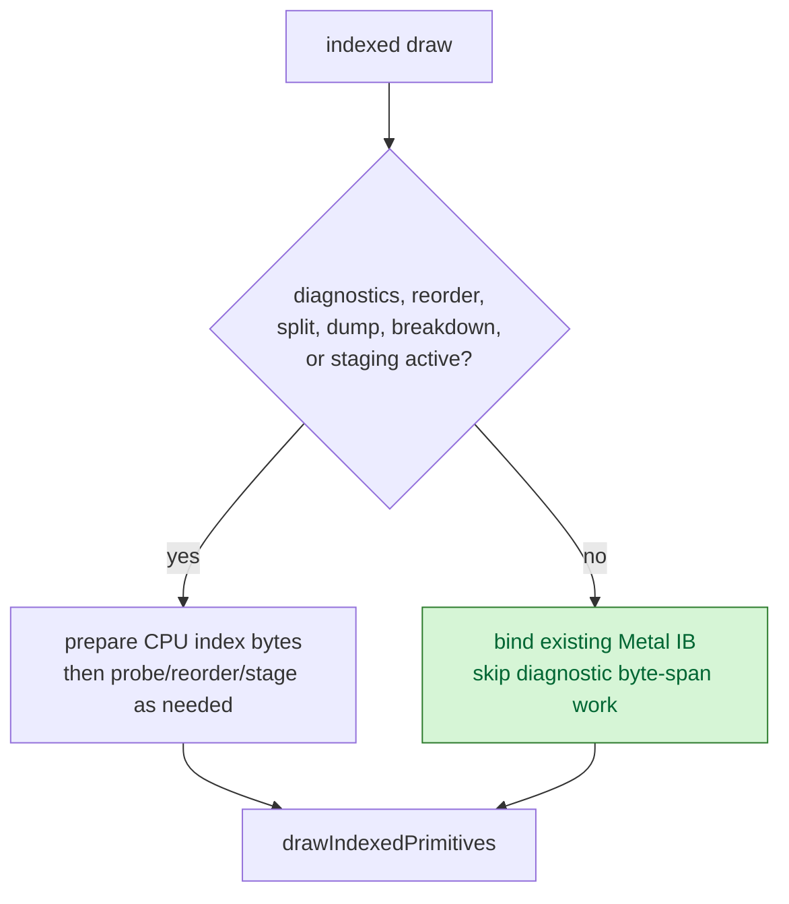

# Default Indexed Fast Path

> **Outdated — every artifact this leaf cites in `source:` is gone from disk.** The numbers below cannot be re-derived or re-checked. Kept as history; do not cite it as current evidence.

**Question / hypothesis.** The phase08 low-overhead scout still spends
`775.311ms` in `encode_draw_stream_bind_index_phase_cpu_ms` and `636.514ms` in
`encode_draw_index_setup_cpu_ms`. In the default GT1 run all index-cache,
reorder, split, indexed-geometry dump, and encoder-breakdown diagnostics are
off, so the encoder should not prepare diagnostic index byte spans or evaluate
row/class filters before binding the existing Metal index buffer.

**Implementation.**

- Added `debug::indexedTriangleDiagnosticsEnabled()` as a single gate for the
  indexed triangle-list diagnostics and opt-in reorder/split paths.
- The indexed draw encoder now fills reusable CPU index bytes from
  snapshot/shadow/contents only when diagnostics or encoder breakdown need
  them.
- If both diagnostics and stream/IB staging are off, the indexed path binds the
  existing Metal index buffer directly and skips the diagnostic/reorder block.
- Shadow fallback still uploads when there is no Metal buffer, so the normal
  rendering path keeps the required data source.

**Method.**

```sh
bash scripts/tools/run_3dmark05_perf_probe.sh \
  --suffix indexed-default-fastpath-r1-20260614 \
  --frame 60 \
  --no-gputrace \
  --no-encoder-breakdown \
  --frame-sampling \
  --timeout 120
```

The run timeout-finalized with `status=pass`, `present_encoded=1800`, no GPU
command-buffer errors, and a normal machine-gun muzzle-flash GT1 frame. This is
a no-gputrace CPU A/B, not an Xcode GPU proof.

**Result versus [present-pacing-stage-delta.08](../present-pacing/present-pacing-stage-delta.08.md).**

| Counter | phase08 | indexed fast path | Delta |
|---|---:|---:|---:|
| `present_encoded` | `1,800` | `1,800` | `0` |
| `draw_indexed` | `1,324,049` | `1,323,653` | `-0.03%` |
| `encode_draw_stream_bind_index_phase_cpu_ms` | `775.311` | `480.350` | `-294.961` |
| `encode_draw_index_setup_cpu_ms` | `636.514` | `342.602` | `-293.912` |
| `encode_draw_index_source_resolve_cpu_ms` | `137.065` | `143.563` | `+6.498` |
| `encode_draw_stream_bind_cpu_ms` | `2,808.640` | `2,502.119` | `-306.521` |
| `encode_draw_cpu_ms` | `16,023.609` | `15,906.915` | `-116.694` |
| `gpu_command_buffer_time_ms` | `5,431.223` | `5,507.941` | `+1.41%` |
| `completion_wait_ms` | `45,002.302` | `45,641.729` | `+1.42%` |
| sampled FPS mean / p50 | `18.753 / 18.377` | `18.663 / 18.303` | flat/noisy |



**Verdict.** Accepted as a default CPU cleanup. The target local bucket moves:
`encode_draw_index_setup_cpu_ms` drops `46.18%` and the index phase drops
`38.04%`. The parent `encode_draw_cpu_ms` only drops `0.73%`, and FPS/GPU/
completion are flat to noisy, so this is not the average-FPS owner.

**Next.** Do not spend more time on default diagnostic index-byte preparation;
that class is now gated. The remaining encode owners are still argbuf setup,
cbuf update/probe/repoint residual, binding-packet identity width, shader stream
bind diversity, issue cost, and the broader pre-publish replay/snapshot cadence.

**Related.** [state-churn-encode](index.md) ·
[state-churn-encode-encode-phase.12](state-churn-encode-encode-phase.12.md) ·
[state-churn-encode-encode-phase.49](state-churn-encode-encode-phase.49.md) ·
[present-pacing-stage-delta.08](../present-pacing/present-pacing-stage-delta.08.md).
