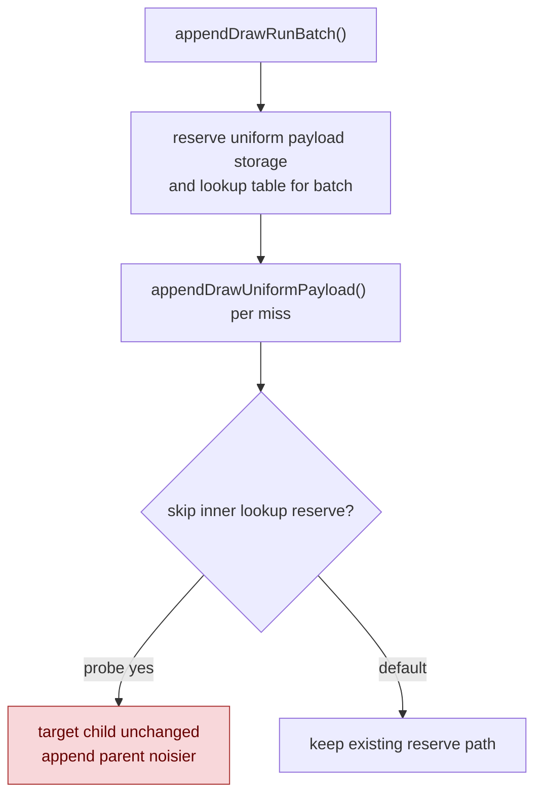

# Uniform Lookup Prereserve Probe

**Question / hypothesis.** `submit_draw_run_batch_append_uniform_cpu_ms`
remains a visible submit-side child after same-stamp state elision. Since
`appendDrawRunBatch()` already reserves `drawUniformPayloads` and the uniform
lookup table for the whole batch, the miss path may waste CPU by calling
`reserveDrawUniformPayloadLookup()` again inside every
`appendDrawUniformPayload()` call.

**Implementation tested.**

- Added an internal `lookupReserved` flag to `appendDrawUniformPayload()`.
- Passed that flag from `appendDrawRun()` and `appendDrawRunBatch()` after their
  existing storage/lookup reserves.
- No render semantics, payload hashing, lookup equality, or handle generation
  changed.

The code was reverted after the run because the normalized counters did not move
the target parent.

**Method.**

```sh
bash scripts/tools/run_3dmark05_perf_probe.sh \
  --suffix uniform-lookup-prereserve-r1-20260614 \
  --frame 60 \
  --no-gputrace \
  --no-encoder-breakdown \
  --frame-sampling \
  --timeout 120
```

Status: pass. The run produced `actual.png` with the expected machine-gun
muzzle bloom frame, `draw_skipped_no_pipeline=0`, and
`gpu_command_buffer_errors=0`.

**Result versus [state-churn-encode-encode-phase.50](state-churn-encode-encode-phase.50.md).** Raw totals are not a
valid decision gate because this run stopped at `1740` presents while phase50
had `1800`; the table uses normalized values.

| Counter | phase50 / present | prereserve / present | Delta |
|---|---:|---:|---:|
| `submit_draw_run_batch_append_uniform_cpu_ms` | `0.474488` | `0.474157` | `-0.07%` |
| `submit_draw_run_batch_append_cpu_ms` | `1.047767` | `1.069220` | `+2.05%` |
| `commit_chunk_queue_draw_submission_cpu_ms` | `3.933378` | `3.992937` | `+1.51%` |
| `d3d9_snapshot_draw_submission_cpu_ms` | `3.323492` | `3.378506` | `+1.66%` |
| `encode_draw_cpu_ms` | `8.837175` | `8.806199` | `-0.35%` |
| `completion_wait_ms` | `25.356516` | `24.996099` | `-1.42%` |
| sampled FPS mean / p50 | `18.663 / 18.303` | `18.398 / 17.924` | flat/noisy |

Per-operation normalization says the same thing:
`submit_draw_run_batch_append_uniform_cpu_ms / draw_uniform_payload_appends`
moves only `0.910868us -> 0.907838us` (`-0.33%`), while the parent append cost
per record regresses by about `+1.7%`.



**Verdict.** Reject and revert. The remaining uniform-append cost is not the
inner lookup-reserve call. If this path is touched again, the next proof must
split payload equality compare, lookup bucket walk, payload copy, and lookup
linking rather than assuming reserve/check overhead owns the bucket.

**Related.** [state-churn-encode](index.md) ·
[state-churn-encode-encode-phase.48](state-churn-encode-encode-phase.48.md) ·
[state-churn-encode-encode-phase.50](state-churn-encode-encode-phase.50.md) · [snapshot-cache](../snapshot-cache/index.md).
