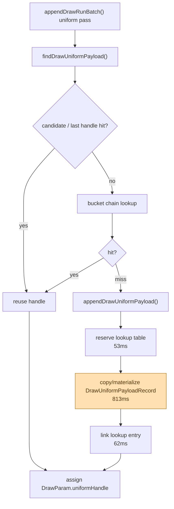

# Uniform Payload Append Split

**Question / hypothesis.** [state-churn-encode-encode-phase.51](state-churn-encode-encode-phase.51.md) rejected the
simple inner-lookup-reserve cleanup, but left the `submit_draw_run_batch_append_uniform_cpu_ms`
child unattributed. The next proof should split lookup traversal, lookup-bucket
work, append reserve, payload copy/materialization, and lookup linking.

**Instrumentation.**

- Added `draw_uniform_payload_lookup_cpu_ms` around
  `ChunkSlot::findDrawUniformPayload()`.
- Added `draw_uniform_payload_lookup_bucket_cpu_ms` around the slot-local bucket
  chain path.
- Added append split timers around `reserveDrawUniformPayloadLookup()`,
  `drawUniformPayloads.push_back(DrawUniformPayloadRecord{...})`, and
  `appendDrawUniformPayloadLookup()`.
- Added the counters to the runtime table, `assert_perf_counters.py`, and
  `summarize_3dmark05_perf.py`.

This is attribution instrumentation. The added timers run on the hot path, so
the parent append bucket is expected to include measurement overhead and must
not be read as an optimization A/B.

**Method.**

```sh
bash scripts/tools/run_3dmark05_perf_probe.sh \
  --suffix uniform-append-split-r1-20260614 \
  --frame 60 \
  --no-gputrace \
  --no-encoder-breakdown \
  --frame-sampling \
  --timeout 120
```

Status: pass. The run produced `present_encoded=1800`,
`draw_skipped_no_pipeline=0`, `gpu_command_buffer_errors=0`, and a normal
machine-gun muzzle-bloom `actual.png`.

**Result.** Normalized phase50/51 comparisons are kept only to show that the
run is in the same operating band; the new split counters are the useful
output.

| Counter | phase50 / present | phase51 / present | phase52 / present |
|---|---:|---:|---:|
| `submit_draw_run_batch_append_uniform_cpu_ms` | `0.474488` | `0.474157` | `0.721674` |
| `submit_draw_run_batch_append_cpu_ms` | `1.047767` | `1.069220` | `1.294292` |
| `commit_chunk_queue_draw_submission_cpu_ms` | `3.933378` | `3.992937` | `3.912708` |
| `d3d9_snapshot_draw_submission_cpu_ms` | `3.323492` | `3.378506` | `3.307993` |
| `encode_draw_cpu_ms` | `8.837175` | `8.806199` | `8.732182` |
| `completion_wait_ms` | `25.356516` | `24.996099` | `25.247861` |
| `gpu_command_buffer_time_ms` | `3.059967` | `3.048194` | `3.040824` |

Phase52 split:

| Counter | Total | Per present | Per append |
|---|---:|---:|---:|
| `draw_uniform_payload_lookup_cpu_ms` | `294.215ms` | `0.163453ms` | `0.313549us` |
| `draw_uniform_payload_lookup_bucket_cpu_ms` | `154.102ms` | `0.085612ms` | `0.164229us` |
| `draw_uniform_payload_append_reserve_cpu_ms` | `53.018ms` | `0.029454ms` | `0.056502us` |
| `draw_uniform_payload_append_copy_cpu_ms` | `813.196ms` | `0.451776ms` | `0.866634us` |
| `draw_uniform_payload_append_link_cpu_ms` | `62.443ms` | `0.034691ms` | `0.066546us` |

`draw_uniform_payload_appends=938338`. The split sums to `1222.872ms`
(`294.215ms` lookup + `928.657ms` append children), close to the
`1299.014ms` parent after timer overhead and residual loop bookkeeping.



**Verdict.** Accepted as attribution. The rejected phase51 reserve hypothesis
is confirmed: reserve is only `53.018ms`, while the append copy/materialization
child is `813.196ms`. Lookup is still visible (`294.215ms` total, `154.102ms`
inside bucket chains), but the append miss path is dominated by copying the
owned `DrawUniformPayloadRecord`.

**Next.** Do not retry lookup-prereserve. If this child is worth another
implementation pass, target fewer payload copies or narrower owned payloads:
intern repeated uniform payload components, store payload references by
generation when lifetime is proven, or move toward a slab/direct-build shape
that avoids copying the full `DrawUniformPayload` on every miss. Any such change
must preserve owned replay storage across the queue boundary.

**Related.** [state-churn-encode](index.md) ·
[state-churn-encode-encode-phase.48](state-churn-encode-encode-phase.48.md) ·
[state-churn-encode-encode-phase.50](state-churn-encode-encode-phase.50.md) ·
[state-churn-encode-encode-phase.51](state-churn-encode-encode-phase.51.md) · [snapshot-cache](../snapshot-cache/index.md).
