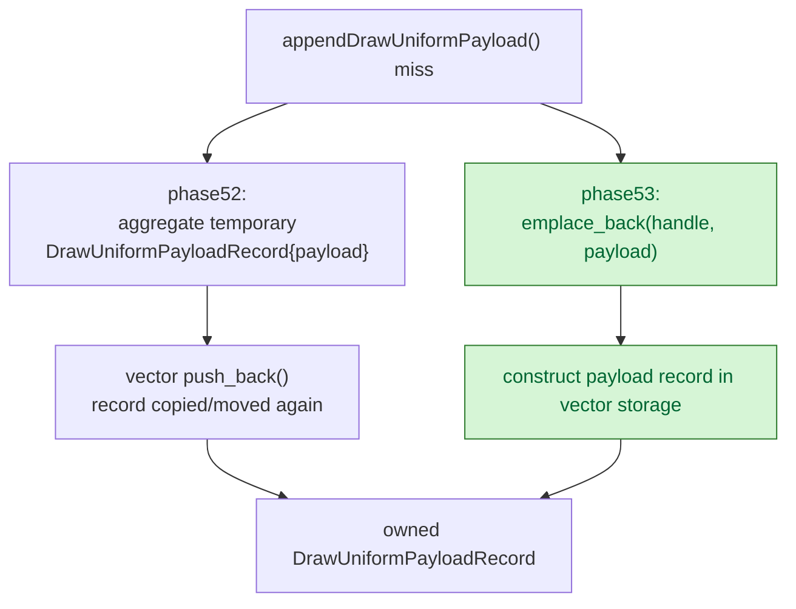

# Uniform Payload Record In-Place Construction

**Question / hypothesis.** [state-churn-encode-encode-phase.52](state-churn-encode-encode-phase.52.md) showed
`draw_uniform_payload_append_copy_cpu_ms=813.196ms`, making the append miss path
copy/materialization-dominated. The current code constructs an aggregate
`DrawUniformPayloadRecord{.handle=..., .payload=...}` and then pushes it into
the vector. Since `DrawUniformPayload` is a large value object, the temporary
record can add another full payload move/copy.

**Implementation.**

- Added a `DrawUniformPayloadRecord(DrawUniformHandle, const DrawUniformPayload&)`
  constructor.
- Replaced the aggregate temporary plus `push_back()` with
  `drawUniformPayloads.emplace_back(uniformHandle, payload)`.

This preserves the owned queue-side payload storage and does not change hashing,
lookup, handle generation, draw params, or encoder-visible uniform contents.

**Method.**

```sh
bash scripts/tools/run_3dmark05_perf_probe.sh \
  --suffix uniform-payload-emplace-r1-20260614 \
  --frame 60 \
  --no-gputrace \
  --no-encoder-breakdown \
  --frame-sampling \
  --timeout 120
```

Status: pass. The run produced `present_encoded=1800`,
`draw_skipped_no_pipeline=0`, `gpu_command_buffer_errors=0`, and a normal
machine-gun muzzle-bloom frame.

**Result versus [state-churn-encode-encode-phase.52](state-churn-encode-encode-phase.52.md).** Both runs keep the
same attribution timers, so the copy child is the intended local gate.

| Counter | phase52 | emplace | Delta |
|---|---:|---:|---:|
| `present_encoded` | `1800` | `1800` | `0` |
| `draw_uniform_payload_appends` | `938,338` | `938,612` | `+0.03%` |
| `draw_uniform_payload_append_copy_cpu_ms` | `813.196` | `602.274` | `-25.94%` |
| `draw_uniform_payload_append_copy_cpu_ms / append` | `0.866634us` | `0.641665us` | `-25.96%` |
| `submit_draw_run_batch_append_uniform_cpu_ms` | `1299.014` | `1128.212` | `-13.15%` |
| `submit_draw_run_batch_append_cpu_ms` | `2329.726` | `2189.235` | `-6.03%` |
| `commit_chunk_queue_draw_submission_cpu_ms` | `7042.874` | `7167.457` | `+1.77%` |
| `d3d9_snapshot_draw_submission_cpu_ms` | `5954.387` | `6075.590` | `+2.04%` |
| `encode_draw_cpu_ms` | `15717.928` | `15943.997` | `+1.44%` |
| `completion_wait_ms` | `45446.149` | `44931.478` | `-1.13%` |
| `gpu_command_buffer_time_ms` | `5473.483` | `5464.576` | `-0.16%` |
| sampled FPS | `16.625` | `16.649` | flat/noisy |



**Verdict.** Accepted as a local CPU cleanup. The targeted copy child falls
`25.94%`, and the append-uniform parent falls `13.15%`. This is still not an
average-FPS owner: queue/snapshot/encode totals remain noisy to slightly worse
while completion and GPU time are flat. The result does, however, close the
temporary-record part of the phase52 payload-copy bucket.

**Next.** Remaining uniform append work requires changing the owned payload
shape or reducing append misses, not another construction micro-optimization.
Potential next proofs: component-interned uniform payload storage, lifetime-safe
payload references keyed by uniform generation, or compact storage for the
subsets of `DrawUniformPayload` the active shader/FFP path can actually read.

**Related.** [state-churn-encode](../state-churn-encode.md) ·
[state-churn-encode-encode-phase.51](state-churn-encode-encode-phase.51.md) ·
[state-churn-encode-encode-phase.52](state-churn-encode-encode-phase.52.md) · [snapshot-cache](../snapshot-cache.md).
