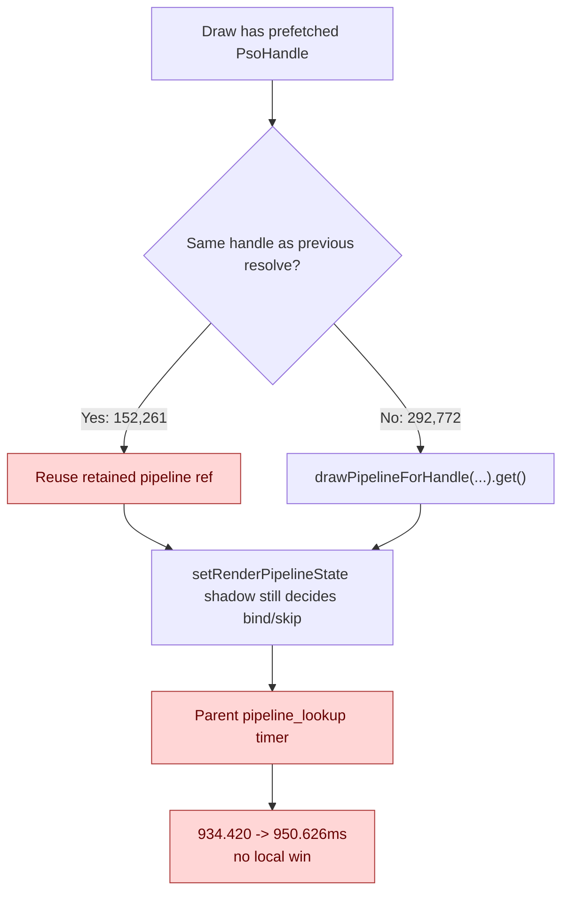

# Encode Phase 54 - Prefetched PSO Resolve Cache Rejected

date: 2026-06-14
status: rejected-current
source: src/dxmt9/dxmt9_draw_encoder.mm, src/dxmt9/dxmt9_pipeline_cache.cpp, experiments/output/app-d3d9-3dmark05-uniform-payload-emplace-r1-20260614/3dmark05-perf-summary.md, experiments/output/app-d3d9-3dmark05-pso-resolve-cache-r1-20260614/3dmark05-perf-summary.md, experiments/output/app-d3d9-3dmark05-pso-resolve-cache-r1-20260614/result.json, experiments/output/app-d3d9-3dmark05-pso-resolve-cache-r1-20260614/actual.png

**Question / hypothesis.** [[state-churn-encode-encode-phase.53]] left
`encode_draw_pipeline_lookup_cpu_ms=934.420ms` even though PSO prefetch was
complete: `encode_draw_pso_prefetch_handle_available=446,201`,
`encode_draw_pso_prefetch_handle_used=446,201`, and missing/bypass counters were
zero. That suggests the residual could be repeated
`drawPipelineForHandle(...).get()` work on an already-prefetched handle rather
than key construction or PSO build.

**Transient implementation.**

- Added an encoder-local `DrawPsoResolveCache` for the prefetched-handle path.
- Reused the retained pipeline reference when the current prefetched
  `PsoHandle` matched the previous resolve slot.
- Counted transient `encode_draw_pso_resolve_cache_hits/misses`.
- Left fallback/build/probe paths unchanged.

The experiment code was removed after the run because the parent timer did not
improve.

**Method.**

```sh
bash scripts/tools/run_3dmark05_perf_probe.sh \
  --suffix pso-resolve-cache-r1-20260614 \
  --frame 60 \
  --no-gputrace \
  --no-encoder-breakdown \
  --frame-sampling \
  --timeout 120
```

Status: pass. The run produced `present_encoded=1800`,
`draw_skipped_no_pipeline=0`, `gpu_command_buffer_errors=0`, and a normal
machine-gun muzzle-bloom frame.

**Result versus [[state-churn-encode-encode-phase.53]].**

| Counter | phase53 | PSO resolve cache | Delta |
|---|---:|---:|---:|
| `present_encoded` | `1800` | `1800` | `0` |
| `encode_draw_pso_prefetch_handle_used` | `446,201` | `445,033` | `-0.26%` |
| `encode_draw_pso_resolve_cache_hits` | n/a | `152,261` | - |
| `encode_draw_pso_resolve_cache_misses` | n/a | `292,772` | - |
| `encode_draw_pipeline_lookup_cpu_ms` | `934.420` | `950.626` | `+1.73%` |
| `encode_draw_cpu_ms` | `15,943.997` | `15,718.720` | `-1.41%` |
| `encode_draw_argbuf_setup_cpu_ms` | `3,399.571` | `3,463.584` | `+1.88%` |
| `encode_draw_stream_bind_cpu_ms` | `2,519.371` | `2,476.633` | `-1.70%` |
| `encode_draw_binding_packet_cpu_ms` | `1,907.312` | `1,874.326` | `-1.73%` |
| `encode_draw_issue_cpu_ms` | `1,029.587` | `955.200` | `-7.22%` |
| `gpu_command_buffer_time_ms` | `5,464.576` | `5,458.563` | `-0.11%` |
| `completion_wait_ms` | `44,931.478` | `45,034.605` | `+0.23%` |
| sampled FPS | `16.649` | `16.632` | flat/noisy |



**Verdict.** Rejected-current. The opportunity exists (`152,261` hits), but
the measured parent `encode_draw_pipeline_lookup_cpu_ms` does not fall. The
small drop in total `encode_draw_cpu_ms` is not attributable to the target
because larger siblings move in both directions and FPS/GPU/completion are flat.
Do not carry a PSO resolve cache as default code without a cheaper proof that it
reduces the parent timer.

**Next.** Treat `pipeline_lookup` as a secondary child for now. Bigger remaining
owners are still the exposed completion/present no-enqueue window and the larger
encode children (`argbuf_setup`, `stream_bind`, `binding_packet`, `issue`) or
snapshot/commit replay cadence. A future PSO attempt should first split
`pipeline_lookup` into handle resolve, depth-state resolve, variant label/hash,
and actual Metal bind/shadow work.

**Related.** [[state-churn-encode]] ·
[[state-churn-encode-encode-phase.53]] · [[snapshot-cache]].
