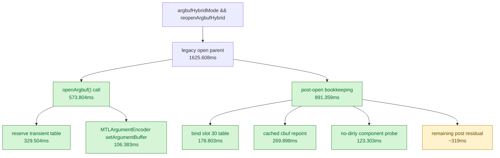

# Encode Phase 55 - Argbuf Reopen Split Attribution

date: 2026-06-14
status: accepted-attribution
source: src/dxmt9/dxmt9_draw_encoder.mm, src/dxmt9/dxmt9_argbuf_hybrid.cpp, src/dxmt9/dxmt9_perf_counters.cpp, experiments/output/app-d3d9-3dmark05-uniform-payload-emplace-r1-20260614/3dmark05-perf-summary.md, experiments/output/app-d3d9-3dmark05-argbuf-reopen-split-r1-20260614/3dmark05-perf-summary.md, experiments/output/app-d3d9-3dmark05-argbuf-reopen-split-r1-20260614/result.json, experiments/output/app-d3d9-3dmark05-argbuf-reopen-split-r1-20260614/actual.png

**Question / hypothesis.** [state-churn-encode-encode-phase.53](state-churn-encode-encode-phase.53.md) left
`encode_draw_argbuf_setup_cpu_ms=3399.571ms`, with
`encode_draw_argbuf_open_cpu_ms=1432.813ms`. The existing `open` timer name
suggested Metal argument-buffer retargeting, but the scope actually covered the
whole per-draw reopen block: `openArgbuf()`, table slot bind, byte accounting,
cached cbuf repoints, and no-dirty component probes. This phase asks whether
the residual belongs to actual `openArgbuf()` or post-open bookkeeping.

**Implementation.** Added attribution-only counters:

- `encode_draw_argbuf_open_call_cpu_ms` around only
  `argbuf_hybrid::openArgbuf()`.
- `encode_draw_argbuf_reopen_post_cpu_ms` around the post-open table/cache
  block.
- `encode_draw_argbuf_cbuf_full_repoint_cpu_ms` around the full cached-cbuf
  repoint branch.

The legacy `encode_draw_argbuf_open_cpu_ms` scope is intentionally unchanged so
old runs remain comparable; it should now be read as the per-draw reopen-block
parent, not the Metal open call alone.

**Method.**

```sh
bash scripts/tools/run_3dmark05_perf_probe.sh \
  --suffix argbuf-reopen-split-r1-20260614 \
  --frame 60 \
  --no-gputrace \
  --no-encoder-breakdown \
  --frame-sampling \
  --timeout 120
```

Status: pass. The run produced `present_encoded=1800`,
`draw_skipped_no_pipeline=0`, `gpu_command_buffer_errors=0`, and a normal
machine-gun muzzle-bloom frame. Sampled FPS remains flat/noisy against phase53
(`16.649 -> 16.657`), and GPU/completion wait remain flat/noisy.

**Result.**

| Counter | phase55 |
|---|---:|
| `encode_draw_argbuf_setup_cpu_ms` | `3541.348` |
| `encode_draw_argbuf_open_cpu_ms` | `1625.608` |
| `encode_draw_argbuf_open_call_cpu_ms` | `573.804` |
| `encode_draw_argbuf_reopen_post_cpu_ms` | `891.359` |
| `encode_draw_argbuf_open_reserve_cpu_ms` | `329.504` |
| `encode_draw_argbuf_open_set_argument_buffer_cpu_ms` | `106.383` |
| `encode_draw_argbuf_table_bind_cpu_ms` | `178.803` |
| `encode_draw_argbuf_cbuf_cached_repoint_cpu_ms` | `269.898` |
| `encode_draw_argbuf_cbuf_content_probe_cpu_ms` | `123.303` |
| `encode_draw_argbuf_cbuf_full_repoint_cpu_ms` | `0.000` |
| `encode_draw_argbuf_cbuf_reopen_no_dirty_hash_mismatch` | `961,164` |
| `encode_draw_argbuf_cbuf_reopen_partial_candidates` | `21,166` |
| `encode_draw_argbuf_cbuf_cached_repoint_calls` | `1,727,479` |
| `encode_draw_argbuf_cbuf_cached_repoint_bytes` | `398,594,288` |
| `encode_draw_argbuf_cbuf_content_probe_vs_hits` | `148,789` |
| `encode_draw_argbuf_cbuf_content_probe_vs_misses` | `812,375` |
| `encode_draw_argbuf_cbuf_content_probe_ps_hits` | `650,655` |
| `encode_draw_argbuf_cbuf_content_probe_ps_misses` | `310,509` |
| `encode_draw_argbuf_cbuf_content_probe_ffp_ps_hits` | `928,035` |
| `encode_draw_argbuf_cbuf_content_probe_ffp_ps_misses` | `33,129` |



**Verdict.** Accepted attribution. The old `argbuf_open` parent is not mostly
Metal `setArgumentBuffer`; actual `openArgbuf()` is `573.804ms`, while
post-open table/cache bookkeeping is `891.359ms`. The full-cbuf repoint branch
does not fire in GT1 (`0` calls/time); the live post-open cost is table bind,
per-component cached repoint, no-dirty component probe, and an inferred
`~319ms` residual.

**Next.** Do not optimize `openArgbuf()` as a single black box. The next
argbuf-side candidate should either:

- reduce reopen frequency before allocation by proving a pre-open component
  identity that keeps the whole table unchanged, or
- split the post-open residual further into table-hash/shadow bookkeeping,
  per-component branch work, and dirty-mask forcing.

Any pre-open skip must preserve the per-draw argbuf table lifetime rule from
the dxut-simple overlay fix: a table cannot be reused when any pointed cbuf
slice changes before older draws have executed.

**Related.** [state-churn-encode](../state-churn-encode.md) ·
[state-churn-encode-encode-phase.53](state-churn-encode-encode-phase.53.md) ·
[state-churn-encode-encode-phase.54](state-churn-encode-encode-phase.54.md).
