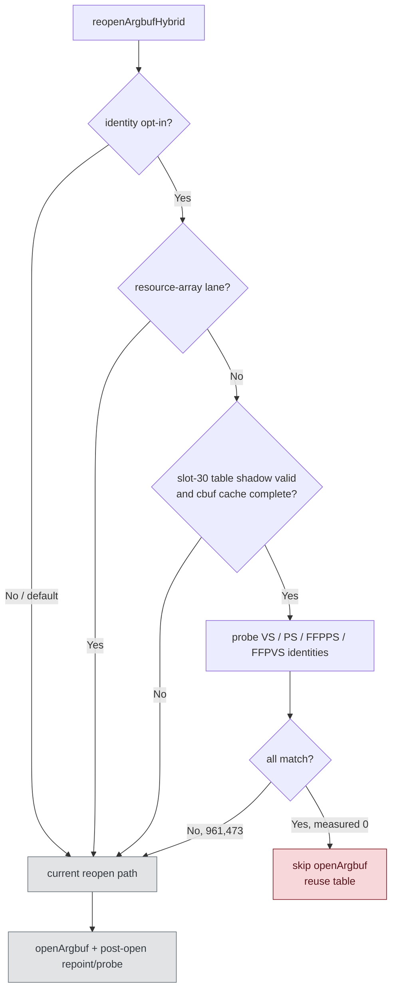

# Encode Phase 56 - Argbuf Reopen Identity Skip Rejection

> **Outdated — the knob or code path this experiment measured no longer exists in `src/`.** It cannot be re-run. Kept as history; do not cite it as current evidence.

**Question / hypothesis.** [state-churn-encode-encode-phase.55](state-churn-encode-encode-phase.55.md) showed that
the old `encode_draw_argbuf_open_cpu_ms` bucket is a per-draw reopen-block
parent, and that post-open bookkeeping is larger than the actual
`openArgbuf()` call. This phase tests the safer pre-open version of the next
idea: if the previous constants-only argbuf table is still bound, no cbuf dirty
bits are pending, and VS/PS/FFPVS/FFPPS identity probes all match the cached
bindings, can we skip `openArgbuf()` entirely and reuse the current table?

**Temporary implementation.** A local default-off branch, removed after this
rejection, added `DXMT9_OPTIMIZE_ARGBUF_REOPEN_IDENTITY=1` and the counters:

- `encode_draw_argbuf_reopen_identity_cpu_ms`
- `encode_draw_argbuf_reopen_identity_candidates`
- `encode_draw_argbuf_reopen_identity_skipped`
- `encode_draw_argbuf_reopen_identity_miss_{vs,ps,ffp_ps,ffp_vs}`

The gate deliberately excluded the resource-array lane because texture/sampler
gpuResourceIDs are written inline into the same argument buffer table and still
need per-draw ownership. It also required the previous slot-30 table shadow to
be valid and all cbuf identities to match before clearing `reopenArgbufHybrid`.

**Method.**

```sh
DXMT9_OPTIMIZE_ARGBUF_REOPEN_IDENTITY=1 \
bash scripts/tools/run_3dmark05_perf_probe.sh \
  --suffix argbuf-reopen-identity-r1-20260614 \
  --frame 60 \
  --no-gputrace \
  --no-encoder-breakdown \
  --frame-sampling \
  --timeout 120
```

Status: pass. The run produced `present_encoded=1800`,
`draw_skipped_no_pipeline=0`, `gpu_command_buffer_errors=0`, and a normal
machine-gun muzzle-bloom frame.

**Result.**

| Counter | phase55 | phase56 | Delta |
|---|---:|---:|---:|
| `sampled_avg_fps` | `16.657` | `16.666` | `+0.009` |
| `gpu_command_buffer_time_ms` | `5524.711` | `5505.699` | `-19.012` |
| `completion_wait_ms` | `45129.639` | `44985.568` | `-144.071` |
| `encode_draw_cpu_ms` | `15792.829` | `16497.875` | `+705.046` |
| `encode_draw_argbuf_setup_cpu_ms` | `3541.348` | `3628.503` | `+87.155` |
| `encode_draw_argbuf_open_cpu_ms` | `1625.608` | `1680.442` | `+54.834` |
| `encode_draw_argbuf_open_call_cpu_ms` | `573.804` | `599.844` | `+26.040` |
| `encode_draw_argbuf_reopen_post_cpu_ms` | `891.359` | `920.556` | `+29.197` |
| `encode_draw_argbuf_reopen_identity_cpu_ms` | `0.000` | `956.102` | `+956.102` |
| `encode_draw_argbuf_reopen_identity_candidates` | `0` | `961,473` | `+961,473` |
| `encode_draw_argbuf_reopen_identity_skipped` | `0` | `0` | `0` |
| `encode_draw_argbuf_reopen_identity_miss_vs` | `0` | `812,520` | `+812,520` |
| `encode_draw_argbuf_reopen_identity_miss_ps` | `0` | `310,696` | `+310,696` |
| `encode_draw_argbuf_reopen_identity_miss_ffp_ps` | `0` | `33,233` | `+33,233` |
| `encode_draw_argbuf_reopen_identity_miss_ffp_vs` | `0` | `1` | `+1` |



**Verdict.** Rejected for GT1. The candidate predicate is reached often
(`961,473` checks), but it never skips: at least one cbuf category differs every
time. The dominant miss is VS (`812,520`), followed by PS (`310,696`) and FFPPS
(`33,233`). The check itself costs `956.102ms` when enabled and increases
`encode_draw_cpu_ms` by `+4.46%`; FPS/GPU/completion movement is noise. The
temporary code was removed after the run.

**Next.** Do not pursue whole-table argbuf reuse as the next GT1 encode lever.
The evidence says the table cannot be reused because the component identities
are genuinely changing. If argbuf work continues, split the phase55 post-open
residual further or reduce the cost of the already-needed per-component
repoint/probe path. A narrower VS-source identity improvement would need a new
counter proving that the `812k` VS misses are false misses, not real uniform
payload changes.

**Related.** [state-churn-encode](index.md) ·
[state-churn-encode-encode-phase.55](state-churn-encode-encode-phase.55.md).
