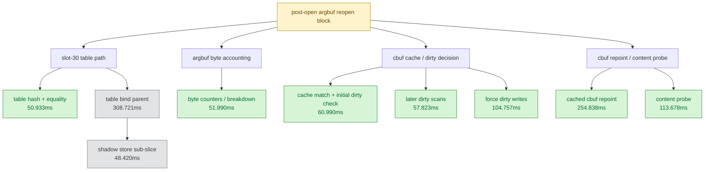

# Encode Phase 57 - Argbuf Reopen Post-Open Residual Split

date: 2026-06-14
status: accepted-attribution
source: src/dxmt9/dxmt9_draw_encoder.mm, src/dxmt9/dxmt9_perf_counters.cpp, experiments/output/app-d3d9-3dmark05-argbuf-reopen-split-r1-20260614/3dmark05-perf-summary.md, experiments/output/app-d3d9-3dmark05-argbuf-reopen-post-split-r1-20260614/3dmark05-perf-summary.md, experiments/output/app-d3d9-3dmark05-argbuf-reopen-post-split-r1-20260614/result.json, experiments/output/app-d3d9-3dmark05-argbuf-reopen-post-split-r1-20260614/actual.png, experiments/output/app-d3d9-3dmark05-argbuf-reopen-post-split-r1-20260614/compare-phase55-phase57.md

**Question / hypothesis.** [state-churn-encode-encode-phase.55](state-churn-encode-encode-phase.55.md) split the
legacy argbuf reopen parent and left an inferred `~319ms` post-open residual
after actual `openArgbuf()`, table bind, cached cbuf repoint, and content probe.
[state-churn-encode-encode-phase.56](state-churn-encode-encode-phase.56.md) then rejected whole-table pre-open reuse
for GT1. This phase asks whether the phase55 post-open residual is one large
hidden child or a set of small per-draw bookkeeping taxes.

**Implementation.** Added attribution-only counters inside the existing
`encode_draw_argbuf_reopen_post_cpu_ms` parent:

- `encode_draw_argbuf_reopen_table_probe_cpu_ms` around table hash and shadow
  equality.
- `encode_draw_argbuf_reopen_table_shadow_store_cpu_ms` around slot-30 shadow
  state update. This is nested inside the existing table-bind parent.
- `encode_draw_argbuf_reopen_byte_account_cpu_ms` around argbuf byte accounting
  and optional encoder-breakdown byte accounting.
- `encode_draw_argbuf_reopen_cbuf_cache_probe_cpu_ms` around cbuf cache match
  and the initial dirty-mask check.
- `encode_draw_argbuf_reopen_cbuf_dirty_scan_cpu_ms` around later dirty-mask
  scans.
- `encode_draw_argbuf_reopen_cbuf_force_dirty_cpu_ms` around cbuf dirty-mask
  forcing.

No behavior or environment flag changed.

**Method.**

```sh
bash scripts/tools/run_3dmark05_perf_probe.sh \
  --suffix argbuf-reopen-post-split-r1-20260614 \
  --frame 60 \
  --no-gputrace \
  --no-encoder-breakdown \
  --frame-sampling \
  --timeout 120
```

Status: pass. The run produced `present_encoded=1740`,
`draw_skipped_no_pipeline=0`, `gpu_command_buffer_errors=0`, and a normal
machine-gun muzzle-bloom frame. The process did not time out.

**Result.**

| Counter | phase55 | phase57 |
|---|---:|---:|
| `present_encoded` | `1,800` | `1,740` |
| `draw_calls` | `1,324,278` | `1,285,356` |
| `encode_draw_cpu_ms` | `15,792.829` | `16,494.476` |
| `encode_draw_us_per_draw` | `11.926` | `12.833` |
| `encode_draw_argbuf_setup_cpu_ms` | `3,541.348` | `4,280.067` |
| `encode_draw_argbuf_open_cpu_ms` | `1,625.608` | `2,381.751` |
| `encode_draw_argbuf_open_call_cpu_ms` | `573.804` | `581.146` |
| `encode_draw_argbuf_reopen_post_cpu_ms` | `891.359` | `1,647.899` |
| `encode_draw_argbuf_reopen_table_probe_cpu_ms` | `n/a` | `50.933` |
| `encode_draw_argbuf_reopen_table_shadow_store_cpu_ms` | `n/a` | `48.420` |
| `encode_draw_argbuf_reopen_byte_account_cpu_ms` | `n/a` | `51.990` |
| `encode_draw_argbuf_reopen_cbuf_cache_probe_cpu_ms` | `n/a` | `60.990` |
| `encode_draw_argbuf_reopen_cbuf_dirty_scan_cpu_ms` | `n/a` | `57.823` |
| `encode_draw_argbuf_reopen_cbuf_force_dirty_cpu_ms` | `n/a` | `104.757` |
| `encode_draw_argbuf_table_bind_cpu_ms` | `178.803` | `308.721` |
| `encode_draw_argbuf_cbuf_cached_repoint_cpu_ms` | `269.898` | `254.838` |
| `encode_draw_argbuf_cbuf_content_probe_cpu_ms` | `123.303` | `113.678` |
| `gpu_command_buffer_errors` | `0` | `0` |
| `draw_skipped_no_pipeline` | `0` | `0` |

The new hot-path timers add measurable attribution overhead. Phase57 processed
fewer presents and raised `encode_draw_us_per_draw` from `11.926us` to
`12.833us`, so parent-bucket deltas must not be read as a regression caused by
runtime behavior. The useful signal is the internal shape: no newly named child
is a hidden multi-hundred-millisecond API call. The non-overlapping new children
sum to about `326.493ms` (`table_probe + byte_account + cbuf_cache_probe +
dirty_scan + force_dirty`), which is close to phase55's inferred `~319ms`
residual. `table_shadow_store=48.420ms` is a sub-slice of the table-bind parent,
not an additive child.



**Verdict.** Accepted attribution, not an optimization win. The phase55
post-open residual is distributed bookkeeping: table probe, byte accounting,
cbuf cache/dirty scans, and dirty-mask forcing. The best next argbuf target is
not another whole-table reuse check and not a single `openArgbuf()` microfix.
Either reduce reopen frequency with a correctness proof that survives the
per-draw table lifetime rule, or reduce the already-required cbuf repoint/probe
control work by consolidating dirty classification and component decisions.

**Related.** [state-churn-encode](index.md) ·
[state-churn-encode-encode-phase.55](state-churn-encode-encode-phase.55.md) ·
[state-churn-encode-encode-phase.56](state-churn-encode-encode-phase.56.md).
