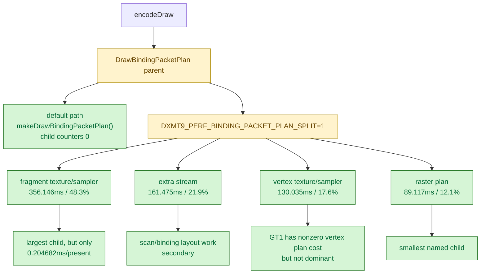

# Encode Phase 58 - Binding Packet Plan Split

date: 2026-06-14
status: accepted-attribution
source: src/dxmt9/dxmt9_draw_encoder.mm, src/dxmt9/dxmt9_perf_counters.cpp, src/dxmt9/dxmt9_perf_counters.hpp, agents/rules/environment_variables_perf.rules.md, experiments/output/app-d3d9-3dmark05-binding-packet-plan-split-optin-r1-20260614/result.json, experiments/output/app-d3d9-3dmark05-binding-packet-plan-split-off-r1-20260614/result.json

**Question / hypothesis.** The current no-gputrace backend profile still has a
non-trivial `encode_draw_binding_packet_plan_cpu_ms` bucket. This phase asks
which `DrawBindingPacketPlan` child owns it: fragment texture/sampler planning,
vertex texture/sampler planning, programmable-VS extra stream planning, or
raster-state planning.

**Implementation.** Added four child counters under
`encode_draw_binding_packet_plan_cpu_ms`:

- `encode_draw_binding_packet_plan_fragment_cpu_ms`
- `encode_draw_binding_packet_plan_vertex_cpu_ms`
- `encode_draw_binding_packet_plan_extra_stream_cpu_ms`
- `encode_draw_binding_packet_plan_raster_cpu_ms`

The child timers are heavy because they add four nested `PerfScope` instances
per draw. They are therefore gated behind
`DXMT9_PERF_BINDING_PACKET_PLAN_SPLIT=1`. The default path still calls
`makeDrawBindingPacketPlan()` directly and leaves all child counters at zero.

**Method.**

Split-on attribution run:

```sh
DXMT9_PERF_BINDING_PACKET_PLAN_SPLIT=1 \
DXMT_LOG_LEVEL=info \
bash scripts/tools/run_3dmark05_perf_probe.sh \
  --suffix binding-packet-plan-split-optin-r1-20260614 \
  --frame 60 \
  --no-gputrace \
  --no-encoder-breakdown \
  --timeout 120
```

Default-off verification run after adding the env guard:

```sh
DXMT_LOG_LEVEL=info \
bash scripts/tools/run_3dmark05_perf_probe.sh \
  --suffix binding-packet-plan-split-off-r1-20260614 \
  --frame 60 \
  --no-gputrace \
  --no-encoder-breakdown \
  --timeout 120
```

Both runs passed. The split-on run produced `present_encoded=1740`,
`draw_skipped_no_pipeline=0`, and `gpu_command_buffer_errors=0`; it timed out
through the standard wrapper after useful artifacts had been written. The
default-off run produced the same `1740` presents, no pipeline skips, and no GPU
command-buffer errors.

**Result.**

Per-present CPU totals:

| Run | Presents | `encode_draw` | `binding_packet` | `plan` | `fragment` | `vertex` | `extra_stream` | `raster` | `cache` |
|---|---:|---:|---:|---:|---:|---:|---:|---:|---:|
| reuse baseline | `1,680` | `9.739440` | `1.022932` | `0.282526` | `0` | `0` | `0` | `0` | `0.392456` |
| split-on attribution | `1,740` | `9.922833` | `1.370206` | `0.623450` | `0.204682` | `0.074733` | `0.092802` | `0.051217` | `0.395939` |
| default-off guard | `1,740` | `9.424517` | `1.063289` | `0.314560` | `0` | `0` | `0` | `0` | `0.399232` |

The split-on child distribution is:

| Child | Total ms | Share of named children |
|---|---:|---:|
| Fragment texture/sampler plan | `356.146` | `48.3%` |
| Programmable VS extra-stream plan | `161.475` | `21.9%` |
| Vertex texture/sampler plan | `130.035` | `17.6%` |
| Raster-state plan | `89.117` | `12.1%` |

The parent plan bucket rises from `0.314560ms/present` default-off to
`0.623450ms/present` split-on. That is measurement overhead from the nested
timers, not a renderer behavior change. The default-off guard is therefore part
of the result: this diagnostic must stay opt-in.



**Verdict.** Accepted attribution, not an optimization win. The largest
binding-packet plan child is fragment texture/sampler planning, but its
absolute size is only `0.204682ms/present` in the heavy split run. The broader
default profile still points at larger owners: argbuf setup, stream bind,
binding-packet cache/probe, snapshot/replay, and present-completion
under-pipelining. Binding-packet plan work should not be the next primary FPS
lever unless a future patch can reuse the fragment plan without adding a
per-entry check that recreates the texture pre-resolve regression from
[state-churn-encode-encode-phase.16](state-churn-encode-encode-phase.16.md).

**Related.** [state-churn-encode](index.md) ·
[state-churn-encode-encode-phase.15](state-churn-encode-encode-phase.15.md) ·
[state-churn-encode-encode-phase.16](state-churn-encode-encode-phase.16.md) ·
[state-churn-encode-encode-phase.57](state-churn-encode-encode-phase.57.md).
