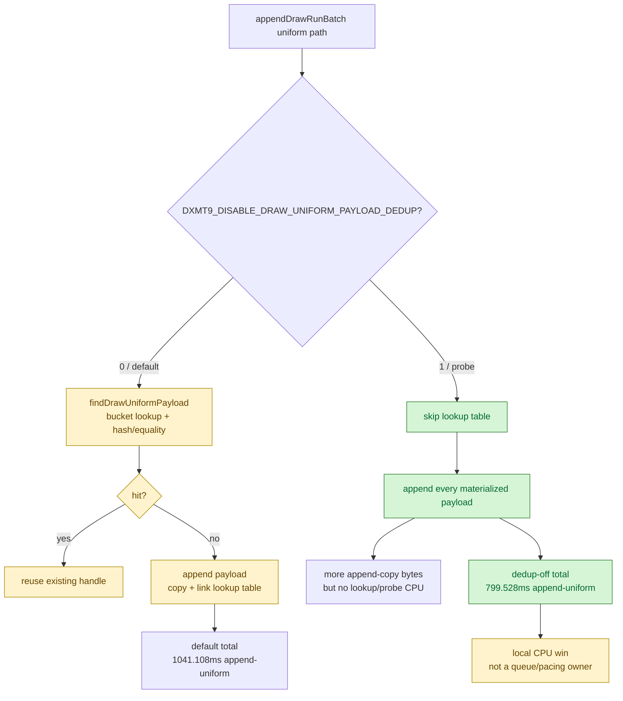

# Encode Phase 59 - Uniform Payload Dedup-Off Probe

date: 2026-06-14
status: accepted-micro-win
source: src/dxmt9/dxmt9_backend_types.hpp, agents/rules/environment_variables_perf.rules.md, tests/native/core/state_draw_transform_spec.cpp, experiments/output/app-d3d9-3dmark05-snapshot-uniform-adjacent-same-gen-r1-20260614/result.json, experiments/output/app-d3d9-3dmark05-uniform-payload-dedup-off-r1-20260614/result.json

**Question / hypothesis.** [snapshot-cache-snapshot.20](../snapshot-cache/snapshot-cache-snapshot.20.md) rejects adjacent
uniform snapshot elision: there are no adjacent same-`uniformGeneration`
submissions in current GT1. The remaining `submit_draw_run_batch_append_uniform`
cost therefore belongs to backend payload storage and dedup lookup. This phase
tests whether the slot-local `DrawUniformPayload` lookup table is worth its CPU
cost for GT1.

**Implementation.** Added diagnostic env
`DXMT9_DISABLE_DRAW_UNIFORM_PAYLOAD_DEDUP=1`. When set, `ChunkSlot`
append paths:

- skip `findDrawUniformPayload()`;
- append every materialized `DrawUniformPayload`;
- skip lookup table reservation and link insertion.

Command views still carry `DrawUniformHandle`, so the run remains behaviorally
equivalent except for slot-local payload interning. Native
`dxmt9-state-draw-transform-spec` now validates both default interning and
env-on append-everything behavior.

**Method.**

Baseline:

```sh
DXMT9_PE_RECORDER_STATS=1 DXMT_LOG_LEVEL=info \
  scripts/tools/run_3dmark05_perf_probe.sh \
  --suffix snapshot-uniform-adjacent-same-gen-r1-20260614 \
  --frame 60 \
  --no-gputrace \
  --no-encoder-breakdown \
  --timeout 120
```

Dedup off:

```sh
DXMT9_PE_RECORDER_STATS=1 \
DXMT_LOG_LEVEL=info \
DXMT9_DISABLE_DRAW_UNIFORM_PAYLOAD_DEDUP=1 \
  scripts/tools/run_3dmark05_perf_probe.sh \
  --suffix uniform-payload-dedup-off-r1-20260614 \
  --frame 60 \
  --no-gputrace \
  --no-encoder-breakdown \
  --timeout 120
```

The dedup-off run timed out through the standard 120s wrapper after useful
artifacts were written, reports `status=pass`, `present_encoded=1680`,
`draw_skipped_no_pipeline=0`, and `gpu_command_buffer_errors=0`. The captured
`actual.png` is a normal GT1 machine-gun muzzle/bloom frame.

**Result.**

Both runs have `1680` presents, so totals are directly comparable.

| Counter | Baseline | Dedup off | Delta |
|---|---:|---:|---:|
| `draw_uniform_payload_lookup_cpu_ms` | `276.107` | `0.000` | `-276.107` |
| `draw_uniform_payload_lookup_bucket_cpu_ms` | `142.708` | `0.000` | `-142.708` |
| `draw_uniform_payload_appends` | `877,508` | `930,994` | `+53,486` |
| `draw_uniform_payload_append_reserve_cpu_ms` | `50.136` | `47.788` | `-2.348` |
| `draw_uniform_payload_append_copy_cpu_ms` | `574.305` | `629.058` | `+54.753` |
| `draw_uniform_payload_append_link_cpu_ms` | `57.800` | `47.172` | `-10.628` |
| `submit_draw_run_batch_append_uniform_cpu_ms` | `1041.108` | `799.528` | `-241.580` |
| `commit_chunk_queue_draw_submission_cpu_ms` | `6813.183` | `6817.526` | `+4.343` |
| `commit_chunk_replay_cpu_ms` | `17490.918` | `17328.435` | `-162.483` |
| `completion_wait_ms` | `45145.208` | `45317.482` | `+172.274` |
| `gpu_command_buffer_time_ms` | `5215.615` | `5172.279` | `-43.336` |

Per present, the targeted append-uniform bucket drops
`0.619707 -> 0.475910ms` (`-0.143798ms/present`). The broader queue-submission
bucket is unchanged (`4.055466 -> 4.058051ms/present`), and completion/GPU
movement is normal run noise.



**Decision.** Keep the env as a diagnostic and consider a default policy change
only if repeated runs or another workload show the same local win without memory
pressure. For current GT1, slot-local uniform dedup is net-negative inside the
append-uniform child because hits are too sparse relative to lookup/probe cost;
skipping it saves about `242ms` over `1680` presents. This does **not** explain
the current FPS ceiling: queue submission, replay, encode, and
completion/present pacing remain essentially unchanged.

**Related.** [state-churn-encode](index.md) · [state-churn-encode-encode-phase.51](state-churn-encode-encode-phase.51.md) ·
[state-churn-encode-encode-phase.52](state-churn-encode-encode-phase.52.md) ·
[state-churn-encode-encode-phase.53](state-churn-encode-encode-phase.53.md) · [snapshot-cache-snapshot.20](../snapshot-cache/snapshot-cache-snapshot.20.md) ·
[overview-3dmark05-gt1](../overview-3dmark05-gt1.md).
