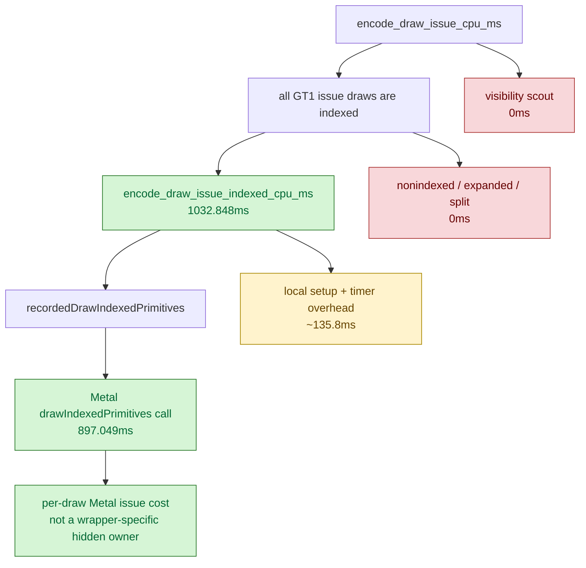

# Encode Phase 60 - Draw Issue Split

date: 2026-06-14
status: accepted-attribution
source: src/dxmt9/dxmt9_draw_encoder.mm, src/dxmt9/dxmt9_perf_counters.cpp, src/dxmt9/dxmt9_perf_counters.hpp, scripts/tools/summarize_3dmark05_perf.py, agents/rules/environment_variables_perf.rules.md, experiments/output/app-d3d9-3dmark05-draw-issue-split-r1-20260614/result.json

**Question / hypothesis.** The current no-gputrace profile still carries an
`encode_draw_issue_cpu_ms` bucket around `~1s/run`. This phase asks whether it
is a hidden dxmt9 wrapper cost (visibility scout, split/expanded draw path,
recorded-call dispatch) or mostly the Metal draw call itself.

**Implementation.** Added opt-in env `DXMT9_PERF_DRAW_ISSUE_SPLIT=1`. When set,
the existing `encode_draw_issue_cpu_ms` parent is split into:

- `encode_draw_issue_indexed_cpu_ms`
- `encode_draw_issue_nonindexed_cpu_ms`
- `encode_draw_issue_expanded_indexed_cpu_ms`
- `encode_draw_issue_split_indexed_cpu_ms`
- `encode_draw_issue_metal_cpu_ms`
- `encode_draw_issue_visibility_cpu_ms`

The child scopes are default-off because they add nested timers around every
draw issue. Default runs leave the child counters at `0`.

**Method.**

```sh
DXMT9_PE_RECORDER_STATS=1 \
DXMT_LOG_LEVEL=info \
DXMT9_PERF_DRAW_ISSUE_SPLIT=1 \
  scripts/tools/run_3dmark05_perf_probe.sh \
  --suffix draw-issue-split-r1-20260614 \
  --frame 60 \
  --no-gputrace \
  --no-encoder-breakdown \
  --timeout 120
```

The run reports `status=pass`, timed out through the standard wrapper after
useful artifacts were written, and captured a normal GT1 machine-gun
muzzle/bloom frame. It reached fewer presents than the adjacent baseline
(`1620` vs `1680`) because the nested timers are intentionally heavy; read this
as attribution, not an A/B performance result.

**Result.**

| Counter | Baseline | Split-on |
|---|---:|---:|
| `present_encoded` | `1680` | `1620` |
| `draw_calls` | `1,235,440` | `1,199,600` |
| `draw_indexed` | `1,235,440` | `1,199,600` |
| `draw_expanded_indexed` | `0` | `0` |
| `draw_skipped_no_pipeline` | `0` | `0` |
| `gpu_command_buffer_errors` | `0` | `0` |
| `encode_draw_issue_cpu_ms` | `960.272` | `1165.041` |
| `encode_draw_issue_indexed_cpu_ms` | `0` | `1032.848` |
| `encode_draw_issue_nonindexed_cpu_ms` | `0` | `0.000` |
| `encode_draw_issue_expanded_indexed_cpu_ms` | `0` | `0.000` |
| `encode_draw_issue_split_indexed_cpu_ms` | `0` | `0.000` |
| `encode_draw_issue_metal_cpu_ms` | `0` | `897.049` |
| `encode_draw_issue_visibility_cpu_ms` | `0` | `0.000` |

The split-on distribution is:

| Child | Share |
|---|---:|
| Indexed path / parent issue | `88.7%` |
| Metal draw call / indexed path | `86.9%` |
| Metal draw call / parent issue | `77.0%` |
| Visibility scout | `0.0%` |
| Expanded/split/non-indexed issue | `0.0%` |



**Decision.** Accepted attribution, rejected as the next primary optimization
target. The `issue` bucket is not visibility scout, expanded-indexed fallback,
split-indexed submission, or non-indexed work. It is overwhelmingly the normal
indexed Metal draw issue path, with `recordedDrawIndexedPrimitives()` owning
most of the child time. The only credible way to move this bucket materially is
to reduce submitted Metal draw count or switch to a different submission model;
micro-optimizing wrapper code around the draw call is unlikely to matter.

For current GT1 average-FPS work, keep priority on larger owners: argbuf setup,
stream/index/shader binding, snapshot/replay, and present under-pipelining.

**Related.** [state-churn-encode](index.md) · [state-churn-encode-encode-phase.58](state-churn-encode-encode-phase.58.md) ·
[state-churn-encode-encode-phase.59](state-churn-encode-encode-phase.59.md) · [present-pacing](../present-pacing/index.md) ·
[overview-3dmark05-gt1](../overview-3dmark05-gt1.md).
