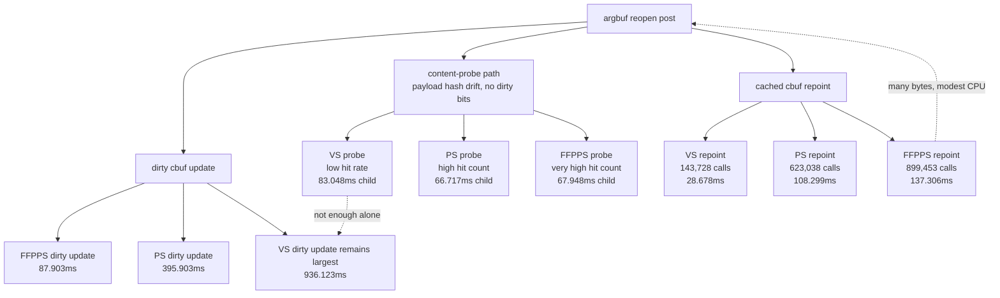

# Encode Phase 61 - Argbuf Cbuf Probe Split

date: 2026-06-14
status: accepted-attribution
source: src/dxmt9/dxmt9_draw_encoder.mm, src/dxmt9/dxmt9_perf_counters.cpp, src/dxmt9/dxmt9_perf_counters.hpp, scripts/tools/summarize_3dmark05_perf.py, agents/rules/environment_variables_perf.rules.md, experiments/output/app-d3d9-3dmark05-argbuf-cbuf-probe-split-r1-20260614/result.json

**Question / hypothesis.** After phase55-57, the remaining argbuf reopen cost
still had aggregate `cached_repoint` and `content_probe` buckets. This phase
asks whether one cbuf stage, especially low-hit VS identity probing, is large
enough to be the next default optimization target.

**Implementation.** Added opt-in env
`DXMT9_PERF_ARGBUF_CBUF_PROBE_SPLIT=1`. When set, the existing aggregate
argbuf cbuf counters are split into:

- `encode_draw_argbuf_cbuf_cached_repoint_{vs,ps,ffp_vs,ffp_ps}_cpu_ms`
- `encode_draw_argbuf_cbuf_cached_repoint_{vs,ps,ffp_vs,ffp_ps}_calls`
- `encode_draw_argbuf_cbuf_cached_repoint_{vs,ps,ffp_vs,ffp_ps}_bytes`
- `encode_draw_argbuf_cbuf_content_probe_{vs,ps,ffp_ps}_cpu_ms`

The child timers and stage call/byte counters are default-off because they add
hot-path atomic/timer work on the per-draw argbuf reopen path. The summary
script allowlist now includes the new keys.

**Method.**

```sh
DXMT9_PERF_ARGBUF_CBUF_PROBE_SPLIT=1 \
DXMT_LOG_LEVEL=info \
  scripts/tools/run_3dmark05_perf_probe.sh \
  --suffix argbuf-cbuf-probe-split-r1-20260614 \
  --frame 60 \
  --no-gputrace \
  --no-encoder-breakdown \
  --timeout 120
```

The run reports `status=pass`, timed out through the standard wrapper after
useful artifacts were written, and captured a normal GT1 machine-gun
muzzle/bloom frame. It reached more presents than the adjacent baseline
(`1740` vs `1680`), but the nested timers inflate the parent buckets; read this
as attribution only.

**Result.**

| Counter | Baseline | Split-on |
|---|---:|---:|
| `present_encoded` | `1680` | `1740` |
| `draw_calls` | `1,235,440` | `1,282,979` |
| `draw_skipped_no_pipeline` | `0` | `0` |
| `gpu_command_buffer_errors` | `0` | `0` |
| `gpu_command_buffer_time_ms / present` | `3.078738` | `3.221049` |
| `completion_wait_ms / present` | `26.974692` | `26.636902` |
| `encode_draw_cpu_ms / present` | `9.432361` | `9.803657` |
| `argbuf_setup_cpu_ms / present` | `2.508071` | `2.805089` |
| `argbuf_reopen_post_cpu_ms / present` | `0.953455` | `1.252097` |
| `content_probe_cpu_ms / present` | `0.065095` | `0.243860` |
| `cached_repoint_cpu_ms / present` | `0.158213` | `0.270114` |
| `cbuf_update_cpu_ms / present` | `0.976251` | `0.989975` |

Stage split for the opt-in run:

| Stage | Content probe CPU | Hits | Misses | Cached repoint CPU | Repoint calls | Repoint bytes |
|---|---:|---:|---:|---:|---:|---:|
| VS | `83.048ms` | `143,728` | `788,015` | `28.678ms` | `143,728` | `19.992MB` |
| PS | `66.717ms` | `623,038` | `308,705` | `108.299ms` | `623,038` | `21.006MB` |
| FFPPS | `67.948ms` | `899,453` | `32,290` | `137.306ms` | `899,453` | `345.390MB` |
| FFPVS | n/a | n/a | n/a | `0.000ms` | `0` | `0` |

The child timers are intentionally nested under the aggregate timers. The
split-on parent regression therefore measures instrumentation overhead as well
as work. Use the relative stage distribution, not the split-on parent totals,
to choose the next code target.



**Decision.** Accepted as attribution, rejected as a new one-stage primary
optimization. The probe/repoint split does not expose a large hidden child
comparable to the remaining VS dirty-update/upload path or the broader
per-draw argbuf reopen structure:

- FFPPS repoint dominates bytes (`345.390MB`) and calls (`899,453`) but is only
  `137.306ms` in the heavy split run.
- PS repoint is many calls but small bytes (`21.006MB`) and `108.299ms`.
- VS identity probing has a low hit rate (`143,728 / 931,743`), but the
  matching repoints are cheap (`28.678ms`) and skipping them would convert
  those hits into additional VS dirty uploads.
- The dirty-update path remains larger (`cbuf_update_vs_cpu_ms=936.123ms`,
  `cbuf_update_ps_cpu_ms=395.903ms`) even in the heavy split run.

Do not pursue a default "skip VS probe" or FFPPS repoint micro-optimization
without a stronger A/B. The next argbuf work should target fewer table reopens,
fewer dirty VS uploads, or a storage model that avoids rebuilding/repointing a
fresh per-draw argument-buffer table, while preserving the correctness fixes
from phases 23 and 32.

**Related.** [state-churn-encode](../state-churn-encode.md) · [state-churn-encode-encode-phase.55](state-churn-encode-encode-phase.55.md) ·
[state-churn-encode-encode-phase.56](state-churn-encode-encode-phase.56.md) · [state-churn-encode-encode-phase.57](state-churn-encode-encode-phase.57.md)
· [overview-3dmark05-gt1](../overview-3dmark05-gt1.md).
