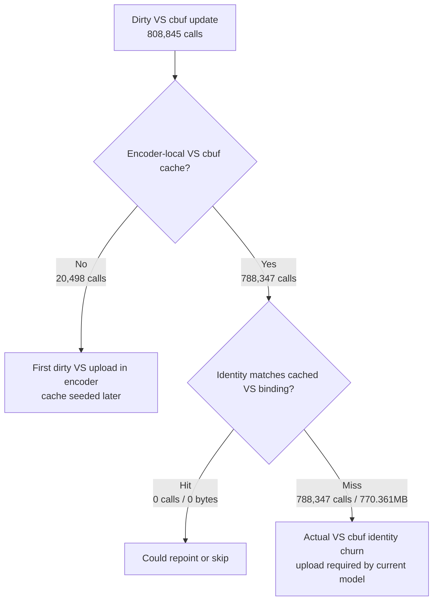

# Encode Phase 62 - Dirty VS Cbuf Identity Probe Refresh

date: 2026-06-14
status: rejected-current
source: src/dxmt9/dxmt9_draw_encoder.mm, src/dxmt9/dxmt9_perf_counters.cpp, src/dxmt9/dxmt9_perf_counters.hpp, scripts/tools/summarize_3dmark05_perf.py, agents/rules/environment_variables_perf.rules.md, experiments/output/app-d3d9-3dmark05-argbuf-dirty-vs-identity-r1-20260614/result.json

**Question / hypothesis.** Phase 61 left dirty VS cbuf update as the largest
argbuf cbuf child. This phase asks whether those dirty VS uploads are still
identity-equivalent to the encoder-local cached VS cbuf binding and therefore
could be skipped or repointed safely.

**Implementation.** Added opt-in env
`DXMT9_PERF_ARGBUF_CBUF_DIRTY_IDENTITY=1`. When set, the dirty argbuf cbuf
mirror computes the same VS upload plan/bytes and identity hash used by the
default binding identity path, compares it against the current
`ArgbufCbufCache` VS entry, and records:

- `encode_draw_argbuf_cbuf_dirty_vs_identity_probe_calls`
- `encode_draw_argbuf_cbuf_dirty_vs_identity_hits`
- `encode_draw_argbuf_cbuf_dirty_vs_identity_misses`
- `encode_draw_argbuf_cbuf_dirty_vs_identity_no_cache`
- `encode_draw_argbuf_cbuf_dirty_vs_identity_hit_bytes`
- `encode_draw_argbuf_cbuf_dirty_vs_identity_miss_bytes`

The probe is default-off and does not change dirty bits, uploads, bindings, or
argbuf cache merge behavior.

**Method.**

```sh
DXMT9_PERF_ARGBUF_CBUF_DIRTY_IDENTITY=1 \
DXMT_LOG_LEVEL=info \
  scripts/tools/run_3dmark05_perf_probe.sh \
  --suffix argbuf-dirty-vs-identity-r1-20260614 \
  --frame 60 \
  --no-gputrace \
  --no-encoder-breakdown \
  --timeout 120
```

The run reports `status=pass` with `present_encoded=1740`,
`draw_calls=1,284,467`, `draw_skipped_no_pipeline=0`, and no GPU command buffer
errors.

**Result.**

| Counter | Value |
|---|---:|
| `encode_draw_argbuf_cbuf_update_cpu_ms` | `1752.848` |
| `encode_draw_argbuf_cbuf_update_vs_cpu_ms` | `937.498` |
| `encode_draw_argbuf_cbuf_update_vs_calls` | `808,845` |
| `encode_draw_argbuf_cbuf_update_vs_bytes` | `778.101MB` |
| `encode_draw_argbuf_cbuf_dirty_vs_identity_probe_calls` | `808,845` |
| `encode_draw_argbuf_cbuf_dirty_vs_identity_hits` | `0` |
| `encode_draw_argbuf_cbuf_dirty_vs_identity_misses` | `788,347` |
| `encode_draw_argbuf_cbuf_dirty_vs_identity_no_cache` | `20,498` |
| `encode_draw_argbuf_cbuf_dirty_vs_identity_hit_bytes` | `0` |
| `encode_draw_argbuf_cbuf_dirty_vs_identity_miss_bytes` | `770.361MB` |

`no_cache=20,498` matches `render_pass_begin=20,498`, so the no-cache rows are
the expected first dirty VS upload for each render encoder before the local
cbuf cache has a VS entry. After that first entry exists, every probed dirty VS
upload is an identity miss:



Per-present context for this run:

| Bucket | ms / present |
|---|---:|
| `encode_draw_argbuf_cbuf_update_cpu_ms` | `1.007` |
| `encode_draw_argbuf_cbuf_update_vs_cpu_ms` | `0.539` |
| `encode_draw_cpu_ms` | `9.652` |
| `encode_chunk_cpu_ms` | `11.656` |
| `commit_chunk_replay_cpu_ms` | `10.655` |
| `commit_chunk_queue_draw_submission_cpu_ms` | `4.155` |
| `d3d9_snapshot_draw_submission_cpu_ms` | `3.526` |
| `completion_wait_ms` | `26.777` |
| `gpu_command_buffer_time_ms` | `3.232` |

**Decision.** Rejected as a default skip/repoint opportunity. The current
dirty VS cbuf updates are not stale-cache repeats: cached dirty VS probes have
a `0 / 788,347` hit rate, and the missed bytes account for nearly all VS dirty
upload traffic. Do not pursue a dirty-VS cached-identity repoint fast path
without a new semantic change that reduces the dirty frequency upstream.

The remaining argbuf direction is narrower than phase 61: reduce the number of
fresh argbuf table reopens, change the cbuf storage model so per-draw VS
constant churn costs less, or reduce upstream VS constant dirty frequency. A
local cached identity check inside the dirty mirror is now closed for the
current GT1 workload.

**Related.** [state-churn-encode](../state-churn-encode.md) · [state-churn-encode-encode-phase.11](state-churn-encode-encode-phase.11.md) ·
[state-churn-encode-encode-phase.61](state-churn-encode-encode-phase.61.md) · [overview-3dmark05-gt1](../overview-3dmark05-gt1.md).
