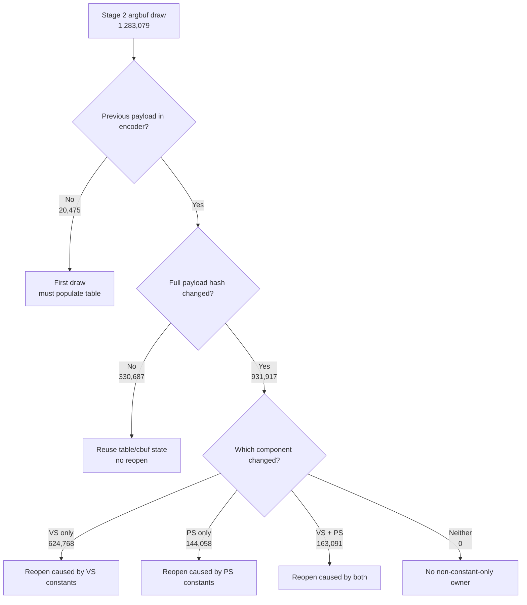

# Encode Phase 63 - Argbuf Payload Delta Attribution

date: 2026-06-14
status: accepted-attribution
source: src/dxmt9/dxmt9_draw_encoder.mm, src/dxmt9/dxmt9_perf_counters.cpp, src/dxmt9/dxmt9_perf_counters.hpp, scripts/tools/summarize_3dmark05_perf.py, agents/rules/environment_variables_perf.rules.md, experiments/output/app-d3d9-3dmark05-argbuf-payload-delta-r1-20260614/result.json

**Question / hypothesis.** Phase 62 closed dirty-VS cached identity reuse, but
the argbuf constants-only path still reopens the table for almost every dirty
draw. This phase asks whether `DrawUniformPayload::hash` is too broad for the
reopen gate: if most changes are non-shader payload fields, argbuf reopen could
split on narrower cbuf component hashes.

**Implementation.** Added default-off
`DXMT9_PERF_ARGBUF_PAYLOAD_DELTA=1`. For every Stage 2 draw, the encoder stores
only three scalar keys from the previous successfully encoded draw in the same
render encoder:

- full payload `hash`
- `vertexConstantsHash`
- `pixelConstantsHash`

The probe counts first draw, same payload, changed payload, VS/PS component
changes, non-constant-only changes, and reopen reason. It does not change table
open, dirty bits, cbuf upload, binding, or cache behavior.

**Method.**

```sh
DXMT9_PERF_ARGBUF_PAYLOAD_DELTA=1 \
DXMT_LOG_LEVEL=info \
  scripts/tools/run_3dmark05_perf_probe.sh \
  --suffix argbuf-payload-delta-r1-20260614 \
  --frame 60 \
  --no-gputrace \
  --no-encoder-breakdown \
  --timeout 120
```

The run reports `status=pass` with `present_encoded=1740`,
`draw_calls=1,283,079`, `draw_skipped_no_pipeline=0`, and
`gpu_command_buffer_errors=0`.

**Result.**

| Counter | Value |
|---|---:|
| `encode_draw_argbuf_payload_delta_probe_calls` | `1,283,079` |
| `encode_draw_argbuf_payload_delta_first` | `20,475` |
| `encode_draw_argbuf_payload_delta_same` | `330,687` |
| `encode_draw_argbuf_payload_delta_changed` | `931,917` |
| `encode_draw_argbuf_payload_delta_changed_vs` | `787,859` |
| `encode_draw_argbuf_payload_delta_changed_ps` | `307,149` |
| `encode_draw_argbuf_payload_delta_changed_vs_ps` | `163,091` |
| `encode_draw_argbuf_payload_delta_changed_nonconst_only` | `0` |
| `encode_draw_argbuf_payload_delta_reopen_first` | `20,475` |
| `encode_draw_argbuf_payload_delta_reopen_payload_changed` | `931,917` |
| `encode_draw_argbuf_payload_delta_reopen_payload_same` | `0` |
| `encode_draw_argbuf_payload_delta_reopen_resource_array` | `0` |
| `encode_draw_argbuf_table_bind_calls` | `952,392` |
| `encode_draw_argbuf_cbuf_reopen_no_dirty_hash_mismatch` | `931,917` |
| `encode_draw_argbuf_cbuf_reopen_partial_candidates` | `20,475` |
| `encode_draw_argbuf_cbuf_update_skipped_clean` | `330,687` |

The equality chain is exact:

- first draw per encoder: `20,475 == render_pass_begin == partial_candidates`
- same payload: `330,687 == cbuf_update_skipped_clean`
- changed payload: `931,917 == reopen_no_dirty_hash_mismatch`
- table binds: `20,475 + 931,917 == 952,392`
- resource-array forced reopen: `0`
- non-constant-only payload changes: `0`

Within the `931,917` changed-payload rows:

| Change class | Count | Share of changed |
|---|---:|---:|
| VS only | `624,768` | `67.04%` |
| PS only | `144,058` | `15.46%` |
| VS + PS | `163,091` | `17.50%` |
| non-constant only | `0` | `0.00%` |



Per-present context for the same run:

| Bucket | ms / present |
|---|---:|
| `encode_draw_argbuf_open_cpu_ms` | `1.346` |
| `encode_draw_argbuf_cbuf_update_cpu_ms` | `0.967` |
| `encode_draw_cpu_ms` | `9.326` |
| `encode_chunk_cpu_ms` | `11.352` |
| `commit_chunk_replay_cpu_ms` | `10.634` |
| `commit_chunk_queue_draw_submission_cpu_ms` | `4.123` |
| `d3d9_snapshot_draw_submission_cpu_ms` | `3.488` |
| `completion_wait_ms` | `27.485` |
| `gpu_command_buffer_time_ms` | `3.268` |

**Decision.** Accepted as attribution and rejected as a narrow-payload reopen
shortcut. The argbuf reopen gate is not being defeated by non-shader payload
fields: every changed-payload reopen is explained by VS and/or PS constant
component hash movement. A narrower gate that ignores non-constant payload
fields would save nothing in this GT1 run.

The remaining argbuf levers are therefore:

- reduce upstream VS/PS constant churn before the encoder;
- make per-draw VS/PS cbuf storage cheaper even when constants really change;
- reduce table-reopen side effects for changed constants without reusing a
  last-write-wins table incorrectly.

Do not spend another GT1 probe on a full-payload-vs-component-hash argbuf
shortcut unless the uniform payload builder or constant upload model changes.

**Related.** [state-churn-encode](index.md) · [state-churn-encode-encode-phase.55](state-churn-encode-encode-phase.55.md) ·
[state-churn-encode-encode-phase.61](state-churn-encode-encode-phase.61.md) ·
[state-churn-encode-encode-phase.62](state-churn-encode-encode-phase.62.md) · [overview-3dmark05-gt1](../overview-3dmark05-gt1.md).
