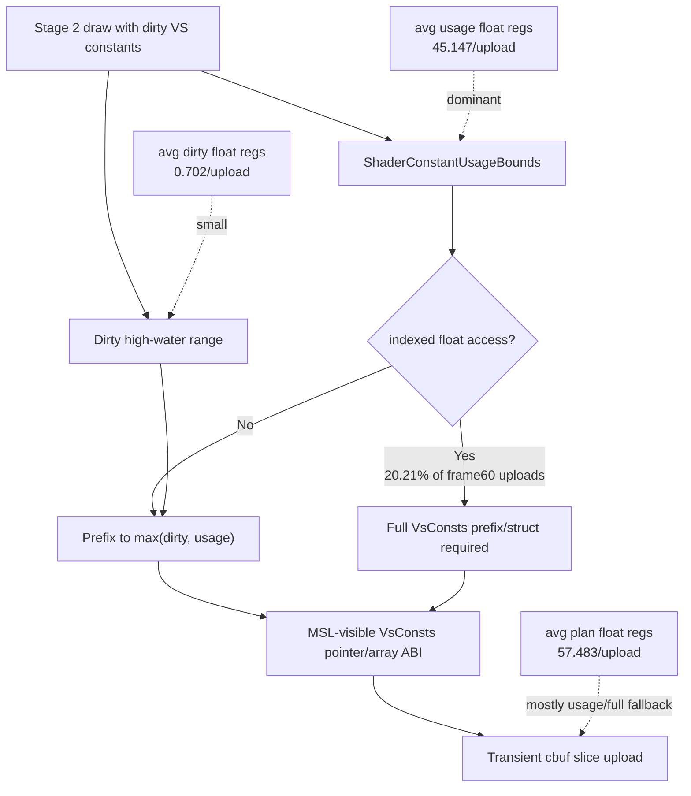

# Encode Phase 64 - VS Cbuf Plan Shape

**Question.** After [[state-churn-encode-encode-phase.63]] proved that
argbuf table reopens are driven by VS/PS constant hashes, is the dirty VS cbuf
upload width mostly caused by the current dirty range, or by the shader-visible
constant ABI shape?

**Method.** Use the existing scoped encoder-breakdown cbuf attribution. No code
change was needed.

```sh
bash scripts/tools/run_3dmark05_perf_probe.sh \
  --suffix cbuf-vs-plan-shape-r1-20260614 \
  --frame 60 --no-gputrace --encoder-breakdown-seq 60 \
  --timeout 120 --top 5
```

The run passed with `present_encoded=1740`, `draw_calls=1,282,749`,
`draw_skipped_no_pipeline=0`, and `gpu_command_buffer_errors=0`.

Run-level cbuf context:

| Counter | Value |
|---|---:|
| `encode_draw_argbuf_cbuf_update_cpu_ms` | `1708.806` |
| `encode_draw_argbuf_cbuf_update_vs_cpu_ms` | `939.110` |
| `encode_draw_argbuf_cbuf_update_vs_calls` | `808,408` |
| `encode_draw_argbuf_cbuf_update_vs_bytes` | `766,161,904` |
| VS bytes / call | `947.742` |
| `encode_draw_cpu_ms` / present | `9.532` |
| `encode_chunk_cpu_ms` / present | `11.662` |
| `commit_chunk_replay_cpu_ms` / present | `10.710` |
| `completion_wait_ms` / present | `28.331` |
| `gpu_command_buffer_time_ms` / present | `3.276` |

Frame-60 scoped encoder rows:

| Metric | Value |
|---|---:|
| encoder rows | `9` |
| draw calls | `395` |
| VS cbuf uploads | `292` |
| VS cbuf bytes | `287,536` |
| VS bytes / upload | `984.712` |
| full-struct VS uploads | `59` (`20.21%`) |
| indexed-float fallback uploads | `59` (`20.21%`) |
| avg plan float regs / upload | `57.483` |
| avg usage float regs / upload | `45.147` |
| avg dirty float regs / upload | `0.702` |

Top VS-cbuf rows:

| row | draws | uploads | VS bytes | bytes / upload | avg plan regs | avg usage regs | avg dirty regs | full uploads |
|---|---:|---:|---:|---:|---:|---:|---:|---:|
| `60/1` | `156` | `95` | `175,808` | `1850.6` | `107.5` | `83.2` | `0.0` | `39` |
| `60/2` | `187` | `156` | `88,768` | `569.0` | `33.5` | `28.0` | `0.0` | `16` |
| `60/0` | `42` | `35` | `22,864` | `653.3` | `38.5` | `26.1` | `5.9` | `4` |



**Decision.** Accepted as attribution. The remaining dirty VS upload width is
not mostly the dirty range. In frame 60, the average dirty range is less than
one float register per upload, while the upload plan averages `57.5` float
registers. The current prefix-preserving builder is already doing the safe
range trim allowed by the current `VsConsts` ABI; the width is now dominated by
shader usage prefix plus indexed-float full fallback.

This rejects another simple "make dirty ranges smaller" pass as the next large
target. The remaining cbuf directions are structural:

- reduce upstream VS/PS constant-hash churn before the encoder;
- introduce a persistent or segmented constant storage model that can patch
  small dirty subranges without rebuilding a per-draw full shader-visible prefix;
- introduce shader-specific packed constant layouts for non-indexed shaders,
  with explicit fallback for indexed access;
- reduce argbuf table-reopen side effects when constants change, without
  reusing last-write-wins table state incorrectly.

Any packed/segmented constant ABI change needs same-input image proof, because
[[state-churn-encode-encode-phase.20]] already showed that zeroing bytes inside
the old visible prefix can produce dark or black geometry.

**Related.** [[state-churn-encode]] · [[state-churn-encode-encode-phase.20]] ·
[[state-churn-encode-encode-phase.62]] ·
[[state-churn-encode-encode-phase.63]] · [[snapshot-cache-snapshot.08]].
