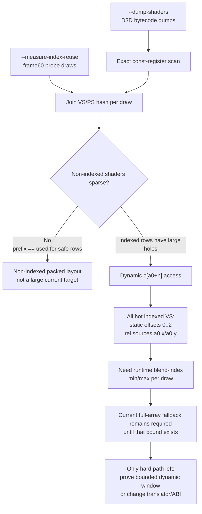

# Encode Phase 65 - Shader Constant Sparsity

**Question.** [state-churn-encode-encode-phase.64](state-churn-encode-encode-phase.64.md) showed dirty VS cbuf
width is dominated by shader-visible usage prefix and indexed-float fallback,
not the current dirty register range. Is shader-specific packed constant layout
for non-indexed shaders a large safe target?

**Method.** Add an offline analyzer for dumped D3D bytecode:
`scripts/tools/analyze_shader_constant_sparsity.py`. It walks shader bytecode,
records exact float/int/bool constant register sets, tracks indexed constant
access, records the static `+n` offsets and relative address sources for
indexed operands, and compares:

- current prefix/full-array cbuf ABI bytes;
- theoretical packed bytes;
- safe packed savings, which are forced to zero for unknown/indexed access.

The runtime path is unchanged.

```sh
bash scripts/tools/run_3dmark05_perf_probe.sh \
  --suffix cbuf-const-sparsity-r1-20260614 \
  --frame 60 --no-gputrace --encoder-breakdown-seq 60 \
  --measure-index-reuse --dump-shaders --timeout 120 --top 5

python3 scripts/tools/analyze_shader_constant_sparsity.py \
  --bytecode-dir traces/app-d3d9-3dmark05-cbuf-const-sparsity-r1-20260614/analysis/shaders/bytecode \
  --probe-draws experiments/output/app-d3d9-3dmark05-cbuf-const-sparsity-r1-20260614/3dmark05-perf-indexed-probe-draws.csv \
  --seq 60 \
  --output experiments/output/app-d3d9-3dmark05-cbuf-const-sparsity-r1-20260614/3dmark05-shader-constant-sparsity.md \
  --csv-output experiments/output/app-d3d9-3dmark05-cbuf-const-sparsity-r1-20260614/3dmark05-shader-constant-sparsity.csv \
  --draw-csv-output experiments/output/app-d3d9-3dmark05-cbuf-const-sparsity-r1-20260614/3dmark05-shader-constant-sparsity-draws.csv \
  --top 12
```

The run passed with `present_encoded=1740`, `draw_calls=1,285,380`,
`draw_skipped_no_pipeline=0`, and `gpu_command_buffer_errors=0`.

Frame60 cbuf context:

| Metric | Value |
|---|---:|
| encoder rows | `9` |
| probe draws | `395` |
| bytecode dumps | `78` |
| VS cbuf uploads | `291` |
| VS cbuf bytes | `287,376` |
| avg plan float regs / upload | `57.65` |
| avg usage float regs / upload | `45.27` |
| avg dirty float regs / upload | `0.704` |
| indexed/full VS uploads | `59` (`20.27%`) |

Shader-corpus result:

| Metric | Value |
|---|---:|
| safe non-indexed packed candidates | `67` |
| indexed/unknown fallback candidates | `11` |
| indexed constant shaders | `11` |
| unknown shader parses | `0` |
| corpus safe packed save | `0` |

Frame60 draw-weighted result:

| Stage | draws | current bytes/draw sum | theoretical packed bytes/draw sum | theoretical gap | safe save | indexed draws | missing draws |
|---|---:|---:|---:|---:|---:|---:|---:|
| VS | `395` | `292,592` | `40,880` | `251,712` | `0` | `59` | `10` |
| PS | `395` | `18,752` | `18,752` | `0` | `0` | `0` | `47` |

The missing VS/PS rows are fixed-function or otherwise non-bytecode shader
hashes not present in the D3D bytecode dump. They are not a packed bytecode
opportunity.

Top theoretical VS gaps:

| Shader | draws | float prefix/used/hole | indexed | current/draw | packed/draw | gap/draw | safe-save/draw |
|---|---:|---:|---:|---:|---:|---:|---:|
| `0x18ffaf75e52f4615` | `39` | `197/8/189` | `1` | `4416` | `128` | `4288` | `0` |
| `0x6d2bb311069a1829` | `4` | `197/8/189` | `1` | `4416` | `128` | `4288` | `0` |
| `0xd835381bb196303e` | `4` | `201/12/189` | `1` | `4416` | `192` | `4224` | `0` |

The enhanced indexed-window fields show every draw-weighted indexed VS row has
the same bytecode shape:

| Indexed shape | Draws |
|---|---:|
| static offsets `0;1;2`, relative sources `a0.x;a0.y` | `59` |

This is the matrix-palette skinning shape rather than random sparse constants:
the shader reads a small three-row window at `c[a0.x + 0..2]` and
`c[a0.y + 0..2]`. The static bytecode side is narrow; the missing proof is the
runtime range of `a0.x/a0.y`, which comes from vertex blend indices.



**Decision.** Rejected as a current large safe target. The apparent packed
constant savings are real only as a theoretical lower bound on indexed VS
shaders: they have high prefixes (`197..206`) but use few literal registers
(`8..17`) and all require indexed-float fallback. With the current MSL ABI
(`constant float4* cFloat` / mutable full array for indexed destinations),
packing those shaders without rewriting dynamic constant addressing would be
incorrect.

For non-indexed shaders, frame60 shows no meaningful sparsity: prefix and exact
used register count are already dense, so shader-specific packed layout gives
`0` safe bytes in this sample. This lowers "packed constants" below upstream
constant churn reduction, persistent/segmented constant storage, and any future
indexed-window proof.

The indexed proof is now narrower than before: it is not arbitrary dynamic
constant addressing. It is consistently `a0.x/a0.y + 0..2`. However, without a
per-draw or per-resource bound on the vertex blend-index values that feed
`a0`, the translator must still expose the full `vsFloatConst[256]` range and
the upload path must preserve the current full-array fallback for correctness.

**Next gates.**

- If packed constants are revisited, first prove a bounded dynamic constant
  window for the indexed VS family by measuring the vertex BLENDINDICES range
  feeding `a0.x/a0.y`, then make the translator rewrite `c[a0+n]` safely.
- Otherwise focus on reducing how often changed VS constants force argbuf table
  reopen/cbuf upload, or on a segmented storage model that patches small dirty
  subranges without relying on sparse per-shader packing.

**Related.** [state-churn-encode](../state-churn-encode.md) · [state-churn-encode-encode-phase.64](state-churn-encode-encode-phase.64.md) ·
[state-churn-encode-encode-phase.63](state-churn-encode-encode-phase.63.md) · [snapshot-cache-snapshot.18](../snapshot-cache/snapshot-cache-snapshot.18.md).
