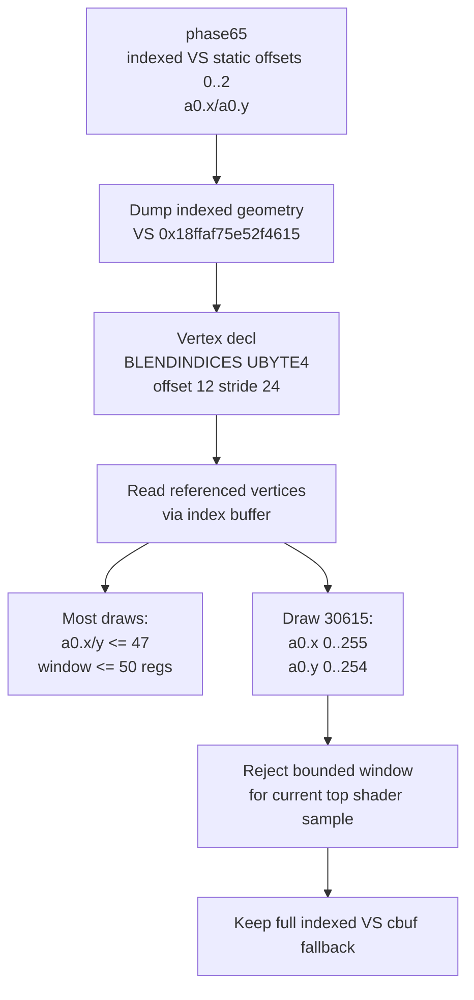

# Encode Phase 66 - Blendindices Window

**Question.** [[state-churn-encode-encode-phase.65]] narrowed the remaining
constant-packing opportunity to indexed VS rows with static offsets `0;1;2` and
relative sources `a0.x/a0.y`. Are the vertex BLENDINDICES values narrow enough
to replace the current full `vsFloatConst[256]` fallback with a bounded window?

**Method.** Dump indexed geometry for the hottest indexed VS hash and analyze
the raw stream payload offline:

```sh
bash scripts/tools/run_3dmark05_perf_probe.sh \
  --suffix blendindices-window-r1-20260614 \
  --frame 60 --no-gputrace --encoder-breakdown-seq 60 \
  --dump-indexed-geometry \
  --dump-indexed-geometry-vs 0x18ffaf75e52f4615 \
  --dump-indexed-geometry-max-draws 12 \
  --timeout 120 --top 5

python3 scripts/tools/analyze_blendindices_geometry.py \
  --geometry-dir traces/app-d3d9-3dmark05-blendindices-window-r1-20260614/analysis/geometry \
  --output experiments/output/app-d3d9-3dmark05-blendindices-window-r1-20260614/3dmark05-blendindices-window.md \
  --csv-output experiments/output/app-d3d9-3dmark05-blendindices-window-r1-20260614/3dmark05-blendindices-window.csv \
  --top 20
```

The run passed with `present_encoded=1740`, `draw_calls=1,285,383`,
`draw_skipped_no_pipeline=0`, and `gpu_command_buffer_errors=0`.

The geometry dump matched the target VS and included current vertex declaration
metadata:

| Field | Value |
|---|---:|
| VS | `0x18ffaf75e52f4615` |
| geometry payloads | `12` |
| BLENDINDICES usage | `usage=2`, `type=5` (`UBYTE4`) |
| stream / offset / stride | `0` / `12` / `24` |
| vertices sampled | `75,395` |

Observed BLENDINDICES ranges:

| Draw | sampled vertices | x | y | z | w | required `c[a0 + 0..2]` window |
|---:|---:|---:|---:|---:|---:|---:|
| `30560` | `1,956` | `0..43` | `0..44` | `0..0` | `0..0` | `0..46` (`47` regs) |
| `30566` | `1,956` | `0..43` | `0..44` | `0..0` | `0..0` | `0..46` (`47` regs) |
| `30567` | `1,956` | `0..43` | `0..44` | `0..0` | `0..0` | `0..46` (`47` regs) |
| `30568` | `5,428` | `0..47` | `0..47` | `0..0` | `0..0` | `0..49` (`50` regs) |
| `30570` | `5,428` | `0..47` | `0..47` | `0..0` | `0..0` | `0..49` (`50` regs) |
| `30575` | `6,881` | `0..6` | `0..6` | `0..0` | `0..0` | `0..8` (`9` regs) |
| `30576` | `1,996` | `0..10` | `0..10` | `0..0` | `0..0` | `0..12` (`13` regs) |
| `30583` | `9,314` | `0..46` | `0..46` | `0..0` | `0..0` | `0..48` (`49` regs) |
| `30584` | `27,750` | `0..16` | `0..14` | `0..0` | `0..0` | `0..18` (`19` regs) |
| `30594` | `5,428` | `0..47` | `0..47` | `0..0` | `0..0` | `0..49` (`50` regs) |
| `30612` | `5,428` | `0..47` | `0..47` | `0..0` | `0..0` | `0..49` (`50` regs) |
| `30615` | `1,874` | `0..255` | `0..254` | `0..253` | `0..191` | `0..257` (`258` regs) |



**Decision.** Rejected as a current safe cbuf-width target. The BLENDINDICES
path is narrow for many draws, but one sampled draw from the same hot indexed
VS uses `a0.x` up to `255` and `a0.y` up to `254`. Since the shader reads
`c[a0.x/y + 0..2]`, the required window reaches the full vertex constant range
and relies on the existing clamp behavior. A shader-specific or per-draw packed
window would need a dynamic validation path and a fallback for full-range draws,
which is not a broad low-risk optimization.

The cbuf direction therefore moves back to reducing constant-change frequency,
argbuf table reopen frequency, or changing storage shape in a way that preserves
full indexed access semantics.

**Next gates.**

- Do not implement packed indexed VS constants from the current evidence.
- If this path is revisited, measure all indexed VS hashes and quantify how many
  uploads are full-range versus narrow-range before considering a fallback
  split.
- Prefer lower-risk cbuf work first: persistent/segmented storage, fewer table
  reopens, or upstream VS constant churn reduction.

**Related.** [[state-churn-encode]] · [[state-churn-encode-encode-phase.65]] ·
[[state-churn-encode-encode-phase.64]] · [[snapshot-cache-snapshot.18]].
