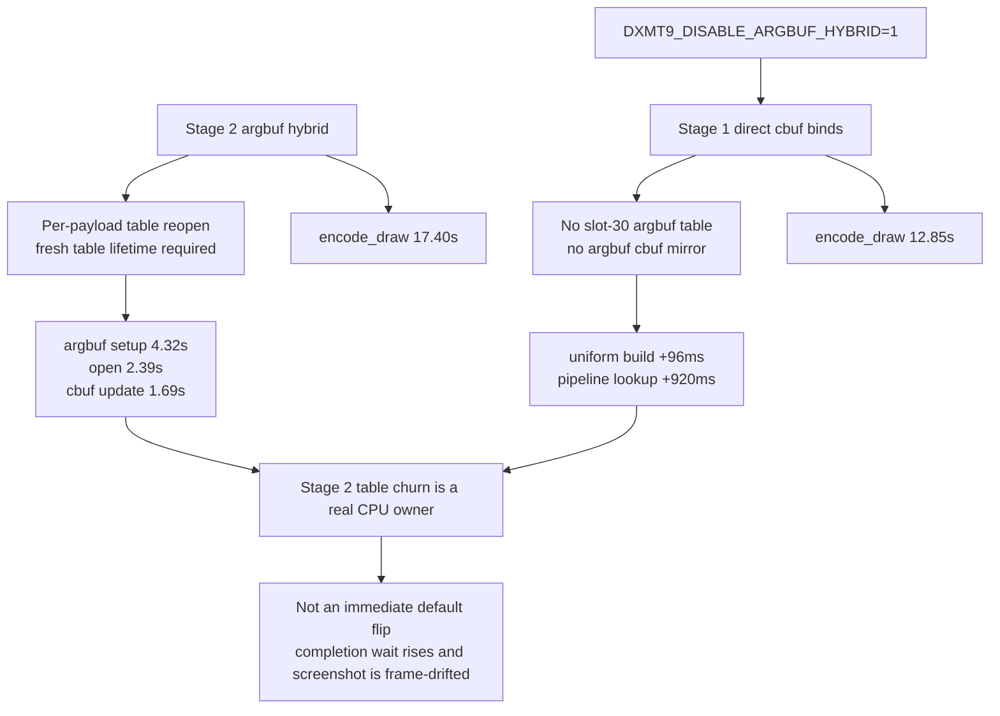

# Encode Phase 67 - Disable Argbuf Hybrid Scout

**Question.** [[state-churn-encode-encode-phase.63]] through
[[state-churn-encode-encode-phase.66]] closed the cheap cbuf-width and
argbuf-reopen shortcut branches. If Stage 2 argument-buffer hybrid remains a
large CPU owner, is it still a net win over the Stage 1 direct uniform binding
lane for current GT1?

**Method.** Run the standard no-gputrace scout with the existing Stage 2 escape
hatch:

```sh
DXMT9_DISABLE_ARGBUF_HYBRID=1 \
bash scripts/tools/run_3dmark05_perf_probe.sh \
  --suffix disable-argbuf-hybrid-r1-20260614 \
  --frame 60 --no-gputrace --timeout 120 --top 5
```

Use [[state-churn-encode-encode-phase.65]]'s Stage 2 scout as the adjacent
comparison because it has the same 120s no-gputrace shape and the same
`present_encoded=1740` count. The Stage 1 run passed with
`draw_skipped_no_pipeline=0`, `gpu_command_buffer_errors=0`, and a non-black GT1
frame. The screenshot is frame-drifted (`Frame 1019` vs the Stage 2 comparison's
`Frame 965`), so it is a smoke check, not a pixel oracle.

| Counter | Stage 2 | Stage 1 (`DXMT9_DISABLE_ARGBUF_HYBRID=1`) | Delta |
|---|---:|---:|---:|
| `present_encoded` | `1,740` | `1,740` | `0` |
| `draw_calls` | `1,285,380` | `1,285,281` | `-99` |
| `render_pass_begin` | `20,497` | `20,497` | `0` |
| `encode_draw_cpu_ms` | `17,399.519` | `12,847.687` | `-4,551.832` |
| `encode_draw_argbuf_setup_cpu_ms` | `4,322.402` | `0.000` | `-4,322.402` |
| `encode_draw_argbuf_open_cpu_ms` | `2,388.854` | `0.000` | `-2,388.854` |
| `encode_draw_argbuf_reopen_post_cpu_ms` | `1,649.769` | `0.000` | `-1,649.769` |
| `encode_draw_argbuf_cbuf_update_cpu_ms` | `1,688.424` | `0.000` | `-1,688.424` |
| `encode_draw_uniform_build_cpu_ms` | `131.405` | `227.879` | `+96.474` |
| `encode_draw_pipeline_lookup_cpu_ms` | `956.014` | `1,876.411` | `+920.397` |
| `transient_upload_cpu_ms` | `221.225` | `27.183` | `-194.042` |
| `transient_upload_bytes` | `909,169,292` | `62,659,556` | `-846,509,736` |
| `gpu_command_buffer_time_ms` | `5,544.923` | `5,266.307` | `-278.616` |
| `completion_wait_ms` | `46,913.049` | `49,233.200` | `+2,320.151` |



**Decision.** Accepted as attribution, rejected as an immediate default-policy
change. Current GT1's Stage 2 constants-only argbuf path is a clear CPU net
cost in this no-gputrace scout: removing it drops `encode_draw_cpu_ms` by
`4.55s` and removes roughly `846.5MB` of transient upload traffic. The direct
Stage 1 lane does pay more uniform-build and pipeline-lookup CPU, but those
increases are much smaller than the removed argbuf setup/update work.

This does **not** prove that disabling Stage 2 improves average FPS. The
Stage 1 run's completion wait is higher (`46.91s -> 49.23s`) and the visual
sample is at a different GT1 frame. Treat this as a CPU architecture signal:
the next argbuf work should change the storage model or per-change table
strategy, not chase more cbuf width micro-trims.

**Next gates.**

- Repeat Stage1-vs-Stage2 with low-overhead frame sampling before considering a
  default policy change.
- If Stage 2 stays enabled, design a cheaper immutable-per-draw table model or
  a persistent/segmented cbuf storage model that preserves per-draw pointer
  lifetime without one full Metal argument-buffer table reopen per changed
  payload.
- Keep the existing last-write-wins correctness constraint: reusing one mutable
  slot-30 table across changed constants is invalid.

**Related.** [[state-churn-encode]] · [[state-churn-encode-encode-phase.63]] ·
[[state-churn-encode-encode-phase.64]] ·
[[state-churn-encode-encode-phase.65]] ·
[[state-churn-encode-encode-phase.66]] · [[present-pacing]].
