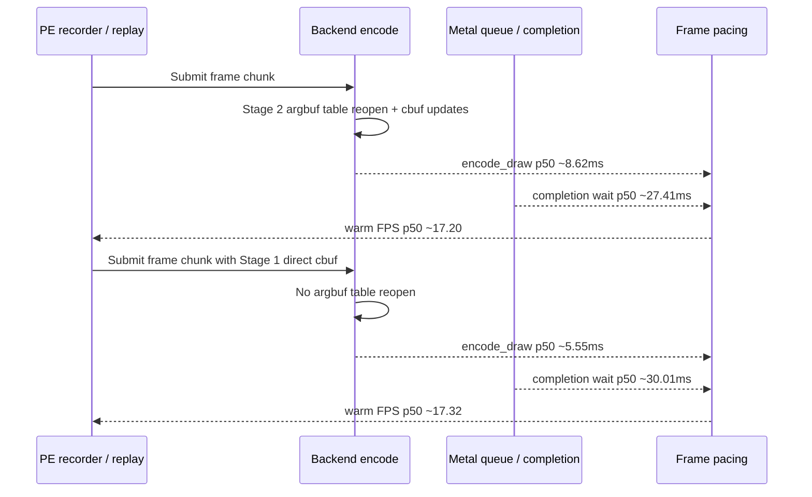
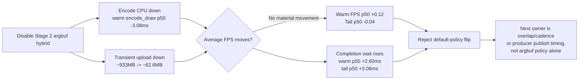

# Encode Phase 68 - Argbuf Hybrid Low-Overhead FPS Gate

**Question.** [state-churn-encode-encode-phase.67](state-churn-encode-encode-phase.67.md) proved that disabling the
Stage 2 constants-only argument-buffer hybrid removes a large encode CPU bucket.
Does that CPU drop translate into average FPS under the low-overhead frame
sampling profile?

**Method.** Run two matching no-gputrace, no-encoder-breakdown, frame-sampling
scouts with the standard 120s timeout:

```sh
bash scripts/tools/run_3dmark05_perf_probe.sh \
  --suffix argbuf-stage2-lowoverhead-r1-20260614 \
  --frame 60 --no-gputrace --no-encoder-breakdown \
  --frame-sampling --timeout 120 --top 5

DXMT9_DISABLE_ARGBUF_HYBRID=1 \
bash scripts/tools/run_3dmark05_perf_probe.sh \
  --suffix argbuf-stage1-lowoverhead-r1-20260614 \
  --frame 60 --no-gputrace --no-encoder-breakdown \
  --frame-sampling --timeout 120 --top 5
```

The Stage 2 run produced `1786` frame-sampling rows. The Stage 1 run produced
`1781` frame-sampling rows and `1740` run-level presents, so compare per-frame
percentiles and per-present counters rather than only absolute run totals.

| Metric | Stage 2 hybrid | Stage 1 (`DXMT9_DISABLE_ARGBUF_HYBRID=1`) | Delta |
|---|---:|---:|---:|
| Warm FPS p50 (`frame >= 120`) | `17.202` | `17.323` | `+0.121` |
| Warm FPS p95 | `26.366` | `26.212` | `-0.154` |
| Tail-600 FPS p50 | `16.855` | `16.817` | `-0.038` |
| Tail-600 FPS p95 | `25.378` | `25.312` | `-0.066` |
| Warm `encode_chunk_cpu_ms` p50 | `10.453` | `7.326` | `-3.127` |
| Warm `encode_draw_cpu_ms` p50 | `8.621` | `5.545` | `-3.076` |
| Warm `completion_wait_ms` p50 | `27.409` | `30.010` | `+2.601` |
| Warm `completion_wait_ms` p95 | `40.548` | `45.961` | `+5.413` |
| Warm `gpu_command_buffer_time_ms` p50 | `1.089` | `0.798` | `-0.291` |
| Tail-600 `completion_wait_ms` p50 | `27.154` | `30.235` | `+3.081` |

Run-level attribution tells the same story with larger totals:

| Counter | Stage 2 hybrid | Stage 1 | Per-present delta |
|---|---:|---:|---:|
| `present_encoded` | `1,786` | `1,740` | n/a |
| `draw_calls` | `1,312,095` | `1,280,952` | `+1.524` draws/present |
| `encode_draw_cpu_ms` | `16,767.196` | `10,688.732` | `-3.245ms` |
| `encode_draw_argbuf_setup_cpu_ms` | `4,403.600` | `0.000` | `-2.466ms` |
| `encode_draw_argbuf_open_cpu_ms` | `2,431.665` | `0.000` | `-1.362ms` |
| `encode_draw_argbuf_cbuf_update_cpu_ms` | `1,724.793` | `0.000` | `-0.966ms` |
| `transient_upload_bytes` | `933,027,284` | `62,560,940` | `-486,457 B` |
| `argbuf_hybrid_bytes_per_encoder` | `932,877,344` | `0` | `-522,328 B` |
| `gpu_command_buffer_time_ms` | `5,500.235` | `4,967.011` | `-0.225ms` |
| `completion_wait_ms` | `48,428.263` | `54,196.888` | `+4.032ms` |





**Decision.** Rejected as a default FPS policy, while retaining the Phase 67 CPU
attribution. Disabling Stage 2 removes roughly `3.1ms` from the warm per-frame
encode path, but the warm completion wait grows by roughly the same amount and
tail FPS is flat. This is the clearest current proof that "large local encode
CPU win" is not sufficient to claim average-FPS movement under GT1's current
pipeline cadence.

Do not flip `DXMT9_DISABLE_ARGBUF_HYBRID` into a default GT1 policy from these
numbers. The Stage 2 table model is still CPU-negative and worth redesigning,
but the average-FPS owner now needs a proof that also moves completion wait,
producer run-ahead, earlier PE/unix chunk publish, or the serialized
commit/encode cadence.

**Next gates.**

- Keep Stage 2 enabled by default unless a repeated low-overhead A/B shows FPS
  movement and a same-input visual check stays clean.
- Treat argbuf-table redesign as CPU cleanup/storage hygiene, not the current
  average-FPS lever.
- Continue the pacing lane: why useful N+1 work is not overlapping the
  completion wait, and whether earlier chunk publish or a producer/consumer
  boundary change can turn the same CPU work into hidden work.

**Related.** [state-churn-encode](index.md) · [state-churn-encode-encode-phase.67](state-churn-encode-encode-phase.67.md) ·
[present-pacing](../present-pacing/index.md) · [present-pacing-pe-chunk-cadence.11](../present-pacing/present-pacing-pe-chunk-cadence.11.md) ·
[present-pacing-pe-chunk-size-ab.12](../present-pacing/present-pacing-pe-chunk-size-ab.12.md).
