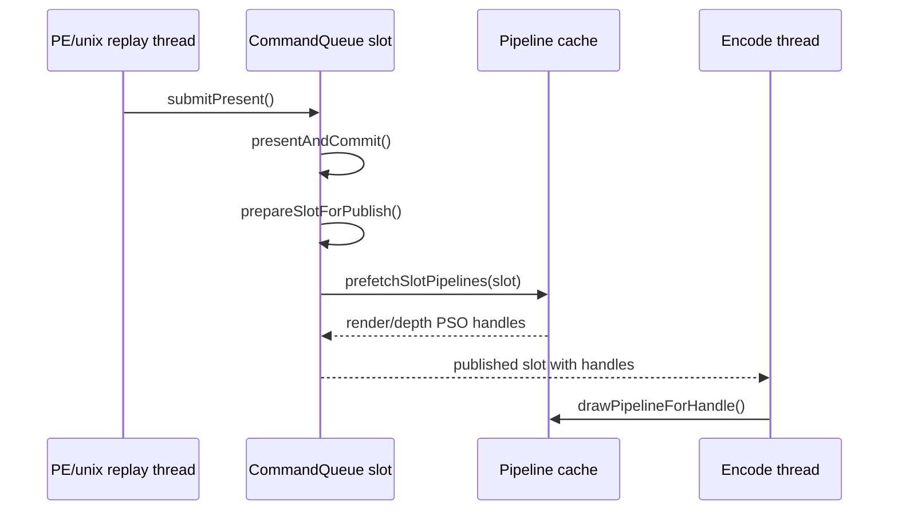
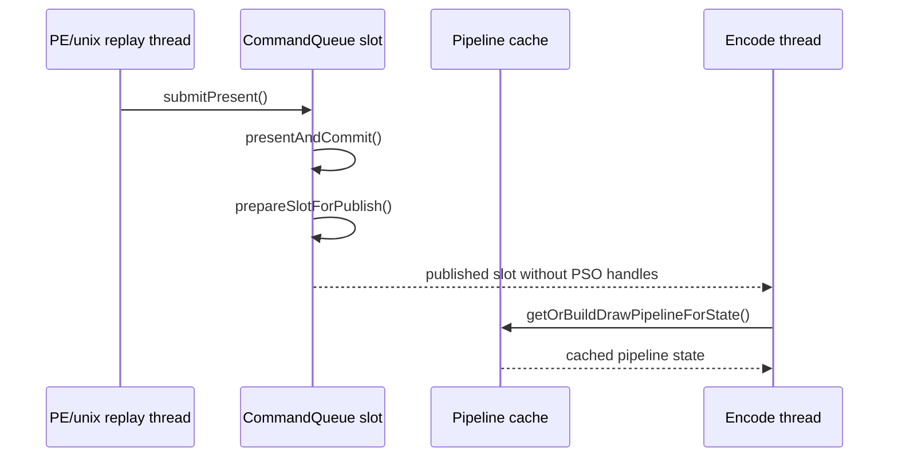
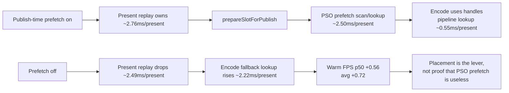

# Encode Phase 69 - Publish-Time PSO Prefetch Placement

**Question.** The replay detail split names `D9C_COMMAND_RECORD_PRESENT` as
almost all non-draw replay CPU. Is this a drawable/present-boundary wait, or
is `submitPresent()` doing serialized queue preparation work before the slot
can publish?

**Method.** Add low-overhead submit/publish split counters, then run the
standard no-gputrace, no-encoder-breakdown, frame-sampling scout:

```sh
bash scripts/tools/run_3dmark05_perf_probe.sh \
  --suffix present-publish-split-lowoverhead-r1-20260614 \
  --no-gputrace --no-encoder-breakdown --frame-sampling --timeout 120
```

Then add the diagnostic-only `DXMT9_DISABLE_PUBLISH_PSO_PREFETCH=1` knob and
repeat twice:

```sh
DXMT9_DISABLE_PUBLISH_PSO_PREFETCH=1 \
bash scripts/tools/run_3dmark05_perf_probe.sh \
  --suffix publish-pso-prefetch-off-lowoverhead-r1-20260614 \
  --no-gputrace --no-encoder-breakdown --frame-sampling --timeout 120

DXMT9_DISABLE_PUBLISH_PSO_PREFETCH=1 \
bash scripts/tools/run_3dmark05_perf_probe.sh \
  --suffix publish-pso-prefetch-off-lowoverhead-r2-20260614 \
  --no-gputrace --no-encoder-breakdown --frame-sampling --timeout 120
```

The publish split proves the present record owner:

| Counter | Publish prefetch on | Per-present |
|---|---:|---:|
| `present_encoded` | `1,750` | n/a |
| `commit_chunk_replay_present_record_cpu_ms` | `4,824.640` | `2.757ms` |
| `submit_present_cpu_ms` | `4,818.268` | `2.753ms` |
| `submit_present_acquire_cpu_ms` | `0.369` | `0.000ms` |
| `submit_present_commit_cpu_ms` | `4,806.664` | `2.747ms` |
| `submit_present_boundary_cpu_ms` | `9.108` | `0.005ms` |
| `prepare_slot_publish_cpu_ms` | `4,782.256` | `2.733ms` |
| `prepare_slot_resource_mark_cpu_ms` | `411.898` | `0.235ms` |
| `prepare_slot_pso_prefetch_cpu_ms` | `4,369.192` | `2.497ms` |

The prefetch-off A/B mostly moves that CPU to backend encode:

| Metric | Publish prefetch on | Prefetch off avg (r1/r2) | Delta |
|---|---:|---:|---:|
| `submit_present_cpu_ms / present` | `2.753ms` | `0.266ms` | `-2.488ms` |
| `prepare_slot_pso_prefetch_cpu_ms / present` | `2.497ms` | `0.000ms` | `-2.497ms` |
| `commit_chunk_replay_cpu_ms / present` | `11.183ms` | `8.445ms` | `-2.739ms` |
| `commit_chunk_replay_present_record_cpu_ms / present` | `2.757ms` | `0.269ms` | `-2.488ms` |
| `encode_draw_cpu_ms / present` | `9.591ms` | `11.812ms` | `+2.221ms` |
| `encode_draw_pipeline_lookup_cpu_ms / present` | `0.551ms` | `2.773ms` | `+2.222ms` |
| `encode_draw_pso_prefetch_handle_used` | `444,533` | `0` | `-444,533` |
| `encode_draw_pso_prefetch_handle_missing` | `0` | `457,354` | `+457,354` |
| Warm FPS p50 | `17.064` | `17.628` | `+0.564` |
| Warm FPS p95 | `25.712` | `26.539` | `+0.827` |
| Warm FPS avg | `17.628` | `18.343` | `+0.715` |







**Decision.** Accepted as a diagnostic placement result, superseded by the
default promotion in [state-churn-encode-encode-phase.70](state-churn-encode-encode-phase.70.md). The `Present` record
cost is not drawable acquire or present-boundary waiting; it is serialized
`prepareSlotForPublish()` work, dominated by `prefetchSlotPipelines(slot)`.
Disabling publish-time prefetch does not remove the total work: it transfers
roughly the same amount to `encode_draw_pipeline_lookup_cpu_ms`. The important
result is that moving this work out of the pre-publish path improves the
low-overhead sampled FPS twice, while keeping a normal output frame.

The direct per-draw fallback was not the final design because it made
`encode_draw_pipeline_lookup_cpu_ms` rise. The follow-up default moves
slot-level prefetch to the encode worker's slot copy instead. Remaining
candidate directions:

- build a lighter per-slot PSO key/index table during draw submit and resolve
  handles without a full slot scan at present time;
- prefetch only cold/missing PSOs and leave hot handles to encode-local cache;
- use `DXMT9_ENABLE_PUBLISH_PSO_PREFETCH=1` for legacy-placement A/B until
  broader workloads clear cold-pipeline risk.

**Related.** [state-churn-encode](../state-churn-encode.md) ·
[state-churn-encode-encode-phase.68](state-churn-encode-encode-phase.68.md) ·
[state-churn-encode-encode-phase.70](state-churn-encode-encode-phase.70.md) · [present-pacing](../present-pacing.md) ·
[present-pacing-publish-pso-prefetch.26](../present-pacing/present-pacing-publish-pso-prefetch.26.md).
