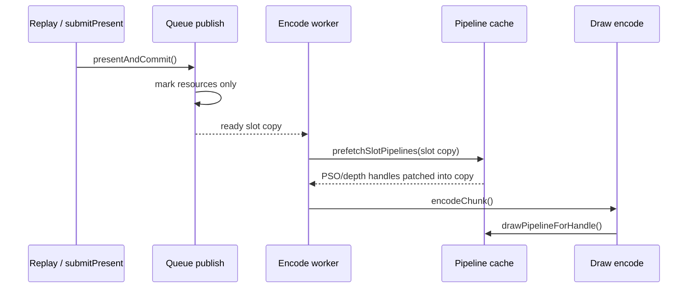
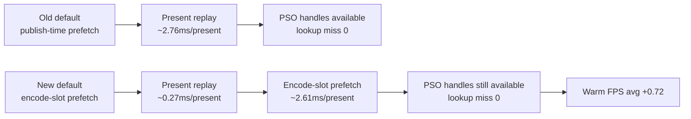

# Encode Phase 70 - Encode-Slot PSO Prefetch Default

> **Outdated — the knob or code path this experiment measured no longer exists in `src/`.** It cannot be re-run. Kept as history; do not cite it as current evidence.

**Question.** [state-churn-encode-encode-phase.69](state-churn-encode-encode-phase.69.md) proved that publish-time
PSO prefetch owns the Present replay bucket, but the first A/B either moved
that work to per-draw pipeline lookup or kept it diagnostic-only. Can the
runtime keep prefetched PSO handles while removing the serialized
`submitPresent()` publish cost?

**Change.** The default policy now resolves draw-run PSO/depth-state handles
on the encode worker's mutable slot copy, immediately before
`backend_->onChunkReady()`. This keeps the handle-based encode path but moves
the slot scan/cache lookup out of `prepareSlotForPublish()`.

Restore / fallback knobs:

- `DXMT9_ENABLE_PUBLISH_PSO_PREFETCH=1` restores the legacy publish-time
  placement.
- `DXMT9_DISABLE_ENCODE_SLOT_PSO_PREFETCH=1` disables the new encode-slot
  prefetch, causing per-draw pipeline lookup fallback unless the legacy publish
  placement is explicitly enabled.

| Metric | Old publish prefetch | Encode-slot opt-in avg (r1/r2) | New default |
|---|---:|---:|---:|
| `prepare_slot_pso_prefetch_cpu_ms / present` | `2.497ms` | `0.000ms` | `0.000ms` |
| `encode_slot_pso_prefetch_cpu_ms / present` | n/a | `2.638ms` | `2.605ms` |
| `submit_present_cpu_ms / present` | `2.753ms` | `0.264ms` | `0.270ms` |
| `commit_chunk_replay_present_record_cpu_ms / present` | `2.757ms` | `0.268ms` | `0.274ms` |
| `commit_chunk_replay_cpu_ms / present` | `11.183ms` | `8.544ms` | `8.561ms` |
| `encode_draw_cpu_ms / present` | `9.591ms` | `9.614ms` | `9.602ms` |
| `encode_draw_pipeline_lookup_cpu_ms / present` | `0.551ms` | `0.533ms` | `0.524ms` |
| `encode_draw_pso_prefetch_handle_missing` | `0` | `0` | `0` |
| Warm FPS p50 | `17.064` | `17.782` | `17.722` |
| Warm FPS avg | `17.628` | `18.345` | `18.345` |

**Decision.** Accepted as the default placement for current dxmt9. This removes
the identified serialized Present replay bottleneck without regressing the
draw encode pipeline into per-draw handle misses. It is a placement change, not
a total-CPU elimination: the same PSO prefetch work now belongs to the encode
stage, where it is less harmful to the observed GT1 wall-clock cadence.

**Remaining risk.** Cold-pipeline-heavy applications may prefer earlier PSO
builds on the submit path. Keep `DXMT9_ENABLE_PUBLISH_PSO_PREFETCH=1` until a
broader workload suite proves the new placement has no cold-stutter downside.

**Related.** [state-churn-encode-encode-phase.69](state-churn-encode-encode-phase.69.md) ·
[present-pacing-publish-pso-prefetch.27](../present-pacing/present-pacing-publish-pso-prefetch.27.md) · [state-churn-encode](index.md) ·
[present-pacing](../present-pacing/index.md).
