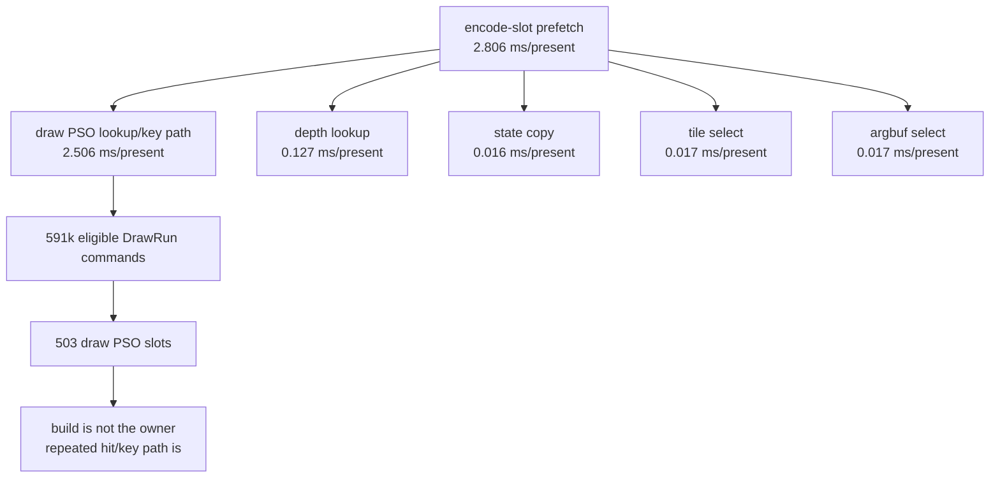
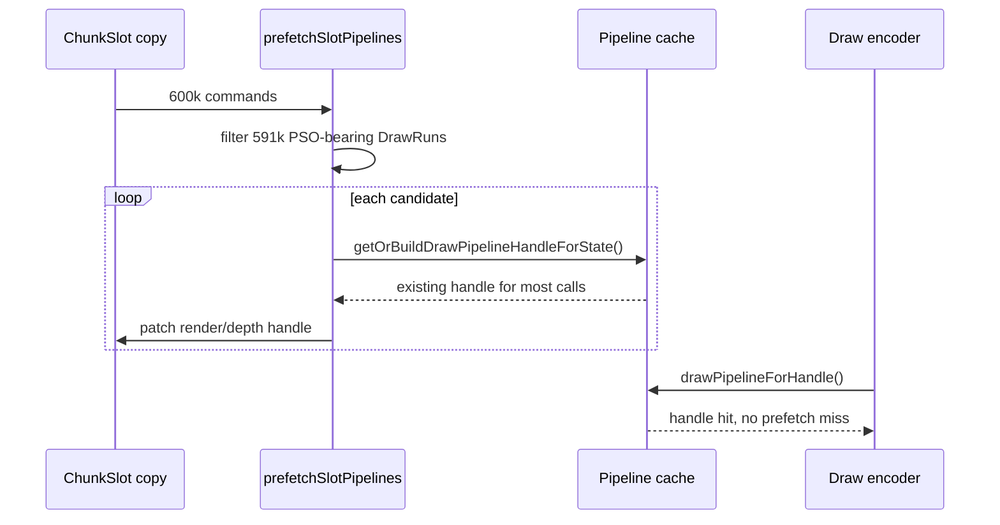

# Encode Phase 71 - Encode-Slot PSO Prefetch Split

> **Outdated — every artifact this leaf cites in `source:` is gone from disk.** The numbers below cannot be re-derived or re-checked. Kept as history; do not cite it as current evidence.

**Question.** [state-churn-encode-encode-phase.70](state-churn-encode-encode-phase.70.md) moved PSO prefetch from
the serialized Present publish path to the encode worker, but left
`encode_slot_pso_prefetch_cpu_ms` at about `2.6ms/present`. Which child owns
that remaining work?

**Instrumentation.** `prefetchSlotPipelines()` now reports command count,
eligible DrawRun count, tile/argbuf route counts, and child CPU timers for
state copy, depth lookup, tile selection, tile PSO lookup, argbuf selection,
and draw PSO lookup.

| Metric | Total | Per present |
|---|---:|---:|
| `present_encoded` | `1,820` | n/a |
| `encode_slot_pso_prefetch_cpu_ms` | `5106.672ms` | `2.805864ms` |
| `encode_slot_pso_prefetch_draw_lookup_cpu_ms` | `4561.732ms` | `2.506446ms` |
| `encode_slot_pso_prefetch_depth_lookup_cpu_ms` | `230.273ms` | `0.126524ms` |
| `encode_slot_pso_prefetch_state_copy_cpu_ms` | `28.282ms` | `0.015540ms` |
| `encode_slot_pso_prefetch_tile_select_cpu_ms` | `31.358ms` | `0.017230ms` |
| `encode_slot_pso_prefetch_argbuf_select_cpu_ms` | `30.959ms` | `0.017010ms` |
| `encode_slot_pso_prefetch_commands` | `600,459` | `329.923` |
| `encode_slot_pso_prefetch_candidates` | `591,477` | `324.987` |
| `encode_slot_pso_prefetch_argbuf_stage2_candidates` | `591,477` | `324.987` |
| `encode_slot_pso_prefetch_tile_candidates` | `0` | `0` |
| `encode_draw_pso_prefetch_handle_missing` | `0` | `0` |

**Decision.** Accepted attribution. The residual encode-slot prefetch cost is
not state copy, selector logic, tile routing, or depth lookup. It is the draw
pipeline lookup/key path repeated across `591,477` candidates even though the
run only creates `503` draw PSO slots and reports no prefetched-handle misses.

**Design implication.** A slot-local memo keyed only by `DrawPsoSubview` is not
safe: the authoritative `ShaderVariantKey` also depends on sampler filter
state, texture types, sample count, attachment formats, debug-env bits,
VSOut-layout selection, and argbuf/tile sub-mode bits. The next safe target is
an exact-key or exact-handle reuse path that avoids repeating
`getOrBuildDrawPipelineHandleForState()` for equivalent states without
collapsing distinct PSO variants.

**Next gate.** Add a non-mutating opportunity counter first: compute how often
adjacent or slot-local candidates resolve to the same final PSO handle/key, and
how much of `encode_slot_pso_prefetch_draw_lookup_cpu_ms` that could elide.
Only after that proof should a handle/key reuse cache be promoted.

**Related.** [state-churn-encode-encode-phase.70](state-churn-encode-encode-phase.70.md) ·
[present-pacing-publish-pso-prefetch.27](../present-pacing/present-pacing-publish-pso-prefetch.27.md) · [state-churn-encode](index.md).
